# IT 입문자를 위한 프로그램과 프로그래밍 기초

## 1. IT의 기본 개념 이해
### 1-1. IT의 정의와 역할의 이해
- 정보를 수집,저장,가공,전달하는 모든 기술을 의미하며, 생활과 업무의 효율을 높이는 수단이다.
- 온라인 뱅킹, 내비게이션, 전자상거래가 모두 IT의 적용 사례이다.

## 2. 하드웨어와 소프트웨어
- **하드웨어**: 눈에 보이고 만질 수 있는 장치 (CPU, 메모리, 키보드 등) 

<image src="img/cpu.png" width="200"> &nbsp; <image src="img/memory.png" width="200" height="133">

- **소프트웨어**: 하드웨어를 움직이는 프로그램과 운영체제이다.

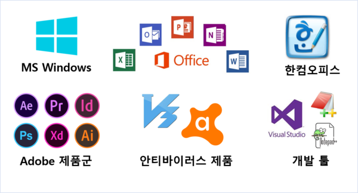

## 3. 프로그램과 프로그래밍
- **프로그램이란?**  
  컴퓨터가 수행할 모든 형태의 실행 가능한 코드의 모음을 말한다.
- **프로그래밍이란?**  
  컴퓨터가 원하는 작업을 수행하도록 **명령어를 만드는 과정**이다.
- **프로그래밍 언어**  
  사람이 컴퓨터에게 '무엇을 할지' 알려주는 약속된 말과 문법  
  예: Python, Java, C, JavaScript
- **코드(Code)**  
  프로그래밍 언어로 작성한 명령어 집합
- **코딩(Coding)**  
  컴퓨터에 내리는 모든 명령

## 4. 운영체제와 어플리케이션
- **운영체제**  
  자원 관리와 프로그램 실행을 담당하는 기본 소프트웨어다.

  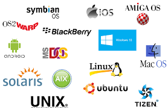

- **어플리케이션**  
  운영체제 위에서 특정 기능을 제공하는 응용 프로그램이다.

  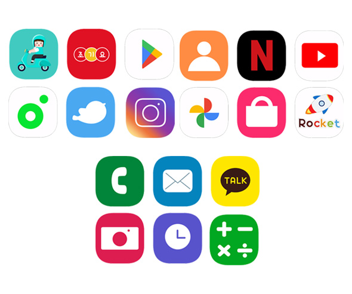

## 5. 프로그래밍이 필요한 이유
- 사람이 직접 기계를 조작할 수 없으니, **프로그래밍**으로 의도를 전달
- 반복 작업 자동화
- 문제 해결 및 새로운 서비스 개발
- 창의적인 아이디어 구현

### 5-1편집기
- 메모장 같은 일반 텍스트 편집기에도 코드를 적을 수 있지만, 보통은 코딩 전용 에디터나 IDE(통합 개발 환경)을 사용한다.
- 코딩 전용 에디터는 문법 색상, 자동 완성, 오류 표시, 실행 버튼 등 개발에 필요한 기능이 있기 때문이다.

#### 코딩 전용 에디터
  - VS Code
  - PyCharm
  - IntelliJ
  - Eclipse
  - Xcode

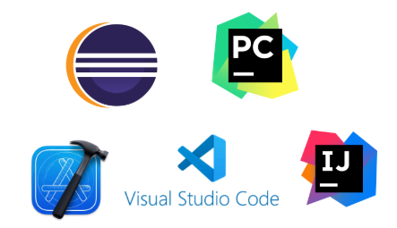

## 6. 프레임워크
- 프로그램을 만들 때 필요한 기본 구조와 동작 방식을 미리 정의해놓은 개발 도구이다.
- 개발자가 일정한 규칙과 구조에 맞춰 코드를 작성하면, 프레임워크가 프로그램의 흐름과 동작을 관리한다.

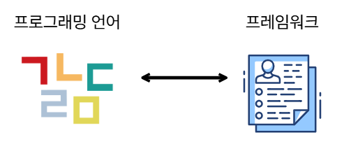

## 7. 네트워크
- 두 개 이상의 장치(컴퓨터, 스마트폰 등)가 데이터를 서로 주고받는 것이다.
  - 웹 브라우저로 사이트에 접속
  - 메신저로 메시지 전송
  - 파일 업로드 다운로드

### 7-1. 네트워크의 기본 요소
1. 송신자(Sender) - 정보를 보내는 쪽
2. 수신자(Receiver) - 정보를 받는 쪽
3. 전송 매체 - 정보를 전달하는 경로(유선, 무선)
4. 프로토콜(Protocol) - 통신 규칙과 약속

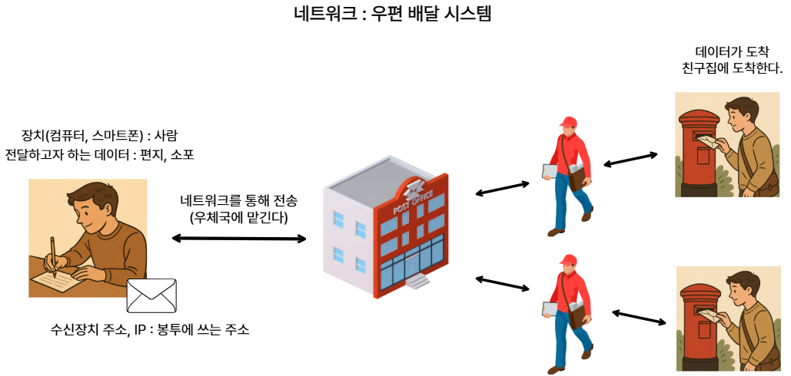

#### 프로토콜
- 컴퓨터나 기계끼리 서로 대화할 때 지켜야 하는 약속과 규칙이다.
- 사람이 대화할 때 같은 언어와 문법을 써야 의사소통이 가능하듯, 컴퓨터끼리도 같은 규칙을 따라야 통신이 가능하다.

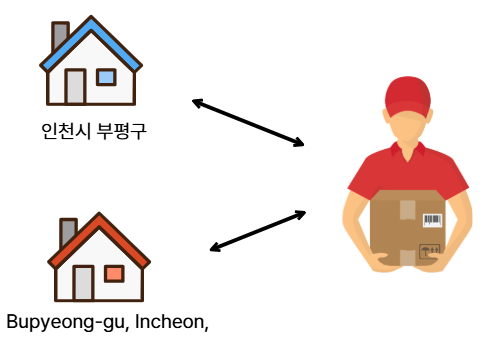

- 각 나라가 **"주소를 어떻게 쓰는지"**, **"상자 크기는 얼마까지 허용하는지"**, <b>"세관 서류를 어떻게 작성하는 지"</b>등 같은 규칙을 정해야 서로 물건을 문제없이 주고받을 수 있다.
- 만약 규칙이 다르다면, 주소를 못 읽거나 세관에 막혀 물건이 도착하지 못할 수 있다.
- 통신에서의 프로토콜도 데이터를 주고받을 때 데이터의 모양, 순서, 절차를 정해놓은 약속이다.

### 7-2. 클라이언트와 서버
- 클라이언트(Client) : 서비스를 요청하는 장치/프로그램
- 서버(Server) : 요청을 받아 처리하고 응답하는 장치/프로그램

### 7-3. API(Application Programming Interface)
- 다른 소프트웨어에서 프로그램이나 시스템과 상호작용 할 수 있도록 인터페이스를 제공하는 것이다.
- 즉, 다른 API는 다른 소프트웨어에서 제공하는 기능을 호출하거나 사용할 수 있도록 해주는 인터페이스이다.
- 위 이미지에서는 종업원이 API가 되는것이다.
- 종업원을 통해 주문을 하면 손님이 직접 주방에 주문을 할 필요가 없다.

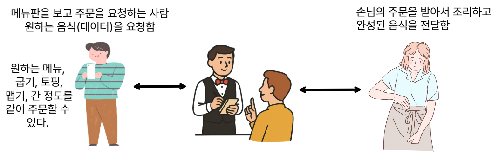

## 8. 데이터베이스

### 8-1. 데이터베이스
- 데이터를 저장해둔 공간, 데이터의 모음
- 고객 목록, 주문 기록, 상품 재고와 같은 데이터를 저장할 수 있다.
- 규칙적으로 구조화 되어있다.
- 데이터 자체만 있고, 이를 다루는 기능은 없다.

### 8-2. DBMS(Database Management System)
- 데이터베이스를 관리하고 조작하는 소프트웨어

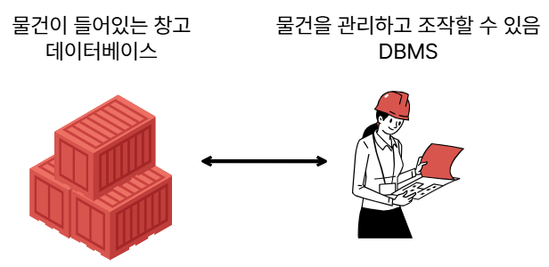

- 데이터 저장, 조회, 수정, 삭제가 가능하다.
- 여러 사람이 동시에 사용해도 충돌 없이 관리
- 보안(권한 관리),백업, 복구 기능 제공


## 9. 인프라
- 컴퓨터 시스템, 네트워크, 저장장치, 보안 시스템 등 소프트웨어와 하드웨어가 동작하는 토대를 의미한다.

### 9-1 인프라의 종류
1. 온프로미스(On-Premises)
     - 회사 자체 서버실에서 모든 인프라 운영
     - 장점 : 보안 통제 가능, 직접 관리
     - 단점 : 초기 비용 높음, 유지보수 부담

    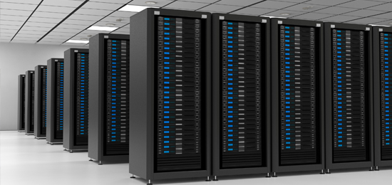

2. 클라우드(Cloud)
     - 인터넷을 통해 외부 서비스 제공자의 인프라 사용
     - 장점 : 초기 비용 낮음, 확장 용이
     - 단점 : 인터넷 의존, 데이터 통제력 일부 감소

    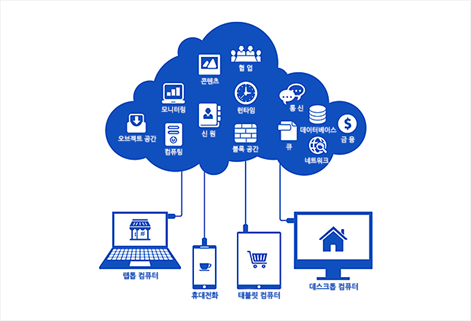

3. 하이브리드(Hybrid)
     - 온프로미스 + 클라우드 혼합 운영
     - 장점 : 유연성 높음
     - 단점 : 관리 복잡성 증가

## 10. 클라우드
- 인터넷을 통해 서버, 저장소, 네트워크, 소프트웨어 등을 빌려쓰는 서비스
- 과거에는 개인이 직접 PC와 프로그램을 설치했다.
- 현재는 클라우드 업체에서 서버를 운영하고, 필요할 때 빌려쓴다.

### 10-1. 등장배경
- 초기 서버 구축 비용과 유지보수 부담 해결
- 급격한 트래픽 증가/감소에 유연 대응

### 10-2. 클라우드 서비스 모델
1. **IaaS(Infrastructure as a Service)**
- 서버, 저장소 네트워크 같은 물리적 기본 컴퓨팅 자원을 인터넷을 통해 제공한다.
- 운영체제 설치, 서버 설정, 보안 설정 등은 사용자가 직접 관리하고 유지해야한다.
- 건물을 빌려서 내 가게를 직접 꾸미고 운영하는것과 같다.

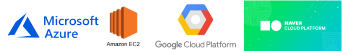

```
선택권은 모두 개발자에게 넘어가고, 컴퓨팅 환경만 빌려서 컴퓨터를 사용하는것이다.
```

2. **PaaS(Platform as a Service)**
- 개발 플랫폼을 서비스로 제공하는 모델이다.
- 서버와 네트워크 같은 인프라 뿐만 아니라 개발 언어, 라이브러리, 데이터베이스, 빌드, 배포 환경까지 세팅된 개발 실행 플랫폼을 제공한다.
- 건물주가 건물에 가게세팅, 직원,재료가 다 준비된 상태로 요리만 하면 되는 상황이라고 생각하며 된다.


#### ※ 라이브러리
- 개발자가 자주 쓰는 기능을 미리 만들어놓은 코드 묶음
#### ※ 빌드
- 개발자가 작성한 소스코드를 컴퓨터가 실행할 수 있는 형태로 변환하는 과정
#### ※ 배포
- 내 컴퓨터에서 만든 프로그램이나 웹사이트를 다른 사람들이 사용할 수 있도록 인터넷에 공개하는 과정


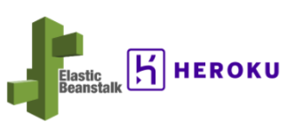

3. **SaaS(Software as a Service)**
- 완성된 소프트웨어를 서비스로 제공하는 모델이다.
- 사용자는 브라우저나 앱을 통해 설치없이 바로 사용할 수 있다.
- 개발, 배포, 서버 관리, 업데이트까지 모두 서비스 제공자가 담당한다.
- 사용자는 완성된 식당에서 메뉴를 주문해서 먹기만 하면된다.

  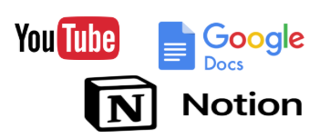


## 10. IT 직무
### 모든 직무에 공통으로 필요한 기반
- 컴퓨터, OS 기초 : 프로세스, 스레드, 메모리, 파일시스템, 기본 명령어
- 네트워크 기초 : IP,DNS,HTTP, TCP/UDP, 요청-응답 흐름과 상태코드
- 프로그래밍 기초 : 자료형, 조건-반복, 함수, 디버깅, 테스트 기초
- 버전관리 : Git 기본 흐름
- 클라우드 상식 : IaaS/PaaS/SaaS 개념과 배포의 기본 흐름이다.
- 보안 상식 : 인증, 인가, 비밀관리, 기본 취약점인지(입력검증, CSRF, XSS)

### 웹 사이트
- 정보를 보여주는 페이지(예: 블로그, 회사 홈페이지)

### 웹 어플리케이션
- 사용자와 상호작용하는 기능이 있는 웹 서비스(예: 쇼핑몰, 유튜브)

### 1. 웹 개발의 두 영역

#### 프론트엔드
- 사용자가 화면에서 직접 보는 부분을 개발
- HTML, CSS, JavaScript로 구조, 디자인, 동작을 구현
- 예: 버튼 클릭 시 화면이 바뀌는 것, 글 목록을 보여주는 UI
- 백엔드에 요청을 보내고 응답을 받아 화면을 갱신하는 역할도 함
  - 프레임워크/라이브러리 : React, Vue, Angular

#### 백엔드
- 화면에 보이지 않는 서버 쪽 로직을 담당
- 프론트엔드로부터 온 요청을 받아서 처리하고, 데이터베이스와 연동해 결과를 반환한다.
- 예: 아이디,비밀번호를 입력받아 로그인 정보 확인하기, 게시글 목록 불러오기, 결제정보를 받아서 결제 처리하기 등