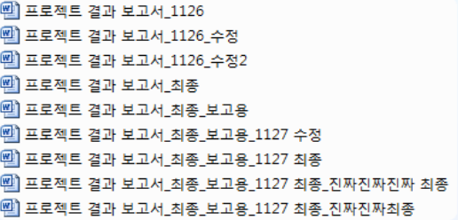
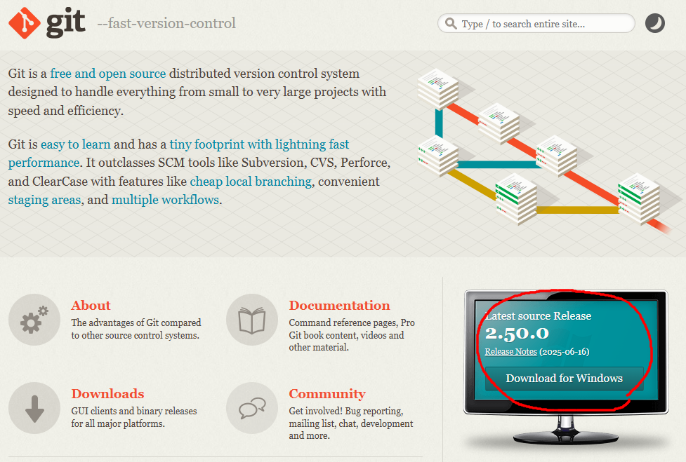
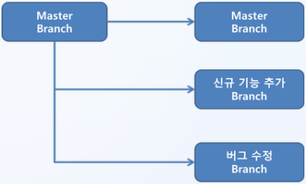
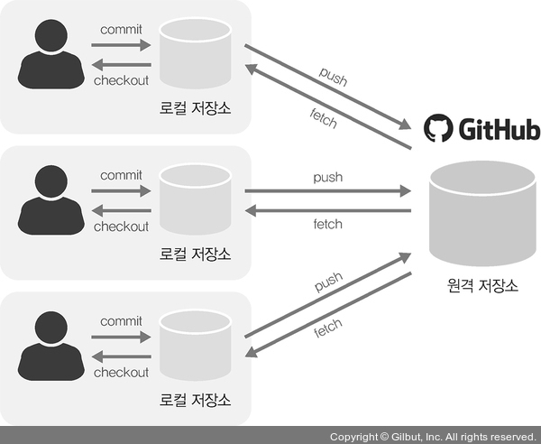

# 개발자를 위한 Git 입문
- 버전 관리와 협업의 시작

## 수업목표
- Git의 기본 개념과 동작 원리를 이해한다.
- Git을 사용하여 버전 관리와 협업 환경을 구축할 수 있다.
- GitHub를 이용해 원격 저장소를 만들고, 클라우드 네이티브 프로젝트에 적용할 수 있다.

## 1. Git의 개념과 필요성
### 1-1. 버전관리란?
- 파일의 변경 이력을 기록하고, 특정 시점으로 되돌릴 수 있는 기능
- Word 문서의 버전 관리, Google Docs의 히스토리

    

#### 장점
- 이전 버전 복원 가능
- 변경 이력 추적 가능
- 협업 시 누가 어떤 부분을 수정했는지 확인 가능

### 1-2. Git이란?
- 분산 버전 관리 시스템
- 모든 개발자가 코드 전체 이력을 로컬에 저장
- 인터넷이 없어도 로컬에서 작업 가능하며, 나중에 원격 저장소와 동기화 할 수 있다.
- 주로 GitHub, GitLab같은 서비스와 함께 사용하여 협업을 한다.
- 한 번의 실수로 전체 프로젝트가 손상되지 않도록 안전하게 관리할 수 있다.

## 2. Git의 설치
- git-scm.com
- Windows : Git for Windows 설치
- macOS : Homebrew이용 또는 공식 웹사이트에서 다운로드
- Linux : 패키지 관리자 사용( apt-get install git)




### 2-1. Git이 필요한 이유
1. 변경 이력 관리
   - 언제,누가,어떤 변경을 했는지 기록
   - 실수했을 때 과거 상태로 되돌릴 수 잇음
2. 협업 지원
    - 여러 개발자가 같은 프로젝트에서 동시에 작업 가능
    - 코드 충돌을 줄이고 통합 관리 가능
3. 백업 기능
   - 원격 저장소(GitHub, GitLab 등)에 업로드하면 컴퓨터가 고장나도 안전하다.
4. 실무 표준 도구
   - 전 세계 개발자들이 사용하는 표준 협업 툴
   - 취업 필수 기술 중 하나.

## 3. Git 관련 용어 정리
|용어|뜻|
|----|----|
|저장소(Repository)|파일과 변경되는 이력이 저장되는 공간|
|로컬(Local)|내 컴퓨터|
|원격저장소(Remote)|다른 서버|
|커밋(Commit)|변경사항을 저장하는 동작|
|스테이징(Staging Area)|커밋 전 대기 공간|
|푸시(Push)|로컬에서 원격저장소로 업로드|
|풀(Pull)|원격저장소에서 로컬로 다운로드|
|클론(Clone)|원격 저장소를 복사|

## 4. Git 기본 명령어
```
git --version                       # Git 버전 확인
git init                            # 새 로컬 저장소 생성
git status                          # 변경 사항 상태 확인
git add 파일명                       # 변경 파일 스테이징
git add .                           # 모든 변경 파일 스테이징
git commit -m "메시지"               # 변경 사항 저장
git log                             # 커밋 이력 확인
git diff                            # 변경 내용 비교
git remote add origin 저장소 주소     # 원격 저장소 연결
git push                            # 원격 저장소 업로드
git pull                            # 원격 저장소에서 변경 사항 가져오기
```

```
-m : 커밋 메시지를 바로 입력하는 옵션

origin
Git에서 원격 저장소를 여러 개 등록할 수 있다.
그 중 기본으로 연결된 저장소에 붙이는 이름
원격 저장소의 주소가 길기 때문에 대신 사용하기 위해 붙히는 별명이라고 보면 된다.
```


## 5. Git 기본 흐름
```
(최초 1회)
1. git config --global user.name "이름" # 사용자 이름 설정
2. git config --global user.email "이메일" # 사용자 이메일 설정
3. git init # 해당 경로를 git이 관리하게 하겠다 설정

(이후 매 작업시)
git add .
git commit -m "메시지" # 변경 사항 저장

(원격 연결 & 업로드)
git remote add origin 저장소 주소
git branch -M main
git push -u origin main
git push

-u : 로컬 브랜치와 원격 브랜치를 연결해주는 옵션
최초 연결시에만 한 번 사용하고, 이후에는 git push만 입력해도 자동으로 같은 브랜치에 푸시된다.
```

## 6. 브랜치
- Git에서 브랜치는 독립적인 작업공간을 의미합니다.
- Git을 사용하면 모든 변경 사항을 기록하는 'Main'(혹은 'Master')브랜치를 가지고 있다.
- 이 브랜치에서 분기하여 새로운 브랜치를 생성할 수 있다.


### 6-1. 브랜치의 개념과 특징
- 한 브랜치에서 작업한 내용이 다른 브랜치에 영향을 주지 않음
- 작업이 끝나면 병합(Merge)하여 반영 가능

### 6-2. 브랜치의 필요성
1. 안전한 개발 : 원본(main)코드를 깨뜨리지 않고 새로운 기능 개발 가능
2. 동시 작업 : 여러 기능을 서로 다른 브랜치에서 동시에 개발 가능
3. 버전 관리 용이 : 특정 시점의 코드를 따로 보관하거나 실험 가능
4. 협업 필수 : 팀원별 작업 브랜치를 만들어 충돌을 최소화 할 수 있다.

### 6-3. 브랜치 관련 기본 명령어
|명령어|설명|비고|
|-----|----|----|
|git branch| 생성된 브랜치의 목록 확인|
|git branch 브랜치명| 새 브랜치 생성|
|git checkout 브랜치명| 다른 브랜치로 이동|
|git checkout -b 브랜치명| 생성과 동시에 해당 브랜치로 이동|-b : 브랜치 생성과 이동을 한 번에 하는 옵션|
|git merge 브랜치명| 현재 브랜치에 다른 브랜치 내용 병합|
|git branch -d 브랜치명|브랜치 삭제| -d :  브랜치를 삭제하는 옵션|



## 7. 원격저장소
### 7-1. 로컬 vs 원격저장소
- 로컬(Local) : 내 컴퓨터 안에서 작업하는 공간을 말한다. 내가 작성한 자료가 내 컴퓨터 안에만 있는 상태를 의미한다.
- 원격저장소(remote) : 인터넷에 있는 저장소를 의미한다.
  - 예를 들어, 구글 드라이브나 네이버 클라우드에 문서를 저장하면 다른 장소에서도 접근이 가능하다.
  - 인터넷 상에 저장된 코드저장소를 의미한다.
  - 언제 어디서든 접근 가능하고, 다른 사람과 함께 공유, 협업이 가능하다.




### 7-2. GitHub
- Git 기반의 강력한 협업 플랫폼이다.
- Git이 로컬에서 버전을 관리하는 도구라면, GitHub는 인터넷에 저장소를 올려서 원격 저장소 기능을 제공한다.
- 코드 백업, 협업, 프로젝트 관리, 이슈 추적, 배포 자동화 등 다양한 기능을 제공한다.

### 7-2. GitHub의 필요성
- 여러 개발자가 동시에 작업할 수 있도록 원격에서 코드 공유
- 로컬 컴퓨터 문제 시에도 안전하게 코드 보관 가능하다.
- 변경 이력 추적 및 이전 버전 복원 가능하다.
- 이슈 트래킹, PR(Pull Request), 코드 리뷰 등 협업 도구 지원
- GitHubActions를 활용해 빌드 및 배포 자동화 가능

### 7-3. 주요 용어
|용어|설명|
|----|----|
|레파지토리(Remote Repository)|프로젝트를 저장하는 원격 저장소|
|Fork|다른 사람의 저장소를 내 계정으로 복사|
|Pull Request(PR)|브랜치 작업 내용을 메인 브랜치에 반영 요청|


### 7-4. 원격 저장소
- GitHub에서 하나의 프로젝트 단위를 의미
- 코드, 문서, 이슈, PullRequest, 히스토리 등 모든 프로젝트 활동의 중심
- 로컬 저장소와 연결하여 Git으로 버전관리가 가능

#### 저장소의 구성요소
- 코드(Code)
  - 소스 코드 파일, 폴더 구조를 확인할 수 있는 탭
  - 브랜치별 파일 내용 확인 가능
  - 특정 커밋 시점으로 코드 비교 가능
- 브랜치(Branches)
  - 여러 개발 흐름을 나눠서 병렬로 작업 가능
  - 기본 브랜치(보통 main 또는 master)와 개발 브랜치(develop, feature/* 등)를 분리가능
- 커밋(Commits)
  - 파일이 변경될 때마다 남기는 저장 시점

#### 협업 도구 기능
- 이슈(Issues)
  - 버그 리포트, 기능 요청, 작업 할당 등의 To-Do 게시판, 라벨, 담당자, 마일스톤 설정 가능
  - 커밋 또는 PR에서 Fixes #이슈번호로 연결 가능
- Pull Request(PR)
  - 브랜치 병합요청 가능
  - 리뷰, 코멘트, 자동 테스트 등 협업 기능 탑재
  - 리뷰 완료되면 병합(Merge)가능
- Discussions
  - 자유로운 의견 교환, Q&A, 설계 논의 공간
  - 이슈와 달리 작업과 연결되지 않음

#### 문서 관리 기능
- README.md
  - 저장소의 대표 소개 문서(최상단에 표시됨)Markdown 문법으로 작성
  - 프로젝트 설명, 설치법, 사용법, 기여 방법등을 담음
