# 실습 환경 구축하기

## 내 PC에 실습을 위한 폴더 만들기
내 PC -> D드라이브 진입 -> JAVA1900_이니셜 -> 안에 util,work 폴더만들기


## 1. 자바란?
- 썬 마이크로시스템즈 소속 제임스고슬링 등의 일부 연구진들은 '그린프로젝트'라는 이름으로 '오크(Oak)'라는 언어를 개발하고 있었다.
- 오크는 오디오,tv,세탁기 등 각각의 가전제품을 제어하는 통합된 언어로써 개발중이었지만 결국 목적을 달성하지 못하고 실패로 돌아간다.
- 그 무렵 웹(www)이 급속도로 발전하게 되고, 이에 발맞추고자 썬에서는 오크의 명칭을 Java로 바꾼뒤 서로 다른 컴퓨터(OS - 운영체제)사이에서 호환성과 이식률을 높인 언어로 발전시켰다.

### 필요성
- **이식성** : 윈도우, 리눅스, 맥OS 등 다양한 OS에서 실행 가능
- **안전성** : 타입 안정성, 예외 처리, 메모리 자동 관리
- **생태계** : Spring, Android 등 실무에서 필수적인 프레임워크와 플랫폼 지원
- **확장성** : 대규모 시스템과 분산 환경에서도 적용 가능


## 2. 자바 설치하기

### 2-1. JDK(Java Development Kit)
- 자바 개발 도구 모음이다.
- 자바 프로그램을 개발하고 실행하는 데 필요한 모든 구성 요소를 포함한다.
	https://www.oracle.com/java/technologies/downloads

```
JDK 구성요소

JDK
 ├── JRE (Java Runtime Environment)
 │     ├── JVM (Java Virtual Machine)
 │     └── 표준 라이브러리(API)
 └── 개발 도구
       ├── javac (컴파일러)
       ├── java (JVM 실행 명령)
       ├── javadoc (문서 생성기)
       ├── jar (압축/배포 도구)
       └── jdb (디버거)
```

### 2-2. JDK에 포함되는 내용

#### 1. JRE(Java Runtime Environment)
- JRE는 말 그대로 자바 실행 환경을 의미한다.
- JVM + 자바 프로그램 실행에 필요한 라이브러리(API), 실행 관련 파일을 묶어놓은 환경이다.

#### 2. JVM
- 자바 가상 머신(Java Virtual Machine)은 자바 프로그램이 실행될 수 있는 가상의 컴퓨터(가상 머신)입니다.
- 자바 코드를 컴파일 하여 바이트 코드로 만들면 이 코드가 자바 가상 머신 환경에서 실행됩니다.
- 현재 사용하는 컴퓨터의 운영체제에 맞는 자바 실행환경(JRE)가 설치되어 있다면 자바 가상 머신이 설치되어 있다는 뜻입니다.

##### 컴파일
- 사람이 작성한 코드를 컴퓨터가 이해할 수 있게 기계어(0과 1)로 변환하는 과정이다.
- 컴퓨터는 사람이 쓰는 언어를 직접 이해하지 못한다.
- 실행 가능한 형태로 변환해야 프로그램이 동작한다.
- 문법 오류를 실행전에 찾는 역할도 한다.

##### 바이트코드
- JVM이 이해하고 실행할 수 있는 중간 언어이다.
- 자바 코드를 적은 파일(확장자가 .java)를 컴파일 하면 .class 확장자의 바이트코드 파일이 생성된다.
- 바이트코드는 CPU가 직접 실행하는 언어가 아니라 JVM이 읽어서 해당 운영체제에 맞는 기계어로 변환한 뒤 실행한다.

##### 기계어
- CPU가 직접 이해하고 실행할 수 있는 언어이다.
- 0과 1로 구성된 이진수 명령어 형태이며, 운영체제와 CPU구조에 따라 다르게 구성된다.

### 2-3. JDK의 버전
- JDK의 버전은 자바 개발 도구의 기능 업데이트와 개선 사항을 반영한다.
- 6개월 주기로 새로운 버전을 출시하지만, 장기간 지원(LTS, Long-Term Support)버전은 3년 주기로 제공된다.
- 실무에서는 LTS버전이 안정성과 호환성 때문에 주로 사용된다.

#### 주요버전
|버전|출시년도|LTS여부|주요 특징|
|----|----|----|----|
|Java 8|2014|O|람다 표현식,Stream API, 날짜/시간 API|
|Java 11|2018|O|모듈 시스템 강화, HTTP Client API 표준화|
|Java 17|2021|O|패턴 매칭, sealed 클래스, 성능 개선|
|Java 21|2023|O|가상 스레드(virtual threads),Record 확장|
|Java 22|2024|X|개발자 미리보기 기능 다수 포함|

#### 실무 선택 전략
1. 신규 프로젝트 : 최신 LTS버전(17,21)우선 고려
2. 기존 프로젝트 유지보수 : 기존 버전 유지 → 필요 시 안정된 LTS로 업그레이드

### 2-4. JDK 벤더사(Vendor)
- JDK는 오픈소스(OpenJDK)기반으로 여러 회사(벤더)가 자신들의 빌드를 배포한다.
- 기능은 거의 동일하지만 지원 기간, 보안 패치 주기, 추가 기능이 다를 수 있다.

|벤더|특징|지원 정책|
|---|----|------|
|Oracle JDK|공식 JDK, 상용 라이선스, 안정적 지원|LTS 8년 지원|
|OpenJDK|오라클이 주도하는 오픈소스 버전, 무료, 6개월 주기 릴리즈|최신 버전 유지|
|Eclipse Temurin(Adoptium)|커뮤니티 빌드, 무료, LTS 지원|4~8년 LTS|
|Amazon Corretto|AWS 제공, 무료, 장기 지원, 클라우드 최적화|8년 지원|
|Azul Zulu|다양한 플랫폼 지원, 상용 지원 옵션|최대 10년|
|Microsoft Build of OpenJDK|MS 서비스(애저, VS Code)에 최적화|LTS 제공|
|Red Hat OpenJDK|리눅스 환경 최적화, RHEL과 통합|LTS 6년|


#### 벤더 선택 시 고려사항
- 라이선스 : 상용 제품에 사용 시 유료인지 여부
- 지원 기간 : 프로젝트 운영 기간과 맞는지
- 환경 최적화 : 클라우드(AWS,Azure), OS(Linux, Windows) 특화 여부
- 업데이트 주기 : 보안 패치와 버그 수정 주기


## 3. 환경 변수 설정
- 환경 변수 : 운영체제에서 프로그램의 실행 방식에 영향을 주는 동적인 값이다.
- 운영체제가 프로그램을 실행할 때 참조하는 전역 설정값으로, 경로, 언어, 메모리 설정 등 다양한 정보를 담을 수 있다.

### 3-1. 전역 설정(Global Setting)
- 운영체제 전체 또는 모든 프로그램에서 공통으로 적용되는 설정을 말한다.
- 즉, 한 번만 설정하면 컴퓨터 안의 여러 프로그램에서 값을 동일하게 쓸 수 있도록 하는 설정이다.

- [내PC] - [속성]을 선택하고 [시스템] - [고급 시스템 설정]을 클릭한다. 이어서[시스템 속성] 창에서 [환경 변수]를 클릭한다.

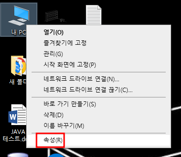

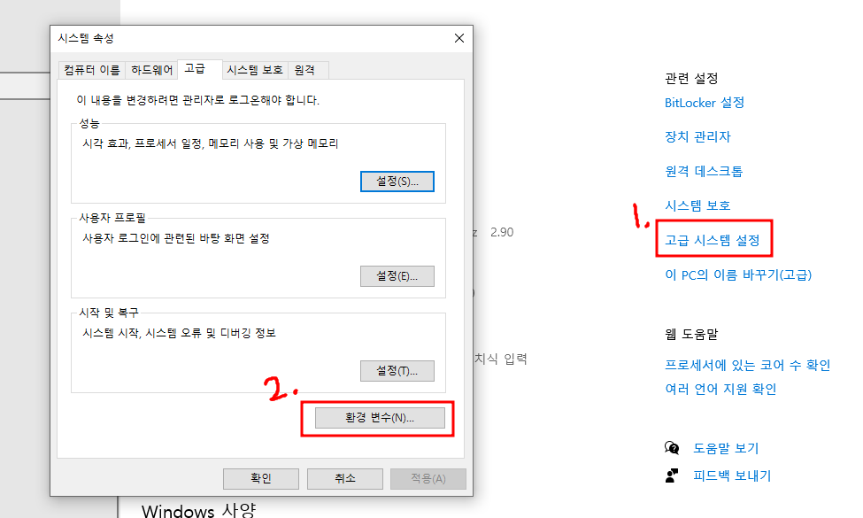

- [시스템 변수]에서 [새로 만들기]를 클릭한다. 변수 이름에 'JAVA_HOME', 변수값에는 자바를 설치한 경로를 찾아주고 확인 버튼을 클릭한다.

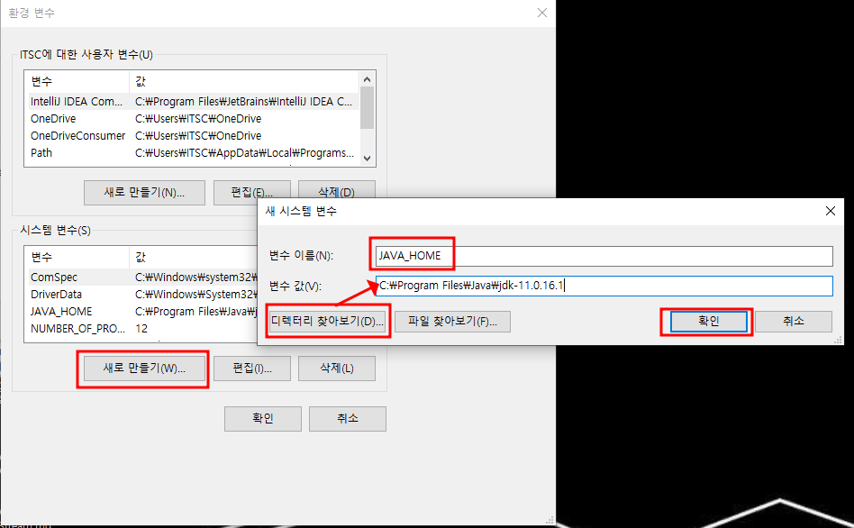

- [시스템 변수]에서 [Path] 환경 변수를 선택하고 [편집]을 클릭한다. 이어서 [새로 만들기]를 클릭한 후 '%JAVA_HOME%\bin'을 입력하고 [확인]버튼을 누른다.

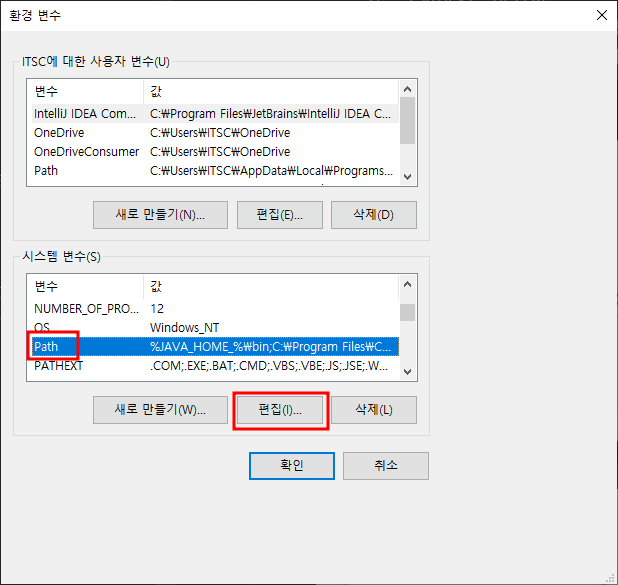

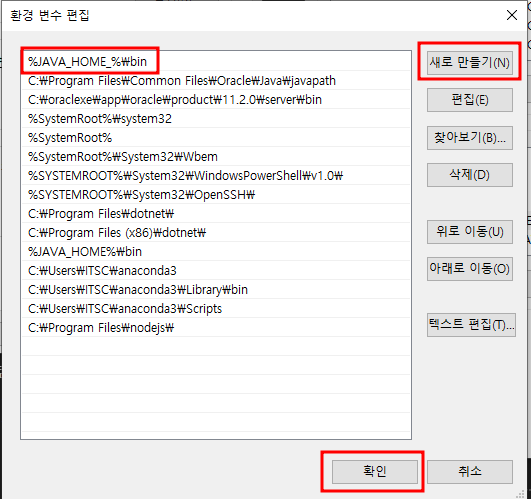

## 자바가 잘 설치되어있는지 확인하는법

win + r -> 실행창에 cmd -> java -version 입력


## 4. 자바의 특징

### 4-1. 운영체제 독립성
- 자바프로그램은 JVM위에서 실행되기 때문에, 윈도우,리눅스,macOS등 어떤 운영체제에서도 동일하게 동작한다.


### 4-2. 객체 지향 언어(Object-Oriented Programming OOP)
- 프로그램을 <b>객체(Object)</b>라는 단위로 나누어 만들고, 객체들끼리 서로 데이터를 주고받으며 동작한다.

#### ※ 객체
- 객체라는 개념이 앞으로 자주 나오게 될 것이다.
- 현실 세계의 사물의 상태(속성)와 행동(기능) 데이터화 시킨것이다.
- 즉, 현실 세계의 대상을 프로그래밍적으로 모델링한 결과물이라고 생각하면된다.

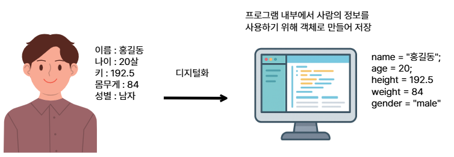

### 4-3. 자동 메모리 관리(Garbage Collection)
- 자바는 사용하지 않는 **메모리**를 자동으로 해제해준다.
- 개발자가 직접 메모리 **주소**를 다룰 필요가 없어 안전하다.

#### ※ 메모리(Memory)
- 컴퓨터가 데이터를 저장하고, 프로그램을 실행하는 공간이다.
- 사람이 글을 쓰기 위해 종이가 필요하듯, 컴퓨터가 프로그램을 실행하려면 메모리가 필요하다.
- RAM(Random Access Memory)라고도 부르며, 프로그램이 실행되는 동안만 데이터를 저장한다.
- 전원을 끄면 RAM에 있던 데이터는 모두 사라진다.


#### ※ 주소(Address)
- 메모리는 칸으로 나눠져 있고, 각 칸에는 고유한 번호가 있다.
- 이 번호를 메모리 주소라고 한다.
- 변수나 객체를 사용할 때, 실제 데이터는 메모리의 특정 주소에 저장된다.

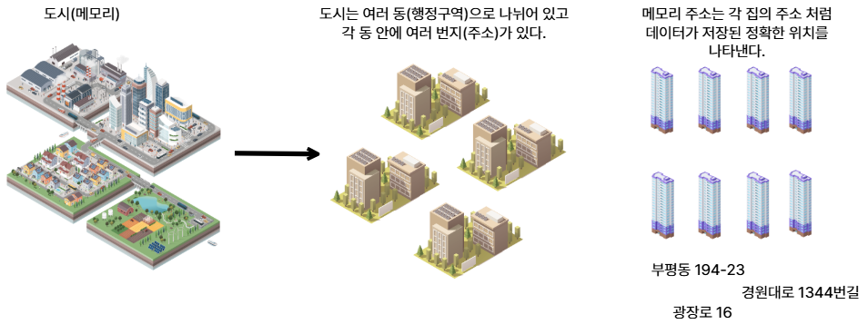

### 4-4. 간결성과 안전성
- C/C++에서 제공하는 복잡하고 위험한 기능(포인터 연산 등)을 제거하여 코드 작성이 단순하고, 오류 가능성을 줄였다.

### 4-5. 풍부한 라이브러리와 API
- 자바는 표준 라이브러리를 통해 문자열 처리, 파일 입출력, 네트워크, 데이터베이스 연결 등 다양한 기능을 제공한다.

## 5. 통합 개발환경
통합 개발 환경(統合開發環境, Integrated Development Environment, IDE)은 코딩, 디버그, 컴파일, 배포 등 프로그램 개발에 관련된 모든 작업을 하나의 프로그램 안에서 처리하는 환경을 제공하는 소프트웨어이다.

### 대중적인 IDE
- 이클립스(Eclipse) : 웹, Java, C, C++
- Visual Studio : C, C++, C#, Python
- Intellij : Java, C/C++
등등 많은 IDE가 있다.

## 6. 이클립스 설치하기
- 이클립스 홈페이지 : https://www.eclipse.org/

- 홈페이지에 접속하여 다운로드 버튼을 누른다.


- 다운로드 버튼 아래 Download Packages를 누른다.


- 오른쪽에서 다른 버전을 고를 수 있다.
- 버전을 골랐다면 Eclipse IDE for Java and Web Developers버전을 다운로드받아야 한다.
- 본인이 사용하고 있는 컴퓨터의 운영체제와 맞는 버전을 다운로드 한다.
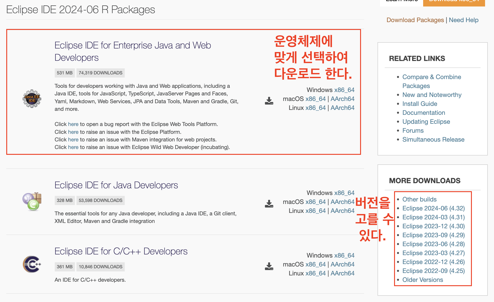

- 다운로드 받은 압축 파일을 util폴더로 옮기고 압축을 푼다.


## 7. 이클립스 실행해보기
```diff
- ※ jdk를 먼저 설치하지 않으면 이클립스가 실행되지 않습니다!!
```
- 이클립스를 켜고 Browse를 눌러 우리가 만들어 놓은 work 폴더로 경로를 잡아주자.
- 앞으로 우리가 작업하는 프로젝트들은 work폴더에 저장될 것이다.


## 8. 이클립스 프로그램 구성


## 9. 자바 프로젝트 생성하기


## 10. 폴더에 해당하는 패키지 생성하기


### 패키지 이름을 적고 finish를 누릅니다.
- section01 이라는 이름으로 패키지를 만들어보자


### 그러면 비어있는 패키지가 생성되게 됩니다.


## 11. 코드를 작성하는 공간인 클래스 생성하기


### 클래스명 작성하기
- 클래스를 작성할 때 클래스의 이름의 첫번째 글자는 반드시 대문자로 작성해야 합니다.
- Hello라는 이름으로 클래스를 생성해보자.


### 자바 프로젝트 구성
1. 프로젝트
	- 모든 소스, 설정, 라이브러리, 실행결과가 들어있다.
2. src 폴더
   - 소스코드가 저장되는 기본 폴더
   - 패키지(package)단위로 폴더가 만들어지고, 그 안에 파일이 위치한다.
   - 작성하는 모든 파일은 이곳에 저장된다.
3. JRE System Library
   - 프로젝트 실행에 필요한 자바 실행 환경(JRE) 라이브러리 묶음
   - 기본적인 기능들이 들어있다.
   - 프로젝트 생성시 자동으로 추가된다.
4. 패키지(package)
   - 관련있는 파일끼리 묶어놓는 폴더 개념
   - src폴더 안에 하위 폴더로 생성된다.
5. 클래스
   - 자바 프로그램의 기본 구성 단위이다.
   - 자바에서 모든 코드는 반드시 클래스 블록 {}안에 있어야 한다.
   - 클래스는 하나의 파일(.java)과 1:1관계이며, 클래스 이름과 파일 이름이 같아야 한다.

```java
// Hello.java
public class Hello { // 클래스 선언 시작
    public static void main(String[] args) { // 프로그램 시작점
        System.out.println("Hello, Java!");
    }
} // 클래스 선언 끝
```

## 12. 클래스 내용 작성하기
- 다음과 같은 코드를 작성한다.
```java
public class Test {
	public static void main(String[] args) {
		
	}
}
```

### main 메서드
- main 메서드는 자바 프로그램의 시작점이다.
- JVM이 프로그램을 실행할 때 가장 먼저 찾는 메서드이며, main 메서드가 없으면 자바 프로그램은 실행되지 않는다.
- 자바에서 코드를 작성해도 main메서드 안에 있어야 실행할 수 있다.
- main메서드는 형식이 정해져 있으며, 변경하면 실행되지 않는다.
```java
public static void main(String[] args)

public : JVM이 어디서든 접근할 수 있도록 공개하겠다는 키워드
static : 객체를 생성하지 않아도 메서드를 사용할 수 있게 해주는 키워드
void : 결과를 반환하지 않는다는 키워드
main : 메서드의 이름
String[] args : 외부에서 전달받는 값을 저장하는 공간
```
### System.out.println("hello world"); 작성해보기
- 항상 명령이 끝난 뒤에는 세미콜론(;)를 붙혀야 한다.
- 세미콜론(;)이 나올 때 까지 한 문장의 실행문으로 인식하기 때문이다.
- 실행을 하기 전에는 ctrl + s를 눌러 꼭 저장을 해주도록 합시다!

```java
public class Test {
	public static void main(String[] args) {
		System.out.println("hello world");
	}
}
```

- 실행단추 Run을 클릭하거나 Ctrl + f11을 누르면 작성한 프로그램을 실행할 수 있다.


### 디버깅(오류 수정하기)
- 프로그래밍 도중 오류가 발생하면 소스 코드 아래 빨간 밑줄이 나타난다.
- 빨간 밑줄이 표시된 부분에 마우스를 가져가면 오류 원인을 확인할 수 있다.

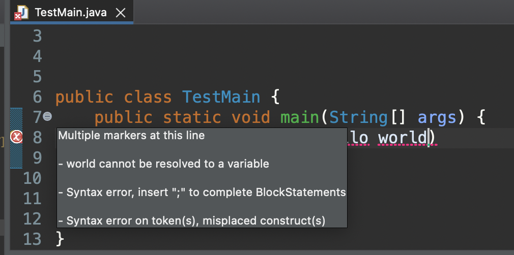

# 자바 프로그램의 실행 프로세스
- 자바 언어로 만들어진 파일을 컴파일 하면서 기계어 파일인 바이트코드(.class)파일이 생성된다.
- 이후 바이트코드를 JVM이 읽고 실행하게 된다.

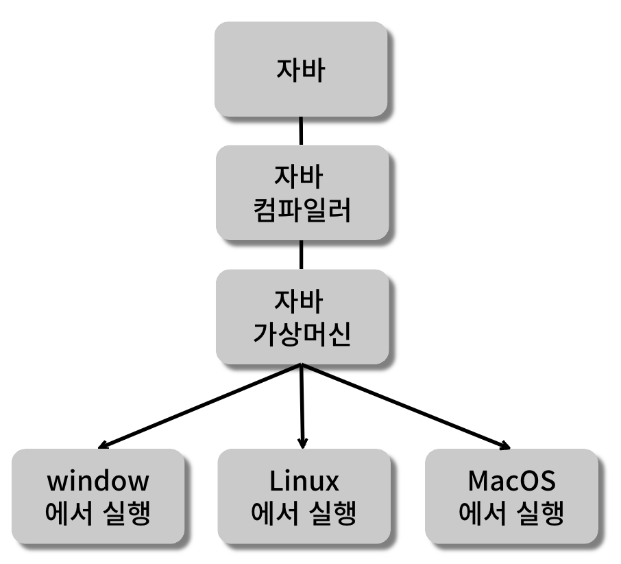

### 자바 컴파일러(Java Compiler)
- 자바 소스 파일을 JVM이  해석할 수 있는 자바 바이트코드(.class)파일로 번역한다.

## 자바 프로그램의 기본 구조
```JAVA
//class : 클래스를 정의하는 키워드
//Hello : 클래스 이름
public class Hello{
	//main : 메서드 이름
	public static void main(String[] args){
		System.out.println("Hello JAVA!!"); //실행문
	}
}
```
### 메서드
- 수행할 작업을 나열한 코드의 묶음
- 자바 프로그램의 시작 위치인 main()메서드를 포함하는 클래스가 반드시 있어야 한다.

### 실행문
- 작업을 지시하는 것으로 변수나 상수의 선언, 값 저장, 메서드 호출 등 다양한 명령어와 연산자로 구성된다.

## 주석
- 프로그램의 소스코드에 프로그래머의 의견이나 설명을 적을 수 있는데 이런 것을 주석(Comment)라고 합니다.
- 주석은 프로그램 소스에 삽입하더라도 프로그램의 수행에 전혀 영향을 끼치지 않습니다.
- 컴퓨터(JVM)에서 컴파일을 할 시 인식하지 못하는 코드이기 때문입니다.
- 주석으로 코드를 잘 설명해놓으면 오류를 찾거나 복잡한 코드를 이해하기 쉽고 다른 개발자가 코드를 해석하는데 도움이 된다.

### 주석의 종류
#### // (행주석)
- //부터 그 줄의 끝까지 주석으로 처리, 주석 내용이 한줄일 때 사용
#### /* \*/ (범위 주석)
-  /* 와 */ 사이의 내용을 모두 주석으로 처리, 여러 줄의 주석이 필요할 때 사용

```java
public class Test {
	public static void main(String[] args) {
	    //한줄 주석 : //
	    /*
	    여
	    러
	    줄
	    주
	    석
	    */
	    //주석을 사용하는 이유 : 코드에 설명을 달아주기 위해
	    //sysout 적고 ctrl + spacebar 자동완성
		System.out.println("hello world");
	}
}
```

#### // TODO
- 아직 해결되지 않은 작업이나 구현해야할 부분을 나타내는 주석 태그
```java
// TODO : 추후에 하드코딩을 개선해야 합니다.
```

#### //FIXME
- 수정이 필요한 버그, 오류, 또는 잘못된 동작을 나타내는 주석 태그
- FIXME 주석 태그를 포함하고 어떤 문제가 있는지 설명하고 이를 해결해야 하는 이유를 기록한다.
- 코드나 문서를 검토할 때 빠른 수정이 필요한 부분을 강조하는데 사용된다.
```java
// FIXME : 해당 코드에서는 런타임 오류가 발생합니다. 수정해야 합니다.!
```

#### //XXX
- 다른 개발자가 알아봐야 할 중요한 이슈 또는 경고를 나타내는 주석 태그를 의미
- XXX와 함께 어떤 문제가 있는지 설명하고 이를 처리해야 하는 이유를 기록한다.
- 코드나 문서를 검토할 때 주의해야 할 부분을 강조하는데 사용되며 주로 버그 또는 잠재적인 문제를 가리키는 데 사용되며 개선이 필요한 부분을 의미한다.
```java
// XXX : 해당 부분이 하드코딩 된 것 같습니다. 수정해야 합니다.
```

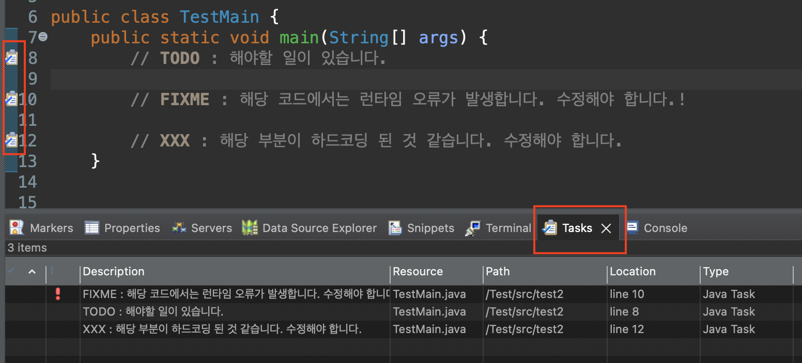

#### /** 주석문 */
- 줄 수 와 상관없이 /** 시작과 */ 사이의 내용을 모두 주석으로 간주한다. 이 주석은 소스를 라이브러리로 만들 때 공식 문서용으로 뽑아 사용할 수 있다. javadoc 시스템을 사용하여 API 문서나 도움말 등에 이용된다.

# 프로그램의 구성
- 컴퓨터 프로그램은 데이터(data)와 명령어(instruction)의 결합으로 구성된다.

## 1. 데이터
- 실제적인 값을 의미한다.
- 숫자,문자와 같은 단순한 데이터부터 사진,영상등의 복합적인 데이터가 있다.
- 데이터는 언제든지 수정할 수 있어야 하며, 사용목적에 따라 다른 형태로 가공할 수 있어야 한다.
- 이러한 데이터는 컴퓨터의 메모리에 저장된다.

## 2. 데이터의 출력
```java
System.out.print() : 괄호안의 내용을 출력한다.
System.out.println() : 괄호안의 내용을 출력하고 줄을 바꿔준다(개행)
```
- System.out.print(),System.out.println() 출력문은 모든 데이터를 문자열로 인식하여 있는 그대로 출력하는 메서드이다.

### 2-1. System.out.print()
```java
package test;

public class Test{
	public static void main(String[] args) {
		//괄호()안의 데이터를 콘솔창에 출력
		System.out.print("Welcome");
		//"Welcome"문자열 옆에 "Java World"문자열 출력
		System.out.print("Java World");
	}
}
```
### 2-2. System.out.println()
```java
package test;

public class Test{
	public static void main(String[] args) {
		//괄호()안의 데이터를 콘솔창에 출력
		System.out.println("Welcome");
		//"Welcome"문자열 아래 "Java World"문자열 출력
		System.out.println("Java World");
	}
}
```

### 2-3. System.out.printf() 
```java
System.out.printf()
```
- System.out.printf() 출력문은 값의 자료형에 따라 서식문자를 이용해 문자열속에서 데이터를 출력할 수 있다.

|서식문자|출력형태|
|-----|------|
|%d|정수(10진수)|
|%o|정수(8진수)|
|%x|정수(16진수)|
|%f|실수|
|%s|문자열|
|%c|문자형|
|%b|논리형|

### Printf01 클래스 생성하기
```java
package test;

public class Printf01{
	public static void main(String[] args) {
		System.out.printf("저는 대학교 %d학년에 재학중입니다.",3);
		
		//서식문자를 한번에 여러개를 넣을 수 있다.
		System.out.printf("%d은 첫 번째, %f은 두 번째, %s은 세 번째.",1,2.0,"셋");
	}
}
```
### 2-4. 출력값의 정렬
- 정수의 정렬
```java
%3d, %5d //주어진 숫자 칸 만큼 확보한후, 오른쪽 정렬하여 출력
예) (%5d,1) -> XXXX1

System.out.printf("%5d",1);
System.out.println();
System.out.printf("%5d",12);
System.out.println();
System.out.printf("%5d",123);
System.out.println();
System.out.printf("%5d",1234);
System.out.println();
System.out.printf("%5d",12345);
System.out.println();
```
- 실수의 정렬

```java
%.2f //소수점 아래 정수번째 자리까지 출력(반올림)

System.out.printf("%.1f",1.1234567);
System.out.println();
System.out.printf("%.2f",1.1234567);
System.out.println();
System.out.printf("%.3f",1.1234567);
System.out.println();
System.out.printf("%.4f",1.1234567);
System.out.println();
System.out.printf("%.5f",1.1234567);
```
# 자료형(기본자료형)
- 현실에서는 물을 종이컵에다 마시든, 플라스틱 컵에다 마시든, 유리컵에다 마시든 전혀 문제가 되지 않습니다.
- 하지만 프로그래밍에서는 '물은 종이컵에 담아먹겠다' 라고 약속을 했으면 무조건 지켜야 합니다.
- 프로그래밍에서 자료형은 데이터를 담을 컵의 크기와 재질이라고 비유를 들 수 있습니다.
- 자료형(data type)은 자바가 처리할 수 있는 데이터의 종류를 의미한다.

## 1. 기본자료형
- 실제 데이터 값을 저장할 수 있게 해줍니다. 정수,실수,문자,논리 타입으로 분류된 8개의 자료형이 존재한다.
- 각 타입에 저장되는 값의 허용 범위를 모두 외울 필요는 없지만 메모리 할당 크기는 알고있는것이 좋다.

|자료형|키워드|메모리 크기|표현 범위|
|------|------|----------|-----------|
|논리형|boolean|1bit|true, false(기본값 false)|
|문자형|char|2byte|기본값 \u0000 or 0|
|정수형|byte<br>short<br>int<br>long<br> |1byte<br>2byte<br>4byte<br>8byte |-128 ~ 127<br>-32,768 ~ 32,767<br>-21,4748,3648 ~ 21,4748,3647<br>-9,223,372,036,854,775,808 ~ (900경)|
|실수형|float<br>double<br>|4byte<br>8byte<br>|기본값 0.0|

```diff
float
메모리를 덜 사용하면서 소수점을 포함한 숫자를 다룰 때 적합
하지만 정확도가 제한적이기 때문에 금융 계산이나 높은 정밀도가 필요한 작업에 부적합

double
훨씬 더 넓은 범위와 높은 정확도를 제공
과학적 계산, 통계, 시뮬레이션 등에서 사용
```
### 1-1. 논리형(boolean)
- 참(true) 또는 거짓(false)만 저장하는 자료형
- 메모리 크기 : 1bit
- 기본값 : false
- 표현범위 : true, false
- 특징 : 조건을 판별할 때 많이 사용한다.

### 1-2. 문자형
- 하나의 문자를 저장하는 자료형. 유니코드(Unicode)사용
- 메모리 크기 : 2byte
- 기본값 : \u0000 (유니코드 값 0, null 문자)
- 표현 범위 : 0 ~ 65,535(유니코드 값)
- 특징 : 문자뿐 아니라 정수 값(유니코드)도 저장 가능

### 주의점
- 정수의 경우 해당 자료형이 표현할 수 있는 범위를 벗어난 데이터를 저장하면, 오버플로우(overflow)가 발생해 전혀 다른 값이 저장될 수 있다.

#### 오버플로우 / 언더플로우
- 오버플로우는 해당 자료형이 표현할 수 있는 최대 범위보다 큰 수를 저장할 때 발생하는 현상으로 잘못된 결과를 얻을 수 있다.
- 언더플로우는 해당 자료형이 표현할 수 있는 최소 범위보다 작은 수를 저장할 때 발생하는 현상이다.

## 참조자료형
- 메모리상에 데이터가 저장된 주소를 저장하기 위한 공간으로, 대표적으로 문자열을 저장하는 String이라는 자료형을 예로 들 수 있다.
- 참조 자료형은 개발자가 직접만들어 추가할 수 있는 자료형으로 그 수가 정해져 있지 않다.

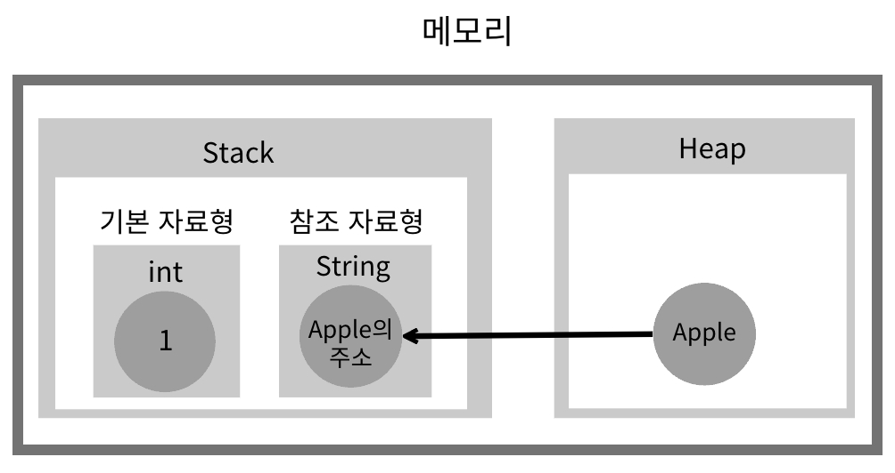

- 프로그램을 실행할 때 필요한 메모리는 Stack과 Heap으로 나뉘어져있다.
- 기본 자료형은 Stack이라는 공간에 자리를 할당받고 데이터를 저장한다.
- 참조 자료형은 Heap이라는 공간에 데이터를 저장하고, 그 주소를 Stack에 저장한다.
- 주소를 참조하여 저장한다고 하여 참조 자료형이라고 한다.

|자료형|키워드|
|------|-----|
|문자열|String|

## 여러가지 형태의 데이터 출력해보기

```java
public class Test {
	public static void main(String[] args) {
		    //한줄 주석 : //
		    /*
		    여
		    러
		    줄
		    주
		    석
		    */
		    //주석을 사용하는 이유 : 코드에 설명을 달아주기 위해
		    //sysout 적고 ctrl + spacebar 자동완성
		System.out.println("hello world");
		System.out.println(100);
		System.out.println(100+50);
		
		//문장뒤에 숫자를 더하면 문장 뒤에 붙는구나
		System.out.println("안녕하세요"+10);
		
		//코드는 항상 위에서 아래로, 좌에서 우로 진행이 되기 때문에 15:15가 나옵니다.
		System.out.println(5+10+":"+(5+10));
		
		// "2 + 2 = "가 숫자 처럼 보이지만 ""안에 묶여있으면 문장 취급을 받고
		//문장에 숫자를 더했기 때문에 22가 됩니다.
		System.out.println("2 + 2 = " + 2 + 2);
		System.out.println("2 + 2 = " + (2 + 2));	 
	}
}
```

# 변수
- 컴퓨터는 프로그램을 실행하는 데 필요한 것들을 미리 올려놓고 사용하는 저장공간이 있다.
- 우리는 그 공간을 메모리라고 부른다.
- 개발자는 프로그램을 만들고 실행하는 데 필요한 값들을 메모리에 저장해두고, 필요할 때마다 꺼내서 사용한다.
- 저장하고자 하는 값을 무질서하게 저장하는 것이 아닌, 메모리의 규칙 속에서 일부 공간을 할당받아야 한다.
- 메모리에 값을 저장하기 위해 할당해 놓은 특정 공간을 변수라고 한다.

## 1. 변수의 선언
- 변수를 사용하기 위해서는 변수를 선언해야 한다.
- 변수를 선언하기 위해서는 메모리에 두가지 정보가 필요하다.
  - 첫번째는 변수에 담을 데이터의 형태
  - 변수의 이름

```java
자료형 변수명;
```

## 2. 변수명 명명 규칙
- 사용 용도를 최대한 명확하게 보여줄 수 있는 이름이라면, 개발자가 마음대로 지정할 수 있지만 다음과 같은 규칙을 지켜야 한다.
```
1. 숫자가 먼저 들어가면 안된다.
2. 영어 대소문자를 구분한다(Name과 name은 다른 변수라고 인식한다)
3. 일반적으로 영어소문자로 시작한다.
4. _를 제외하고 특수기호가 포함될 수 없다.
5. 예약어 금지(switch, while 등)
6. 한글은 사용하지 말 것.
```
- 변수명은 문자 수의 제한이 없으므로 최대한 변수의 의미를 쉽게 파악할 수 있도록 구체적으로 명명하는것이 좋다.

### 표기법
- 변수명은 문자 수의 제한 이 없으므로 최대한 변수의 의미를 쉽게 파악할 수 있도록 구체적으로 명명하는 것이 좋다.

#### 카멜 표기법(camel case)
- 두번째 단어부터 첫글자를 대문자료 표기하는 방법
- 마치 낙타의 등처럼 올라갔다 내려갔다 하는 모양이라 붙혀진 이름
```java
userName
phoneNumber
```

#### 스네이크 표기법(snake case)
- 모든 단어가 소문자로 시작하고, 단어와 단어 사이는( _ ) 로 연결하는 방식
```java
user_name
phone_number
```
## 3. 변수에 데이터 입력하기
- 개발자가 데이터 값이 필요할 때 데이터의 값을 직접 사용하는 대신, 데이터를 변수에 저장해두고 변수의 이름을 호출하여 그 값을 사용할 수 있게 해준다.

### 변수에 데이터를 저장하는 방법
- = 기호를 사용하면 된다.
- 수학에서는 좌변과 우변이 같다는 의미이지만 프로그래밍에서는 우변에 값을 좌변에 대입하겠다는 의미를 가지고 있다.

### Variable02 클래스 생성하기
```java
public class Variable02{
	public static void main(String[] args){
		int studentAge; //학생의 나이를 저장할 수 있는 변수의 선언
		studentAge = 20; //변수에 값을 대입(저장)

		System.out.println(studentAge);
	}
}
```
- 위처럼 변수를 선언하고 처음으로 값을 대입하는 것을 '초기화'라고 한다.
- 초기 + 화 (initialization)이라는 뜻이다.
- 변수를 선언하고 초기화를 하는 작업을 한 줄로 쓸 수 있다.

### Variable03 클래스 생성하기
```java
public class Variable02{
	public static void main(String[] args){
		String myCity = "Seoul"; //도시를 저장할 수 있는 변수를 선언하고, 변수에 "Seoul"을 대입했다.

		System.out.println("I am from " + myCity);
	}
}
```

### Variable04 클래스 생성하기
```java
----------------------------------------------------------------
논리형
논리형은 true, false 즉, 사실이다와 사실이 아니다의 두 가지 값만을 가진다.
boolean b = true;
System.out.println("b의 값 : " + b); //+기호는 더한다는 의미가 아닌 이어붙인다의 의미.
//단, 숫자 사이의 + 기호는 더하기를 의미.
boolean b = 1;//자료형의 값이 올바르지 않아 오류
-----------------------------------------------------------------

문자형
char ch = 'A'; //문자형은 홑따옴표 안에 넣어야 하며 한글자이상 넣을 수 없다.
System.out.println("ch = " + ch); //결과 : A

char ch3 = 65 + 1; //아스키코드 65에 + 1
System.out.println("ch3 = " + ch3); //결과 : B


-----------------------------------------------------------------

정수형
//byte b = 128; byte자료형의 표현범위를 벗어나므로 오류가 난다.

byte b1 = 127;
short s = 32767;
int n = 550;

System.out.println("b1 = " + b1); //결과 127
System.out.println("s = " + s); //결과 32767
System.out.println("n = " + n); //결과 550
-----------------------------------------------------------------
실수형(소수)
//float f = 3.14;
//java에서 실수는 기본적으로 double형으로 인식하기 때문에 float자료형을 사용한다는 것을 명시해줘야 한다. (3.14f)

float f1, f2;
f1 = 3.14f;

System.out.println("f1 = " + f1); //결과 3.14 
System.out.println("f2 = " + f2); //결과 150.0
----------------------------------------------------------------
//변수를 이용해 다른 변수에 복사하기

int myAge = 20; //myAge에 20을 저장
int yourAge = myAge; //myAge에 저장된 20이 복사되어 yourAge에 저장된다.

----------------------------------------------------------------
//두 변수에 들어있는 값을 바꾸려면 어떻게 해야할까??
int su1 = 20;
int su2 = 30;

System.out.println("변경전");
System.out.println("su1 : " + su1);
System.out.println("su2 : " + su2);

//컵 두개에 들어있는 내용물을 서로 교환한다고 생각을 해보자.
//컵 두개로는 서로 바꾸는게 불가능하다.
//내용물을 임시로 담아놓을 컵이 하나 필요하다.
int temp;
temp = su1;
su1 = su2;
su2 = temp;

System.out.println("변경후");
System.out.println("su1 : " + su1);
System.out.println("su2 : " + su2);

```

## 5. 변수의 사용 범위
- 모든 변수는 만들어진 중괄호 안에서만 사용할 수 있다.

### Variable05클래스 생성
```java
public class Variable05{
	public static void main(String[] args){
		String favoriteFood;
	}

	favoriteFood = "돈까스"; //오류 발생
}
```


# 형변환
- 자료형을 다른 자료형으로 변환하는 것을 말한다.
- 모든 연산은 기본적으로 같은 자료형들끼리만 수행할 수 있다.
- 따라서 서로 다른 자료형의 연산을 수행하기 위해서는 같은 자료형으로 변환해야 한다.

### Casting01 클래스 생성하기
```java
public class Casting01{
	public static void main(String[] args){
		int num1 = 11;
		double num2 = 3.14;
		double num1Change = (double)num1;

		System.out.println("num1 : " + num1);
		System.out.println("num1Change : " + num1Change);
		System.out.println((int)1.23);
	}
}
```
- 형 변환은 숫자를 담을 수 있는 기본 자료형간에만 가능하다.
- 즉, 정수인 byte,short,int,long,float,double형 간에만 가능하며, 문자형인 char역시 문자형인 동시에 정수이기도 하므로 형 변환을 할 수 있다.

## Promotion(자동형변환)
- 서로 다른 자료형간의 대입이나 연산을 할 때 형 변환으로 자료형을 일치시켜야 하지만 다음과 같은 경우 자바의 컴파일러가 자동으로 형 변환을 해주기 때문에 생략할 수 있다.
### 작은 자료형에서 큰 자료형으로 변환할 때
  - ### 정수형
    - byte -> short -> int -> long
  - ### 실수형
    - float(4바이트) -> double(8바이트)
### 정수형이 실수형으로 변환 될 때

### Casting02클래스 생성하기
```java
package test2;

public class Casting02 {
	public static void main(String[] args) {
		int num1 = 14;
		double num2 = 3.14;
		
		double num4 = num1;//num1을 자동으로 double로 형 변환 해줌
		
		//int num3 = (double)num2;//자동 형 변환을 할 수 없는 역방향! 컴파일에러 발생
		int num3 = (int)num2;
		
		System.out.println(num4);
	}
}
```
### Casting03클래스 생성하기
```java

package test2;

public class Casting03 {
	public static void main(String[] args) {
		int i = 100;
		char c = 'a';
		int j = c; //char형에서 int형으로 자동 변환
		double d = i; //int형에서 double형으로 자동 변환
		
		System.out.println("int형 변수 j의 값 : " + j);
		System.out.println("double형 변수 d의 값 : " + d);
	}
}
```

## Demotion(강제형변환)
- 큰 컵의 물을 작은 컵에 옮겨 담는것과 같다.
- 물의 양에 따라서 보존될 수도 있지만 넘칠수도 있다.
- 큰 자료형에서 작은 자료형으로 옮길 때 데이터의 손실이 발생할 수도 있고 아닐 수도 있다.
- 데이터의 손실이 일어난다면 정확한 연산을 수행할 수 없기 때문에 예상하지 못한 결과를 얻을 수 있으므로 강제 형변환은 항상 주의할 필요가 있다.

### 형변환 방법
```java
(원하는 자료형) 데이터or 변수;
```

### Casting04클래스 생성하기
```java
package test2;

public class Casting04 {
	public static void main(String[] args) {
		//int -> byte형 강제 형변환(값이 작을 경우)
		int i = 10;
		byte b = (byte)i;
		System.out.println("[int -> byte] i의 값 : " + i + " b의 값 : " + b);
		
		//int -> byte형 강제 형변환(값이 큰 경우)
		int j = 1000;
		byte c = (byte)j;
		System.out.println("[int -> byte] j의 값 : " + j + " c의 값 : " + c);
	}
}

```

### Casting05클래스 생성하기
```java
package test2;

public class Casting05 {
	public static void main(String[] args) {
		
		//double -> float형 강제 형변환(float형 범위 내 값)
		double d1 = 1.1234;
		float f1 = (float)d1;
		System.out.println("[double -> float] d1의 값 : " + d1 + ", f1의 값 : " + f1);
		//범위 값 내에서 강제 형 변환을 실행하면 데이터의 손실 없이 변환된다.
		
		//double -> float형 강제 형변환(float형 최소값보다 작은 값)
		double d2 = 1.0e-50;
		float f2 = (float)d2;
		System.out.println("[double -> float] d2의 값 : " + d2 + ", f2의 값 : " + f2);
		//float형이 가질 수 있는 최소값보다 작은 경우 0.0이 된다.
		
		//double -> float형 강제 형변환(float형 최대값보다 큰 경우)
		double d3 = 1.0e100;
		float f3 = (float)d3;
		System.out.println("[double -> float] d3의 값 : " + d3 + ", f3의 값 : " + f3);
		//float형이 가질 수 있는 최대값보다 큰 경우 Infinity가 된다.
		
		//double과 float형의 정밀도 차이
		double d4 = 9.123456789;
		float f4 = (float)d4;
		System.out.println("[정밀도차이] d4의 값 : " + d4 + ", f4의 값 : " + f4);
		//float형 범위 내 값이지만 소수점 아래 값에서는 정밀도에서 차이가 난다.
	}
}
```

### Casting06클래스 생성하기
```java
package test2;

public class Casting06 {
	public static void main(String[] args) {
		//float -> int 강제 형변환
		float f1 = 12345.67f;
		int i1 = (int)f1;
		System.out.println("[float -> int] f1의 값 : " + f1+", i1의 값 : " + i1);
		
		//float -> int 강제 형변환
		double d1 = 12345.67;
		int i2 = (int)d1;
		System.out.println("[double -> int] d1의 값 : " + d1+", i2의 값 : " + i2);	
	}
}

```

## 자바의 특징
```java
짚고 넘어갈 자바의 장점(신기함)
byte b1 = 100;
byte b2 = 20;
byte b3 = b1 + b2; //오류남.

int b3 = b1 + b2; //이렇게 수정
```
- byte의 표현 범위가 127까지 밖에 되지 않다보니, byte끼리의 연산은 127을 넘어가버릴 가능성이 높다.
- 이런 상황을 대비하여 java개발자들은 byte끼리의 연산이 수행될 때, int형 변수로 값을 받도록 만든다.

# 데이터의 입력
- 키보드를 통해 다양한 데이터를 자유롭게 입력하는 방법이 있다.
- 키보드를 통해 입력하는 데이터를 문자열로 얻기 위해서는 'java.util'패키지에 있는 Scanner클래스를 이용해야 한다.
```java
import java.util.Scanner; //Scanner클래스 호출
Scanner 객체명 = new Scanner(System.in); //Scanner 객체 선언
int 변수명 = 객체명.nextInt(); //정수 입력받기
```
<table>
<tr>
	<th>자료형</th>
	<th>메서드</th>
	<th>설명</th>
</tr>
<tr>
	<td rowspan = "4">정수형</td>
	<td>byte nextByte()</td>
	<td>입력받은 값을 byte형으로 반환</td>
</tr>
<tr>
	<td>short nextShort()</td>
	<td>입력받은 값을 short형으로 반환</td>
</tr>
<tr>
	<td>int nextInt()</td>
	<td>입력받은 값을 int형으로 반환</td>
</tr>
<tr>
	<td>long nextLong()</td>
	<td>입력받은 값을 long형으로 반환</td>
</tr>
<tr>
	<td rowspan = "2">실수형</td>
	<td>float nextFloat()</td>
	<td>입력받은 값을 float형으로 반환</td>
</tr>
<tr>
	<td>double nextDouble()</td>
	<td>입력받은 값을 double형으로 반환</td>
</tr>
<tr>
	<td rowspan="2">문자형</td>
	<td> String nextLine()</td>
	<td>입력받은 라인 전체를 문자열 타입으로 반환.enter키로 구분</td>
</tr>
<tr>
	<td>String next()</td>
	<td>입력받은 값을 문자열 타입으로 반환. 띄어쓰기로 구분</td>
</tr>
 
</table>

## 데이터 입력받기
```java
//Scanner 객체명 = new Scanner(System.in);
Scanner sc = new Scanner(System.in);
System.out.print("나이를 입력해주세요");

//자료형 변수명 = 객체명.Scanner함수();
int age = sc.nextInt();

System.out.printf("제 나이는 %d세 입니다.",age);
```
```java
//Scanner 객체명 = new Scanner(System.in);
Scanner sc = new Scanner(System.in);
String name,address;
int age;
double weight;
System.out.print("이름 : ");
name = sc.next();
System.out.print("나이 : ");
age = sc.nextInt();
System.out.print("주소 : ");
address = sc.next();
System.out.print("체중 : ");
weight = sc.nextDouble();

System.out.printf("당신의 이름은 %s입니다.\n",name);
System.out.printf("당신의 나이는 %d입니다.\n",age);
System.out.printf("당신의 주소는 %s입니다.\n",address);
System.out.printf("당신의 체중은 %.1fkg입니다.\n",weight);
```

# 연산자(Operator)
- 연산이란 데이터를 처리하고 결과를 산출하는 작업을 말한다.
- 연산은 항(피연산자)과 연산자로 이루어진다.
- 항은 연산에 사용되는 값을 의미하며, 연산자는 기호를 의미한다.
- 항과 연산자를 이용해 연산 과정을 나열한 것을 연산식(expression)이라고 합니다.


## 기본 연산자의 종류
- 자바는 사칙연산을 비롯해 다양한 연산자를 제공하고 있다.
- 피연산자의 개수에 따라 단항,이항,삼항 연산자로 분류할 수 있다.
- 사용 목적에 따라 산술,증감,대입,비교,논리, 비트,증감등으로 분류할 수 있다.

## ex1_operator 패키지 생성
|종류|연산자|기능|
|----|------|-----|
|최고연산자연산자|. , ()| 괄호 연산 먼저 계산|
|증감연산자연산자| ++, --| 1씩 증감|
|산술연산자연산자|+,-,*,/,%|사칙연산,나머지계산|
|시프트연산자|>>,<<| 비트의 이동|
|비교연산자| >, <, >=,<=,==,!= | 두 값의 비교|
|논리연산자| &&,\|\|\,!|논리의 연산|
|비트연산자|&,\|,~,^ |비트단위의 논리연산|
|대입연산자|=, +=,-=,/=,*=,%=|우변의 값을 좌변에 대입|
|삼항연산자|조건식? A : B| 조건식의 결과에 따라 A와 B선택|

# 단항연산자
- 단항연산자는 피연산자가 한 개인 연산자를 말하며, 부호연산자(+,-), 증감 연산자(++,--),논리 부정 연산자(!)가 있다.

## 1. 부호연산자
### Operator01클래스 생성하기
```java
package test2;

public class Operator01 {
	public static void main(String[] args) {
		int x = 100;
		int resultPlus = +x; //+부호
		int resultMinus = -x; //-부호
	
		System.out.println(resultPlus);
		System.out.println(resultMinus);

		double d = 1.11; //기본값이 +이기 때문에 생략 가능하다.
		double result = -d;
		
		System.out.println(-d);
		System.out.println(result);
	}	
}
```

## 2. 증감연산자.
- 1씩 증가시키거나 1씩 감소시키는 연산자.
- ++
  - 1을 증가시키는 연산자로 피연산자의 값을 1 증가시키는, 피연산자+1과 같은 연산이다.
- \--
  - 1을 감소시키는 연산자로, 피연산자-1과 같은 연산이다.

### Operator02클래스 생성하기
```java
package test2;

public class Operator02 {
	public static void main(String[] args) {
		
		//선행증감
		//1이 먼저 증감되고 코드에 즉시 반영되어 실행
		int a = 10;
		System.out.println("a : " + ++a); //결과 11
		
		
		//후행증감
		//코드가 먼저 실행되고 1이 증감
		//다음에 다시 사용될 때 증감값을 반영한다.
		int b = 10;
		System.out.println("b : " + b++); //결과 10
		System.out.println("b++ : " + b); //결과 11

		char alphabetA = 'A'; //아스키 정수 65가 저장되어 'A'와 매핑
		System.out.println(alphabetA++);//코드가 실행된후 65+1이 됨
		System.out.println(alphabetA);//66값인 B가 출력이 된다.

		//오버플로우와 언더플로우
		//정수 타입 연산에서 오버플로우 또는 언더플로우가 발생하면
		//실행에러가 발생할 것 같지만 해당 정수 타입의 최소값 또는
		//최대값으로 되돌아간다.
		byte value = 127;
		value++;
		System.out.println(value);

		byte value2 = -128;
		value2--;
		System.out.println(value2);

	}
}
```

## 3. 논리 부정 연산자
- boolean값을 가지는 피연산자 앞에 !를 붙여서 값을 반대로 바꾸는 역할을 한다.
- true를 false로, false를 true로 바꿔준다.

### Operator03클래스 생성하기
```java
package test2;

public class Operator3 {
	public static void main(String[] args) {
		
		boolean isHuman = false;
		System.out.println(!isHuman);//true
		System.out.println(isHuman);//false
		
	}
}
```
- 주의할 점은 논리 부정 연산자를 사용하더라도 그 사용한 곳에서만 적용될 뿐 진짜 변수의 값이 바뀌어 저장되는 것은 아니다.

# 이항연산자
- 피연산자가 2개인 연산자를 말한다.
- 일반적으로 연산자를 가운데 두고 피연산자가 왼쪽, 오른쪽에 위치한다.

## 1. 산술연산자
- 산술연산자는 4칙연산(+,-,*,/)과 나머지 값을 구하는 연산자로 나뉜다.
- 프로그래밍에서 곱셈은 x가 아닌 *, 나눗셈은 / 기호를 사용한다.

### Operator04클래스 생성하기
```java
package test2;

public class Operator04 {
	public static void main(String[] args) {
		
		int x = 100;
		int y = 200;
		
		System.out.println(x + y);// 100 + 200
		System.out.println(x - y);// 100 - 200
		System.out.println(x * y);// 100 * 200
		System.out.println(x / y);// 100 / 200 정수형의 계산으로 0.5가 아닌 0을 반환
		System.out.println(x % y);// 100 % 200

		//계산 결과가 표현범위를 벗어나면 오버플로우가 발생하거나 쓰레기 값이 입력된다.
		int result = 1000000 * 100000;
		System.out.println(result);
		
	}
}

```

### 산술변환
- 기본적으로 이항 연산자의 연산은 두 피연산자의 타입이 일치해야 연산이 가능하다.
- 컴퓨터는 서로 다른 타입을 계산하지 못하므로 값의 손실이 적은쪽으로 타입을 맞춰준다.

```java
long + int -> long + long -> long
float + int -> float + float -> float
double + float -> double + double -> double
```


## 2. 대입연산자
- 우변의 값을 좌변에 대입을 한다 라고 생각하자!

### Operator05클래스 생성하기
```java
int n1 = 10; //n1이라는 int형 변수에 10이라는 정수를 대입함.
int n2 = 7;
System.out.println("=연산자: n1 = " + n1 + ", n2 = " + n2);
```
### 복합대입연산자 
- 산술연산자와 대입연산자가 합쳐진 형태, +=,-=,*=,/=,%=
- A = A +,-,*,/,% B 와 같은 의미이다.
```java
package test;

public class Test{
	public static void main(String[] args) {
		int x = 10;
		int y = 1;
		
		y += x; // y = y + x; -> y = 1 + 10;
		System.out.println(y); //11
		
		y *= x; // y = y * x -> y = 11 * 10;
		System.out.println(y); //110
		
		y %= x; //y = y % x; -> y = 110 % 10;
		System.out.println(y); //0
	}
}
```

## 3. 관계(비교)연산자
- 변수나 상수의 값을 비교하여 참과 거짓을 판단하는 연산자.
- 결과가 항상 true나 false로 반환된다. (반환을 받는다는건 연산식 자체가 반환값 데이터로 바뀌게 된다)
### Operator06클래스 생성
```java
package test2;

public class TestMain {
	public static void main(String[] args) {
		
		int a = 10;
		int b = 20;
		
		System.out.println(a > b);
		System.out.println(a <= b);
		System.out.println(a == b);
		System.out.println(a != b);
		
	}
}
```
## 3. 논리연산자
- 피연산자를 두개 필요로 하는 연산자이다.
- 피연산자로 boolean형 데이터만 사용가능하다.

|연산자|논리식|연산내용|
|-----|-----|--------|
|&&|논리곱(AND)|두 항이 모두 참이면 true, 아니면 false)|
|\|\||논리합(OR)|두 항 중 하나라도 참이면 true, 아니면 false|
| ! | 부정(not) | 참을 거짓으로, 거짓을 참으로 연산|

### &&은 And의 의미를 가지고 있다. 앞 뒤의 연산이 모두 True여야 True를 반환한다.
```java
int myAge = 30;
int limit = 35;

//&&은 앞쪽의 연산이 false일때 뒤쪽연산을 수행하지 않고 넘어간다.
//&&는and의 뜻. '~하고'라는 의미로 이해하면 도움이 된다.
//참 && 참 = 참
//참 && 거짓 = 거짓
//거짓 && 참 = 거짓
//거짓 && 거짓 = 거짓
//둘 다 참일때만 참
boolean result = (limit - myAge) >= 5 && myAge > 30;
System.out.println("&&연산결과: " + result);
```
### ||는 Or의 의미를 가지고 있다. 앞 뒤의 연산중 하나만 True이어도 True를 반환한다.

```java
int n1 = 10;
int n2 = 20;
//||은앞쪽의연산이false여도 뒤쪽연산을수행한다.
//||는or의 뜻. '~거나'라는의미로이해하면도움이된다.
//참 || 참 = 참
//참 || 거짓 = 참
//거짓 || 참 = 참
//거짓 || 거짓 = 거짓

//한쪽만 참이어도 참
boolean result2 = (n1 += 10) > 20 || n2 - 10 == 11;
System.out.println("||연산결과: " + result2);
```

### !는 not의 의미를 가지고 있다. True를 False로 False를 True로 바꿔준다.
```java
System.out.println("true의 부정 : " + !true);
System.out.println("false의 부정 : " + !false);

Scanner sc = new Scanner(System.in);

System.out.print("정수 하나 입력 : ");
int num = sc.nextInt();

System.out.println("입력한 정수가 짝수인가? " + !(!(num % 2 == 0)));
System.out.println("입력한 정수가 짝수인가? " + !(num % 2 != 0));

//위에서 입력 받은 수가 3의 배수인지 확인하여 출력하세요
System.out.println("입력한 정수가 3의 배수인가? " + !(!(num % 3 == 0)));
System.err.println("입력한 정수가 3의 배수인가? " + !(num % 3 != 0));

System.out.println("입력한 정수가 양수인가? " + (num > 0));
System.out.println("입력한 정수가 양수인가? " + !(num <= 0));
```

## 4. 삼항연산자.
- 하나의 조건을 정의하여 조건식이 참일 때 반환할 명령, 거짓일때 반환할 명령을 얻어내기 위한 연산자.

```java
int a = 10;
int b = 15;
boolean result;		
result = ++a >= b ? true : false;
System.out.println("result :" + result);
		
int n1 = 10;
int n2 = 20;
char result2;
result2 = (n1 += n1) == n2 ? 'O' : 'X';
System.out.println("result2 : " + result2);
//삼항연산의 값을 받을 변수의 자료형과 ?뒤의 결과값의 타입이 같아야 한다.
```

## 비트연산자.
- 논리 연산자와 유사하지만 bit단위(2진수)의 연산만 가능하다.
- 일반적으로 다음에 배울 시프트 연산자와 더불어 암호화, 복호화 작업에 사용된다.

|연산자|논리식|연산내용|
|-----|-----|--------|
|&|논리곱(AND)|두 항이 모두 참이면 true, 아니면 false)|
|\||논리합(OR)|두 항 중 하나라도 참이면 true, 아니면 false|
|^|배타적논리합(XOR)|두 항이 다르면 true, 같으면 false|
| ~ | 부정(not) | 참을 거짓으로, 거짓을 참으로 연산|

```java
int a = 10; //1010
int b = 7; //0111
int c = a & b; //논리곱(and) - 2진수로바꿨을 때 두값이모두1 일때만결과가1. 나머지는0
System.out.println("c : " + c);

int a2 = 12;
int b2 = 8;
int c2 = a2 | b2; //논리합(or) - 2진수로바꿨을 때 두값이모두0일때만결과가0. 나머지는1
System.out.println("c2 : " + c2);

int a3 = 9;
int b3 = 11;
int c3 = a3 ^ b3; //배타적or(xor) - 2진수로바꿨을때 두값이 서로같을때는0.서로다를때는1
System.out.println("c3 : " + c3);  
```

### ~ (not연산)
- 2진수로는 음수를 표현할 수 없다.
- 그래서 비트의 맨 앞자리는 수의 표현이 아닌 부호의 표현으로 쓰기로 약속을 했다.
- 1이면 음수, 0이면 양수이다.
```c
int x = 7;
System.out.println("~x : " + ~x); //-8

왜 -8이 나오는가

1. 7의 2진수 표현 :  0111
2. 비트의 반전 : 1000
3. 가장 낮은 비트에 1 더하기 : 1001

편하게 그냥 -(x+1) 를 하자.
```
## 연산의 방향과 우선순위
- 산술연산에서 덧셈과 뺄셈보다는 곱셈과 나눗셈이 우선 처리된다는것을 이미 알고 있다.
- 사칙연산 외에도 자바에서 사용하는 다양한 연산자들은 연산 방향과 우선순위가 정해져있다.
- 하나의 연산식에 여러 종류의 연산자가 있을 경우 우선순위가 높은 연산자를 먼저 처리한다.

<table border="1">
	<tr>
		<td>우선순위</td>
		<td>종류</td>
		<td>연산자</td>
		<td>항</td>
		<td>연산 방향</td>
	</tr>
		<td rowspan="10">높음<br>↓<br>↓<br>↓<br>↓<br>↓<br>↓<br>↓<br>낮음</td>
		<td>최우선연산자</td>
		<td>괄호((),{})</td>
		<td>다양</td>
		<td>→</td>
	</tr>
	<tr>
		<td>단항 연산자</td>
		<td>증감(++,--),부호(+,-),비트(~),논리(!)</td>
		<td>단항</td>
		<td>←</td>
	</tr>
	<tr>
		<td rowspan="3">산술 연산자</td>
		<td>산술(*,/,%)</td>
		<td rowspan="3">이항</td>
		<td>→</td>
	</tr>
	<tr>
		<td>산술(+,-)</td>
		<td>→</td>
	</tr>
	<tr>
		<td>쉬프트(>>,<<,>>>)</td>
		<td>→</td>
	</tr>
	<tr>
		<td rowspan="2">비교 연산자</td>
		<td>비교(<,>,<=,>=,instanceof)</td>
		<td rowspan="2">이항</td>
		<td>→</td>
	</tr>
	<tr>
		<td>비교(==,!=)</td>
		<td>→</td>
	</tr>
	<tr>
		<td>논리 연산자</td>
		<td>비트 논리(&,^,|),논리(&&,||)</td>
		<td>단항/이항</td>
		<td>←</td>
	</tr>
	<tr>
		<td>삼항 연산자</td>
		<td>조건(?,:)</td>
		<td>삼항</td>
		<td>→</td>
	</tr>
	<tr>
		<td>대입연산자</td>
		<td>대입(=,+=,-=,*-,/=,%=,&=,^=,|=,<<=,>>=,>>>=)</td>
		<td>이항</td>
		<td>←</td>
	</tr>
</table>


```

