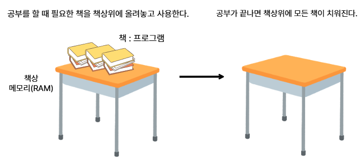

# 실습 환경 구축하기

## 내 PC에 실습을 위한 폴더 만들기
내 PC -> D드라이브 진입 -> JAVA1900_이니셜 -> 안에 util,work 폴더만들기


## 1. 자바란?
- 썬 마이크로시스템즈 소속 제임스고슬링 등의 일부 연구진들은 '그린프로젝트'라는 이름으로 '오크(Oak)'라는 언어를 개발하고 있었다.
- 오크는 오디오,tv,세탁기 등 각각의 가전제품을 제어하는 통합된 언어로써 개발중이었지만 결국 목적을 달성하지 못하고 실패로 돌아간다.
- 그 무렵 웹(www)이 급속도로 발전하게 되고, 이에 발맞추고자 썬에서는 오크의 명칭을 Java로 바꾼뒤 서로 다른 컴퓨터(OS - 운영체제)사이에서 호환성과 이식률을 높인 언어로 발전시켰다.

### 필요성
- **이식성** : 윈도우, 리눅스, 맥OS 등 다양한 OS에서 실행 가능
- **안전성** : 타입 안정성, 예외 처리, 메모리 자동 관리
- **생태계** : Spring, Android 등 실무에서 필수적인 프레임워크와 플랫폼 지원
- **확장성** : 대규모 시스템과 분산 환경에서도 적용 가능

## 2. 자바의 특징

### 2-1. 운영체제 독립성
- 자바프로그램은 JVM위에서 실행되기 때문에, 윈도우,리눅스,macOS등 어떤 운영체제에서도 동일하게 동작한다.


### 2-2. 객체 지향 언어(Object-Oriented Programming OOP)
- 프로그램을 <b>객체(Object)</b>라는 단위로 나누어 만들고, 객체들끼리 서로 데이터를 주고받으며 동작한다.

#### ※ 객체
- 객체라는 개념이 앞으로 자주 나오게 될 것이다.
- 현실 세계의 사물의 상태(속성)와 행동(기능) 데이터화 시킨것이다.
- 즉, 현실 세계의 대상을 프로그래밍적으로 모델링한 결과물이라고 생각하면된다.


### 2-3. 자동 메모리 관리(Garbage Collection)
- 자바는 사용하지 않는 **메모리**를 자동으로 해제해준다.
- 개발자가 직접 메모리 **주소**를 다룰 필요가 없어 안전하다.

#### ※ 메모리(Memory)
- 컴퓨터가 데이터를 저장하고, 프로그램을 실행하는 공간이다.
- 사람이 글을 쓰기 위해 종이가 필요하듯, 컴퓨터가 프로그램을 실행하려면 메모리가 필요하다.
- RAM(Random Access Memory)라고도 부르며, 프로그램이 실행되는 동안만 데이터를 저장한다.
- 전원을 끄면 RAM에 있던 데이터는 모두 사라진다.




#### ※ 주소(Address)
- 메모리는 칸으로 나눠져 있고, 각 칸에는 고유한 번호가 있다.
- 이 번호를 메모리 주소라고 한다.
- 변수나 객체를 사용할 때, 실제 데이터는 메모리의 특정 주소에 저장된다.


### 2-4. 간결성과 안전성
- C/C++에서 제공하는 복잡하고 위험한 기능(포인터 연산 등)을 제거하여 코드 작성이 단순하고, 오류 가능성을 줄였다.

### 2-5. 풍부한 라이브러리와 API
- 자바는 표준 라이브러리를 통해 문자열 처리, 파일 입출력, 네트워크, 데이터베이스 연결 등 다양한 기능을 제공한다.


## 3. 자바 설치하기

### 3-1. JDK(Java Development Kit)
- 자바 개발 도구 모음이다.
- 자바 프로그램을 개발하고 실행하는 데 필요한 모든 구성 요소를 포함한다.
	https://www.oracle.com/java/technologies/downloads


```
JDK 구성요소

JDK
 ├── JRE (Java Runtime Environment)
 │     ├── JVM (Java Virtual Machine)
 │     └── 표준 라이브러리(API)
 └── 개발 도구
       ├── javac (컴파일러)
       ├── java (JVM 실행 명령)
       ├── javadoc (문서 생성기)
       ├── jar (압축/배포 도구)
       └── jdb (디버거)
```

### 3-2. JDK에 포함되는 내용

#### 1. JRE(Java Runtime Environment)
- JRE는 말 그대로 자바 실행 환경을 의미한다.
- JVM + 자바 프로그램 실행에 필요한 라이브러리(API), 실행 관련 파일을 묶어놓은 환경이다.

#### 2. JVM
- 자바 가상 머신(Java Virtual Machine)은 자바 프로그램이 실행될 수 있는 가상의 컴퓨터(가상 머신)입니다.
- 자바 코드를 컴파일 하여 바이트 코드로 만들면 이 코드가 자바 가상 머신 환경에서 실행됩니다.
- 현재 사용하는 컴퓨터의 운영체제에 맞는 자바 실행환경(JRE)가 설치되어 있다면 자바 가상 머신이 설치되어 있다는 뜻입니다.

##### 컴파일
- 사람이 작성한 코드를 컴퓨터가 이해할 수 있게 기계어(0과 1)로 변환하는 과정이다.
- 컴퓨터는 사람이 쓰는 언어를 직접 이해하지 못한다.
- 실행 가능한 형태로 변환해야 프로그램이 동작한다.
- 문법 오류를 실행전에 찾는 역할도 한다.

##### 바이트코드
- JVM이 이해하고 실행할 수 있는 중간 언어이다.
- 자바 코드를 적은 파일(확장자가 .java)를 컴파일 하면 .class 확장자의 바이트코드 파일이 생성된다.
- 바이트코드는 CPU가 직접 실행하는 언어가 아니라 JVM이 읽어서 해당 운영체제에 맞는 기계어로 변환한 뒤 실행한다.

##### 기계어
- CPU가 직접 이해하고 실행할 수 있는 언어이다.
- 0과 1로 구성된 이진수 명령어 형태이며, 운영체제와 CPU구조에 따라 다르게 구성된다.

### 3-3. JDK의 버전
- JDK의 버전은 자바 개발 도구의 기능 업데이트와 개선 사항을 반영한다.
- 6개월 주기로 새로운 버전을 출시하지만, 장기간 지원(LTS, Long-Term Support)버전은 3년 주기로 제공된다.
- 실무에서는 LTS버전이 안정성과 호환성 때문에 주로 사용된다.

#### 주요버전
|버전|출시년도|LTS여부|주요 특징|
|----|----|----|----|
|Java 8|2014|O|람다 표현식,Stream API, 날짜/시간 API|
|Java 11|2018|O|모듈 시스템 강화, HTTP Client API 표준화|
|Java 17|2021|O|패턴 매칭, sealed 클래스, 성능 개선|
|Java 21|2023|O|가상 스레드(virtual threads),Record 확장|
|Java 22|2024|X|개발자 미리보기 기능 다수 포함|

#### 실무 선택 전략
1. 신규 프로젝트 : 최신 LTS버전(17,21)우선 고려
2. 기존 프로젝트 유지보수 : 기존 버전 유지 → 필요 시 안정된 LTS로 업그레이드

### 3-4. JDK 벤더사(Vendor)
- JDK는 오픈소스(OpenJDK)기반으로 여러 회사(벤더)가 자신들의 빌드를 배포한다.
- 기능은 거의 동일하지만 지원 기간, 보안 패치 주기, 추가 기능이 다를 수 있다.

|벤더|특징|지원 정책|
|---|----|------|
|Oracle JDK|공식 JDK, 상용 라이선스, 안정적 지원|LTS 8년 지원|
|OpenJDK|오라클이 주도하는 오픈소스 버전, 무료, 6개월 주기 릴리즈|최신 버전 유지|
|Eclipse Temurin(Adoptium)|커뮤니티 빌드, 무료, LTS 지원|4~8년 LTS|
|Amazon Corretto|AWS 제공, 무료, 장기 지원, 클라우드 최적화|8년 지원|
|Azul Zulu|다양한 플랫폼 지원, 상용 지원 옵션|최대 10년|
|Microsoft Build of OpenJDK|MS 서비스(애저, VS Code)에 최적화|LTS 제공|
|Red Hat OpenJDK|리눅스 환경 최적화, RHEL과 통합|LTS 6년|


#### 벤더 선택 시 고려사항
- 라이선스 : 상용 제품에 사용 시 유료인지 여부
- 지원 기간 : 프로젝트 운영 기간과 맞는지
- 환경 최적화 : 클라우드(AWS,Azure), OS(Linux, Windows) 특화 여부
- 업데이트 주기 : 보안 패치와 버그 수정 주기


## 4. 환경 변수 설정
- 환경 변수 : 운영체제에서 프로그램의 실행 방식에 영향을 주는 동적인 값이다.
- 운영체제가 프로그램을 실행할 때 참조하는 전역 설정값으로, 경로, 언어, 메모리 설정 등 다양한 정보를 담을 수 있다.

### 4-1. 전역 설정(Global Setting)
- 운영체제 전체 또는 모든 프로그램에서 공통으로 적용되는 설정을 말한다.
- 즉, 한 번만 설정하면 컴퓨터 안의 여러 프로그램에서 값을 동일하게 쓸 수 있도록 하는 설정이다.

- [내PC] - [속성]을 선택하고 [시스템] - [고급 시스템 설정]을 클릭한다. 이어서[시스템 속성] 창에서 [환경 변수]를 클릭한다.


- [시스템 변수]에서 [새로 만들기]를 클릭한다. 변수 이름에 'JAVA_HOME', 변수값에는 자바를 설치한 경로를 찾아주고 확인 버튼을 클릭한다.


- [시스템 변수]에서 [Path] 환경 변수를 선택하고 [편집]을 클릭한다. 이어서 [새로 만들기]를 클릭한 후 '%JAVA_HOME%\bin'을 입력하고 [확인]버튼을 누른다.


### 가장 위로 올리는 이유 
- Path 환경 변수에 등록된 순서대로 명령어를 찾기 때문이다.
- 만약 '%JAVA_HOME%\\bin보다 위쪽에 위치한 java 명령어가 있다면 다른 버전의 java 명령어가 사용될 수 있으므로 주의해야 한다.

## 자바가 잘 설치되어있는지 확인하는법

win + r -> 실행창에 cmd -> java -version 입력


## 소스 작성부터 실행까지
### 1. 윈도우 탐색기에서 다음과 같은 구조를 구성한다.
```
c:\temp
	|-- src
	|	|-- ch01
	|		|-- sec06
	|			|-- Hello.java
	|
	|-- bin		
```
- Hello.java라는 파일을 생성한다.
### 2. Hello.java를 텍스트 에디터로 열고 다음과 같이 작성한다.
```java
package ch01.sec06;

public class Hello {
	public static void main(String[] args){
		System.out.println("Hello, Java");
	}
}
```
### 3. 소스파일 컴파일해보기
- javac 명령어로 컴파일을 해보자.
- 명령 프롬프트에서 cd 명령어로 c:\temp 디렉토리로 이동하고 다음과 같이 javac 명령어를 실행한다.

<table border="1">
  <tr>
    <td rowspan="2" width="60">컴파일</td>
    <td>javac -d [바이트코드파일저장위치][소스경로/*.java]</td>
  </tr>
  <tr>
    <td>C:\...> cd C:\temp<br>C:\temp javac -d bin src/ch01/sec06/Hello.java</td>
  </tr>
  <tr>
	<td>결과</td>
	<td>C:\temp\bin에 패키지 디렉토리와 바이트코드 파일(ch01/sec06/Hello.class)이 생성
  </tr>
</table>

### 4. java 명령어로 바이트코드 파일 실행하기
- 여전히 명령 프롬프트의 현재 위치는 C:\temp 디렉토리이다.
- 주의할 점은 패키지 구분자는 .을 사용해야 하고, 클래스명은 .class를 제외한 Hello만 입력해야 한다는 점이다.

<table border="1">
  <tr>
    <td rowspan="2" width="60">실행</td>
    <td>java -cp [바이트코드파일저장위치][패키지...클래스명]</td>
  </tr>
  <tr>
    <td>C:\temp> java -cp bin ch01.sec06.Hello</td>
  </tr>
  <tr>
	<td>결과</td>
	<td>콘솔에 Hello, Java가 출력</td>
  </tr>
</table>


## 5. 통합 개발환경
통합 개발 환경(統合開發環境, Integrated Development Environment, IDE)은 코딩, 디버그, 컴파일, 배포 등 프로그램 개발에 관련된 모든 작업을 하나의 프로그램 안에서 처리하는 환경을 제공하는 소프트웨어이다.

### 대중적인 IDE
- 이클립스(Eclipse) : 웹, Java, C, C++
- Visual Studio : C, C++, C#, Python
- Intellij : Java, C/C++
등등 많은 IDE가 있다.

## 6. 이클립스 설치하기
- 이클립스 홈페이지 : https://www.eclipse.org/

- 홈페이지에 접속하여 다운로드 버튼을 누른다.


- 다운로드 버튼 아래 Download Packages를 누른다.


- 오른쪽에서 다른 버전을 고를 수 있다.
- 버전을 골랐다면 Eclipse IDE for Java and Web Developers버전을 다운로드받아야 한다.
- 본인이 사용하고 있는 컴퓨터의 운영체제와 맞는 버전을 다운로드 한다.


- 다운로드 받은 압축 파일을 util폴더로 옮기고 압축을 푼다.


## 7. 이클립스 실행해보기
```diff
- ※ jdk를 먼저 설치하지 않으면 이클립스가 실행되지 않습니다!!
```
- 이클립스를 켜고 Browse를 눌러 우리가 만들어 놓은 work 폴더로 경로를 잡아주자.
- 앞으로 우리가 작업하는 프로젝트들은 work폴더에 저장될 것이다.


## 8. 이클립스 프로그램 구성


## 9. 자바 프로젝트 생성하기


### JRE 옵션
- Use an execution environment JRE
  - 이클립스는 선택된 Java SE 버전 기준으로 소스 파일을 컴파일하고 실행한다.
  - 빌드 번호와 상관없이 Java SE버전에 중점을 둘 때 선택한다.
  - ※ [Configure JREs]링크를 클릭하면 선택한 Java SE버전에 해당하는 JDK가 등록되어 있어야 한다.
- Use a project specific JRE
  - 이클립스는 선택된 JDK 기준으로 소스파일을 컴파일하고 실행한다.
  - 빌드 번호별로 JDK를 선택할 때 유용하다.
  - ※ [Configure JREs]링크를 클릭하면 빌드 번호에 해당하는 JDK가 등록되어 있어야 한다.
- Use default JRE 'jdk-21' and workspace compiler preferences
  - 이클립스의 기본 자바 버전을 사용해서 소스 파일을 컴파일하고 실행한다.
  - ※ [Configure JREs]링크를 클릭했을 때 기본으로 등록되어 있는 자바 버전을 말한다.


## 10. 폴더에 해당하는 패키지 생성하기


### 패키지 이름을 적고 finish를 누릅니다.
- ch01.sec08라고 입력해보자.


### 그러면 비어있는 패키지가 생성되게 됩니다.


- ch01.sec10 이름을 가진 패키지를 하나 더 만들어보자.
- 이클립스는 기본적으로 패키지를 Flat(한 줄)로 표시한다.

## 11. 코드를 작성하는 공간인 클래스 생성하기
- sec08패키지를 우클릭하여 클래스를 생성해보자.


### 클래스명 작성하기
- 클래스를 작성할 때 클래스의 이름의 첫번째 글자는 반드시 대문자로 작성해야 합니다.
- Hello라는 이름으로 클래스를 생성해보자.


- public static void main(String[] args) 체크박스를 체크하면 main()메소드가 추가된 채로 클래스가 만들어진다.


### 자바 프로젝트 구성
1. 프로젝트
	- 모든 소스, 설정, 라이브러리, 실행결과가 들어있다.
2. src 폴더
   - 소스코드가 저장되는 기본 폴더
   - 패키지(package)단위로 폴더가 만들어지고, 그 안에 파일이 위치한다.
   - 작성하는 모든 파일은 이곳에 저장된다.
3. JRE System Library
   - 프로젝트 실행에 필요한 자바 실행 환경(JRE) 라이브러리 묶음
   - 기본적인 기능들이 들어있다.
   - 프로젝트 생성시 자동으로 추가된다.
4. 패키지(package)
   - 관련있는 파일끼리 묶어놓는 폴더 개념
   - src폴더 안에 하위 폴더로 생성된다.
5. 클래스
   - 자바 프로그램의 기본 구성 단위이다.
   - 자바에서 모든 코드는 반드시 클래스 블록 {}안에 있어야 한다.
   - 클래스는 하나의 파일(.java)과 1:1관계이며, 클래스 이름과 파일 이름이 같아야 한다.

```java
// Hello.java
public class Hello { // 클래스명 = 소스파일명 -> Hello.java
    public static void main(String[] args) { // 프로그램 시작점
        System.out.println("Hello, Java!");
    }
} // 클래스 선언 끝
```
### main 메서드
- main 메서드는 자바 프로그램의 시작점이다.
- JVM이 프로그램을 실행할 때 가장 먼저 찾는 메서드이며, main 메서드가 없으면 자바 프로그램은 실행되지 않는다.
- 자바에서 코드를 작성해도 main메서드 안에 있어야 실행할 수 있다.
- main메서드는 형식이 정해져 있으며, 변경하면 실행되지 않는다.
```java
public static void main(String[] args)

public : JVM이 어디서든 접근할 수 있도록 공개하겠다는 키워드
static : 객체를 생성하지 않아도 메서드를 사용할 수 있게 해주는 키워드
void : 결과를 반환하지 않는다는 키워드
main : 메서드의 이름
String[] args : 외부에서 전달받는 값을 저장하는 공간
```
```java
System.out.println("hello world"); 
```
- 항상 명령이 끝난 뒤에는 세미콜론(;)를 붙혀야 한다.
- 세미콜론(;)이 나올 때 까지 한 문장의 실행문으로 인식하기 때문이다.
- 실행을 하기 전에는 ctrl + s를 눌러 꼭 저장을 해주도록 합시다!
- 실행단추 Run을 클릭하거나 Ctrl + f11을 누르면 작성한 프로그램을 실행할 수 있다.


### 디버깅(오류 수정하기)
- 프로그래밍 도중 오류가 발생하면 소스 코드 아래 빨간 밑줄이 나타난다.
- 빨간 밑줄이 표시된 부분에 마우스를 가져가면 오류 원인을 확인할 수 있다.


# 자바 프로그램의 실행 프로세스
- 자바 언어로 만들어진 파일을 컴파일 하면서 기계어 파일인 바이트코드(.class)파일이 생성된다.
- 이후 바이트코드를 JVM이 읽고 실행하게 된다.


### 자바 컴파일러(Java Compiler)
- 자바 소스 파일을 JVM이  해석할 수 있는 자바 바이트코드(.class)파일로 번역한다.


## 주석
- 프로그램의 소스코드에 프로그래머의 의견이나 설명을 적을 수 있는데 이런 것을 주석(Comment)라고 합니다.
- 주석은 프로그램 소스에 삽입하더라도 프로그램의 수행에 전혀 영향을 끼치지 않습니다.
- 컴퓨터(JVM)에서 컴파일을 할 시 인식하지 못하는 코드이기 때문입니다.
- 주석으로 코드를 잘 설명해놓으면 오류를 찾거나 복잡한 코드를 이해하기 쉽고 다른 개발자가 코드를 해석하는데 도움이 된다.

### 주석의 종류
#### // (행주석)
- //부터 그 줄의 끝까지 주석으로 처리, 주석 내용이 한줄일 때 사용
#### /* \*/ (범위 주석)
-  /* 와 */ 사이의 내용을 모두 주석으로 처리, 여러 줄의 주석이 필요할 때 사용
#### /** \*/(도큐먼트 주석)
- javadoc 명령어로 API 도큐먼트를 생성하는데 사용한다.

#### sec10 패키지에 Hello.java 소스파일 만들기
```java
package ch01.sec11;
/**
 * @author 여러분 이름
 */
/*
장제목: 1장 자바 시작하기
작성일: 2025.09.24
*/
public class Hello {
	//프로그램 실행 진입점
	public static void main(String[] args) {
		//콘솔에 출력하는 실행문
		System.out.println("Hello, Java");
	} 
} 
```
#### // TODO
- 아직 해결되지 않은 작업이나 구현해야할 부분을 나타내는 주석 태그
```java
// TODO : 추후에 하드코딩을 개선해야 합니다.
```

#### //FIXME
- 수정이 필요한 버그, 오류, 또는 잘못된 동작을 나타내는 주석 태그
- FIXME 주석 태그를 포함하고 어떤 문제가 있는지 설명하고 이를 해결해야 하는 이유를 기록한다.
- 코드나 문서를 검토할 때 빠른 수정이 필요한 부분을 강조하는데 사용된다.
```java
// FIXME : 해당 코드에서는 런타임 오류가 발생합니다. 수정해야 합니다.!
```

#### //XXX
- 다른 개발자가 알아봐야 할 중요한 이슈 또는 경고를 나타내는 주석 태그를 의미
- XXX와 함께 어떤 문제가 있는지 설명하고 이를 처리해야 하는 이유를 기록한다.
- 코드나 문서를 검토할 때 주의해야 할 부분을 강조하는데 사용되며 주로 버그 또는 잠재적인 문제를 가리키는 데 사용되며 개선이 필요한 부분을 의미한다.
```java
// XXX : 해당 부분이 하드코딩 된 것 같습니다. 수정해야 합니다.
```


## 실행문과 세미콜론
- main()메소드 블록 내부에는 다양한 실행문이 작성된다.
- System.out.println("Hello, Java");은 괄호()안의 내용을 출력하는 실행문이다.
- 실행문은 변수 선언, 변수값 저장, 메소드 호출에 해당하는 코드를 말한다.

# 변수
- 하나의 값을 저장할 수 있는 메모리 번지에 붙여진 이름이다.
- 변수를 통해 프로그램은 메모리 번지에 값을 저장하고 읽을 수 있다.


- 자바의 변수는 다양한 타입의 값을 저장할 수 없다.


## 1. 변수의 선언
- 변수를 사용하기 위해서는 변수를 선언해야 한다.
- 변수를 선언하기 위해서는 메모리에 두가지 정보가 필요하다.
  - 첫번째는 변수에 담을 데이터의 형태
  - 변수의 이름

```java
자료형 변수명;

int age;
```

- 컵이 준비가 됐고, 아직 내용물은 담기지 않은 상태라고 볼 수 있다.
- 변수에 최초로 값을 대입하는 행위를 초기화라고 하고, 이때의 값을 초기값이라고 한다.
- 초기값은 변수를 선언함과 동시에 대입할 수도 있다.
```java
int age = 25;
```

## 2. 변수명 명명 규칙
- 사용 용도를 최대한 명확하게 보여줄 수 있는 이름이라면, 개발자가 마음대로 지정할 수 있지만 다음과 같은 규칙을 지켜야 한다.
```
1. 숫자가 먼저 들어가면 안된다.
2. 영어 대소문자를 구분한다(Name과 name은 다른 변수라고 인식한다)
3. 일반적으로 영어소문자로 시작한다.
4. _를 제외하고 특수기호가 포함될 수 없다.
5. 예약어 금지(switch, while 등)
6. 한글은 사용하지 말 것.
```
- 변수명은 문자 수의 제한이 없으므로 최대한 변수의 의미를 쉽게 파악할 수 있도록 구체적으로 명명하는것이 좋다.

### 2-1. 표기법
- 변수명은 문자 수의 제한 이 없으므로 최대한 변수의 의미를 쉽게 파악할 수 있도록 구체적으로 명명하는 것이 좋다.

#### 카멜 표기법(camel case)
- 두번째 단어부터 첫글자를 대문자료 표기하는 방법
- 마치 낙타의 등처럼 올라갔다 내려갔다 하는 모양이라 붙혀진 이름
```java
userName
phoneNumber
```

#### 스네이크 표기법(snake case)
- 모든 단어가 소문자로 시작하고, 단어와 단어 사이는( _ ) 로 연결하는 방식
```java
user_name
phone_number
```

### 2-2. 네이밍 컨벤션
- 실무에서는 코드의 가독성과 유지보수를 위해 약속을 만들어서 사용하는 편이다.

#### 1. 의미 있는 이름
- 추상적인 이름 대신 목적을 드러내는 이름 사용하기
- userAge, totalPrice, isLoggedIn

#### 2. 소문자 시작
- 변수명은 소문자로 시작하는 게 일반적

#### 3. 접두사
- 상태를 나타내는 변수일 때 is, has, can, should같은 접두사를 자주 사용
- isActive, hasPermission, canUpload


## 3. 변수에 데이터 입력하기
- 개발자가 데이터 값이 필요할 때 데이터의 값을 직접 사용하는 대신, 데이터를 변수에 저장해두고 변수의 이름을 호출하여 그 값을 사용할 수 있게 해준다.

### 3-1. 대입하기
- 선언된 변수에 값을 저장하는 것
- 수학에서는 좌변과 우변이 같다는 의미이지만 프로그래밍에서는 우변에 값을 좌변에 대입하겠다는 의미를 가지고 있다.

```java
age = 25;
```
- 대입을 할 때는 자료형을 쓰지 않고 변수명만 이용한다.

### VariableInitializationExample 클래스 생성하기
```java
package ch02.sec01;

public class VariableInitializationExample {
	public static void main(String[] args) {
		//변수 value 선언
		int value;    
		
		//연산 결과를 변수 result의 초기값으로 대입
		int result = value + 10;
		
		//변수 result 값을 읽고 콘솔에 출력
		System.out.println(result);
	}
}
```
- 변수는 출력문이나 연산식에 사용되어 변수값을 활용한다.

### VariableUseExample 클래스 생성하기
```java
package ch02.sec01;

public class VariableUseExample {
	public static void main(String[] args) {
		int hour = 3;
		int minute = 5;
		System.out.println(hour + "시간 " + minute + "분");

		int totalMinute = (hour*60) + minute;
		System.out.println("총 " + totalMinute + "분");
	}
}

결과
3시간 5분
총 185분
```
- 변수는 또 다른 변수에 대입되어 메모리 간에 값을 복사할 수 있다.
```java
int x = 10;
int y = x;

x 10 -> y 10
```
### VariableExchangeExample클래스 생성하기
```java
package ch02.sec01;

public class VariableExchangeExample {
	public static void main(String[] args) {
		int x = 3;
		int y = 5;
		System.out.println("x:" + x + ", y:" + y);
		
		int temp = x;
		x = y;
		y = temp;
		System.out.println("x:" + x + ", y:" + y);
	}
}

x:3, y:5
x:5, y:3
```
# 자료형(기본자료형)
- 프로그래밍에서 자료형은 데이터를 담을 컵의 크기와 재질이라고 비유를 들 수 있습니다.
- 자료형(data type)은 자바가 처리할 수 있는 데이터의 종류를 의미한다.


## 1. 기본자료형
- 실제 데이터 값을 저장할 수 있게 해줍니다. 정수,실수,문자,논리 타입으로 분류된 8개의 자료형이 존재한다.
- 각 타입에 저장되는 값의 허용 범위를 모두 외울 필요는 없지만 메모리 할당 크기는 알고있는것이 좋다.

### 1-1. 정수형(byte)
- 작은 범위의 정수를 저장, 주로 파일 네트워크 데이터 전송에 사용
- 메모리 크기 : 1byte
- 기본값 : 0
- 표현 범위 : -128 ~ 127
- 특징 : 메모리 절약 가능, 큰 범위 연산 시 자동 형변환(int)

### 1-2. 정수형(short)
- 개념: 중간 크기의 정수를 저장
- 메모리 크기: 2byte
- 기본값: 0
- 표현 범위: -32,768 ~ 32,767
- 특징: C언어 호환을 위해 존재, 실제 사용 빈도 낮음

### 1-3. 정수형(int)
- 개념: 가장 많이 쓰이는 기본 정수형
- 메모리 크기: 4byte
- 기본값: 0
- 표현 범위: -2,147,483,648 ~ 2,147,483,647
- 특징: 정수 연산의 기본 타입, 대부분의 연산은 int로 처리

#### <span style="color:red">리터럴</span>
- 코드에서 개발자가 직접 입력한 값을 의미한다.
- 변수에 대입할 정수 리터럴은 진수에 다라 작성하는 방법이 다르다.

```java
package ch02.sec02;

public class IntegerLiteralExample {
	public static void main(String[] args) {
		int var1 = 0b1011; //2진수
		int var2 = 0206; //8진수
		int var3 = 365; //10진수
		int var4 = 0xB3; //16진수

		System.out.println("var1: " + var1);
		System.out.println("var2: " + var2);
		System.out.println("var3: " + var3);
		System.out.println("var4: " + var4);
	}
}
```
### 주의점
- 정수의 경우 해당 자료형이 표현할 수 있는 범위를 벗어난 데이터를 저장하면, 오버플로우(overflow)가 발생해 전혀 다른 값이 저장될 수 있다.

#### <span style="color:red">오버플로우 / 언더플로우</span>
- 오버플로우는 해당 자료형이 표현할 수 있는 최대 범위보다 큰 수를 저장할 때 발생하는 현상으로 잘못된 결과를 얻을 수 있다.
- 언더플로우는 해당 자료형이 표현할 수 있는 최소 범위보다 작은 수를 저장할 때 발생하는 현상이다.

```java
package ch02.sec02;

public class ByteExample {
	public static void main(String[] args) {
		byte var1 = -128;
		byte var2 = -30;
		byte var3 = 0;
		byte var4 = 30;
		byte var5 = 127;
		//byte var6 = 128; //컴파일 에러(Type mismatch: cannot convert from int byte)

		System.out.println(var1);
		System.out.println(var2);
		System.out.println(var3);
		System.out.println(var4);
		System.out.println(var5);
	}
}
```

### 1-4. 정수형(long)
- 개념: 수치가 큰 데이터를 다루는 프로그램에서 사용된다.
- ex) 금융, 과학 분야
- 메모리 크기: 8byte
- 기본값: 0L
- 표현 범위: -9,223,372,036,854,775,808 ~ 9,223,372,036,854,775,807
- 특징: 리터럴 뒤에 L 또는 l을 붙여야 한다.

```java
package ch02.sec02;

public class LongExample {
	public static void main(String[] args) {
		long var1 = 10;
		long var2 = 20L;
		//long var3 = 1000000000000; //컴파일러는 int로 간주하기 때문에 에러 발생
		long var4 = 1000000000000L;

		System.out.println(var1);
		System.out.println(var2);
		System.out.println(var4);
	}
}
```

### 1-5. 문자형
- 하나의 문자를 저장하는 자료형. 유니코드(Unicode)사용
- 메모리 크기 : 2byte
- 기본값 : \u0000 (유니코드 값 0, null 문자)
- 표현 범위 : 0 ~ 65,535(유니코드 값)
- 특징 : 문자뿐 아니라 정수 값(유니코드)도 저장 가능

#### <span style="color:red">유니코드</span>
- 전 세계 모든 문자를 컴퓨터에서 통일된 방식으로 표현하기 위해 만든 문자 인코딩 표준이다.
- 영어,한글,일본어,중국어 뿐만 아니라 기호, 이모지까지 모두 코드값으로 관리한다.

#### <span style="color:red">인코딩</span>
- 문자를 컴퓨터가 이해할 수 있는 코드값으로 변환하는 과정
#### <span style="color:red">디코딩</span>
- 코드값을 다시 문자로 변환하는 과정

```java
package ch02.sec03;

public class CharExample {
	public static void main(String[] args) {
		char c1 = 'A';          	//문자 저장
		char c2 = 65;          	//유니코드 직접 저장
		
		char c3 = '가';         	//문자 저장
		char c4 = 44032;      	//유니코드 직접 저장
				
		System.out.println(c1);
		System.out.println(c2);
		System.out.println(c3);
		System.out.println(c4);
	}
}
```
### 1-6. 실수형(float)
- 개념 : 부동소수점 방식의 실수 저장
- 메모리 크기 : 4byte
- 기본값 : 0.0f
- 표현 범위 : 약 ±3.4E38 (소수점 7자리 정밀도)
- 특징 : 실수 리터럴 뒤에 f 또는 F필수

### 1-7. 실수형(double)
- 개념 : 부동소수점 방식의 실수 저장
- 메모리 크기 : 8byte
- 기본값 : 0.0d
- 표현 범위 : 약 ±1.7E308 (소수점 15자리 정밀도)
- 특징: 실수 연산의 기본 타입, d 생략 가능

#### <span style="color:red">부동소수점</span>
- 컴퓨터가 매우 큰 수나 아주 작은 수를 표현하기 위해 사용하는 방식이다.
- 즉, 숫자를 가수(유효 숫자 부분)과 지수(10의 몇제곱인지)로 나눠서 저장하는 방식이다.

```123.45``` → ```1.2345 × 10^2```

```0.0000123``` → ```1.23 × 10^-5```


```java
package ch02.sec04;

public class FloatDoubleExample {
	public static void main(String[] args) {
		//정밀도 확인
		float var1 = 0.1234567890123456789f;
		double var2 = 0.1234567890123456789;
		System.out.println("var1: " + var1);
		System.out.println("var2: " + var2);

		//10의 거듭제곱 리터럴
		double var3 = 3e6;
		float var4 = 3e6F;
		double var5 = 2e-3;
		System.out.println("var3: " + var3);
		System.out.println("var4: " + var4);
		System.out.println("var5: " + var5);
	}
 }
```

### 1-8. 논리형(boolean)
- 참(true) 또는 거짓(false)만 저장하는 자료형
- 메모리 크기 : 1bit
- 기본값 : false
- 표현범위 : true, false
- 특징 : 조건을 판별할 때 많이 사용한다.

```java
package ch02.sec05;

public class BooleanExample {
	public static void main(String[] args) {
		// 논리 자료형 변수 선언
        boolean isOn = true;     // 전등이 켜져 있다
        boolean isStudent = false; // 학생이 아니다

        // boolean 값 출력하기
        System.out.println("전등 상태: " + isOn);
        System.out.println("학생 여부: " + isStudent);

        // boolean 변수를 다른 변수에 대입 가능
        boolean copy = isOn;
        System.out.println("복사한 값: " + copy);

        // boolean은 true/false만 올 수 있다
        isOn = false;  // 전등을 껐다고 표현
        System.out.println("전등 상태 바뀜: " + isOn);
	 }
 }
 ```

 ## 2. 참조자료형
 ### 2-1. 문자열타입(String)
 - 작은따옴표(')로 감싼 한 개의 문자는 char타입이지만, 큰따옴표(")로 감싼 여러 개의 문자들은 유니코드로 변환되지 않는다.
```java
char var1 = "A"; //컴파일 에러
char var2 = "홍길동"; //컴파일 에러
```
- 큰따옴표(")로 감싼 문자들을 문자열이라고 부르는데, 문자열을 변수에 저장하고 싶다면 다음과 같이 String 타입을 사용해야 한다.

```java
String var1 = "A";
String var2 = "홍길동";
```
- 문자열 내부에 역슬래쉬(\\)가 붙은 문자를 사용할 수가 있는데, 이것을 이스케이프문자라고 한다.
- 이스케이프 문자를 사용하면 특정 문자를 포함할 수 있고, 출력에 영향을 미치기도 한다.

|이스케이프 문자| |
|----------|----|
|\\" |"문자 포함|
|\\' |'문자 포함|
|\\  |\\문자 포함|
|\\u16진수 |16진수 유니코드에 해당하는 문자 포함|
|\\t |출력시 탭만큼 띄움|
|\\n |출력 시 줄바꿈|
|\\r |출력 시 캐리지 리턴|

```java
package ch02.sec06;

public class StringExample {
	public static void main(String[] args) {
		String name = "홍길동";
		String job = "프로그래머";
		System.out.println(name);
		System.out.println(job);

		String str = "나는 \"자바\"를 배웁니다.";
		System.out.println(str);
		
		str = "번호\t이름\t직업 ";
		System.out.println(str);
		
		System.out.print("나는\n");
		System.out.print("자바를\n");
		System.out.print("배웁니다.");
	}
}
```
- Java 13부터는 다음과 같은 텍스트 블록 문법을 제공한다.
```java
String str = """
...

""";
```
- 큰따옴표 3개로 감싸면 이스케이프하거나 라인피드를 할 필요가 없이 작성된 그대로 문자열로 저장된다.

```java
package ch02.sec06;

public class TextBlockExample {
	public static void main(String[] args) {
		String str1 = "" +
		"{\n" +
		"\t\"id\":\"winter\",\n" +
		"\t\"name\":\"눈송이\"\n" +
		"}";

		String str2 = """
		{
			"id":"winter",
			"name":"눈송이"
		}
		""";

		System.out.println(str1);
		System.out.println("------------------------------------");
		System.out.println(str2);
		System.out.println("------------------------------------");
		String str = """
		나는 자바를 \
		학습합니다.
		나는 자바 고수가 될 겁니다.
		""";
		System.out.println(str);
	}
}
```

# 형변환
## 1. Promotion(자동형변환)
- 서로 다른 자료형간의 대입이나 연산을 할 때 형 변환으로 자료형을 일치시켜야 하지만 다음과 같은 경우 자바의 컴파일러가 자동으로 형 변환을 해주기 때문에 생략할 수 있다.

### 작은 자료형에서 큰 자료형으로 변환할 때
  - ### 정수형
    - byte -> short -> int -> long
  - ### 실수형
    - float(4바이트) -> double(8바이트)


```java
package ch02.sec07;

public class PromotionExample {
	public static void main(String[] args) {
		//자동 타입 변환
		byte byteValue = 10;
		int intValue = byteValue;
		System.out.println("intValue: " + intValue);

		char charValue = '가';
		intValue = charValue;
		System.out.println("가의 유니코드: " + intValue);
			
		intValue = 50;
		long longValue = intValue;
		System.out.println("longValue: " + longValue);
		
		longValue = 100;
		float floatValue = longValue;
		System.out.println("floatValue: " + floatValue);
			
		floatValue = 100.5F;
		double doubleValue = floatValue;
		System.out.println("doubleValue: " + doubleValue);
	}
}			
```

## Demotion(강제형변환)
- 큰 컵의 물을 작은 컵에 옮겨 담는것과 같다.
- 물의 양에 따라서 보존될 수도 있지만 넘칠수도 있다.
- 큰 자료형에서 작은 자료형으로 옮길 때 데이터의 손실이 발생할 수도 있고 아닐 수도 있다.
- 데이터의 손실이 일어난다면 정확한 연산을 수행할 수 없기 때문에 예상하지 못한 결과를 얻을 수 있으므로 강제 형변환은 항상 주의할 필요가 있다.

### 형변환 방법
```java
(원하는 자료형) 데이터or 변수;
```
```java
package ch02.sec08;

public class CastingExample {
	public static void main(String[] args) {
		int var1 = 10;
		byte var2 = (byte) var1;
		System.out.println(var2);	 //강제 타입 변환 후에 10이 그대로 유지

		long var3 = 300;
		int var4 = (int) var3;
		System.out.println(var4);	 //강제 타입 변환 후에 300이 그대로 유지

		int var5 = 65;
		char var6 = (char) var5;
		System.out.println(var6); 	//'A'가 출력

		double var7 = 3.14;
		int var8 = (int) var7;
		System.out.println(var8); 	//3이 출력
	}
}
```

### 연산식에서 자동 타입 변환
- 자바는 실행 성능을 향상시키기 위해 컴파일 단계에서 연산을 수행한다.

```java
byte result = 10 + 20;
```
- 정수 타입 변수가 산술 연산식에서 피연산자로 사용되면 int 타입보다 작은 byte, short타입의 변수는 int 타입으로 자동 타입 변환되어 연산을 수행한다.

```java
package ch02.sec09;

public class OperationPromotionExample {
	public static void main(String[] args) {
		byte result1 = 10 + 20; //컴파일 단계에서 연산
		System.out.println("result1: " + result1);

		byte v1 = 10;
		byte v2 = 20;
		int result2 = v1 + v2; //int 타입으로 변환 후 연산
		System.out.println("result2: " + result2);

		byte v3 = 10;
		int v4 = 100;
		long v5 = 1000L;
		long result3 = v3 + v4 + v5; //long 타입으로 변환 후 연산
		System.out.println("result3: " + result3);
			
		char v6 = 'A';
		char v7 = 1;
		int result4 = v6 + v7; //int 타입으로 변환 후 연산
		System.out.println("result4: " + result4);
		System.out.println("result4: " + (char)result4);

		int v8 = 10;
		int result5 = v8 / 4; //정수 연산의 결과는 정수
		System.out.println("result5: " + result5);

		int v9 = 10;
		double result6 = v9 / 4.0; //double 타입으로 변환 후 연산
		System.out.println("result6: " + result6);

		int v10 = 1;
		int v11 = 2;
		double result7 = (double) v10 / v11; //double 타입으로 변환 후 연산
		System.out.println("result7: " + result7);
	}
}
```


### + 연산자의 기능
- 자바에서 + 연산자는 두 가지 기능을 가지고 있다.
- 피연산자가 모두 숫자일 경우에는 덧셈 연산을 수행하고, 피연산자 중 하나가 문자열일 경우에는 나머지 피연산자도 문자열로 자동 변환되어 문자열 결합 연산을 수행한다.
```java
int value = 3 + 7 -> int value = 10;
String str = "3" + 7 -> String str = "3" + "7"; -> String str= "37";

String str = 3 + "7" -> String str = "3" + "7"; -> String str= "37";
```
- 연산식에서 + 연산자가 연이어 나오면 왼쪽에서 오른쪽으로 + 연산을 수행한다.
- 먼저 수행된 연산이 덧셈 연산이라면 덧셈 결과를 가지고 그 다음 + 연산을 수행한다.
- 만약 먼저 수행된 연산이 결합 연산이라면 이후 + 연산은 모두 결합 연산이 된다.

```java
int value = 1 + 2 + 3; -> int value = 3 + 3; -> int value = 6;
String str = 1 + 2 + "3" -> String str = 3 + "3" -> String str = "33"
String str = 1 + "2" + 3 -> String str = "12" + 3 -> String str = "123"
String str = "1" + 2 + 3 -> String str = "12" + 3 -> String str = "123"
```
- 앞에서 순차적으로 + 연산을 수행하지 않고 특정 부분을 우선 연산하고 싶다면 해당 부분을 괄호{}로 감싸면 된다.
- 괄호는 항상 최우선으로 영산을 수행한다.
```java
String str = "1" + (2+3); -> String str = "1" + 5; -> String str="15";
```
### StringConcatExample.java
```java
package ch02.sec09;

public class StringConcatExample {
	public static void main(String[] args) {
		//숫자 연산
		int result1 = 10 + 2 + 8;
		System.out.println("result1: " + result1);

		//결합 연산
		String result2 = 10 + 2 + "8";
		System.out.println("result2: " + result2);

		String result3 = 10 + "2" + 8;
		System.out.println("result3: " + result3);

		String result4 = "10" + 2 + 8;
		System.out.println("result4: " + result4);

		String result5 = "10" + (2 + 8);
		System.out.println("result5: " + result5);
	}
}
```

### 문자열을 기본 타입으로 변환
- 자바에서 문자열을 기본 타입으로 변환하는 방법은 다음과 같다.

|변환 타입|사용 예|
|------|-------|
|String -> byte|String str = "10";<br>byte value= Byte.parseByte(str);|
|String -> short|String str = "200";<br>short value= Short.parseShort(str);|
|String -> int|String str = "300000";<br>int value= Int.parseInt(str);|
|String -> long|String str = "400000000";<br>long value= Long.parseLong(str);|
|String -> float|String str = "12.345";<br>float value= Float.parseFloat(str);|
|String -> double|String str = "12.345";<br>double value= Double.parseDouble(str);|
|String -> boolean|String str = "true";<br>boolean value= Byte.parseBoolean(str);|

- 반대로 기본 타입의 값을 문자열로 변경하는 경우에는 String.valueOf()메서드를 사용하면 된다.

```java
String str = String.valueOf(기본타입값);
```

### PrimitiveAndStringConversionExample.java
```java
package ch02.sec10;

public class PrimitiveAndStringConversionExample {
	public static void main(String[] args) {
		int value1 = Integer.parseInt("10");
		double value2 = Double.parseDouble("3.14");
		boolean value3 = Boolean.parseBoolean("true");
		
		System.out.println("value1: " + value1);
		System.out.println("value2: " + value2);
		System.out.println("value3: " + value3);
		
		String str1 = String.valueOf(10);
		String str2 = String.valueOf(3.14);
		String str3 = String.valueOf(true);		
		
		System.out.println("str1: " + str1);
		System.out.println("str2: " + str2);
		System.out.println("str3: " + str3);
	}
}
```

## 변수 사용 범위
- main() 메서드 블록에는 다른 중괄호 {} 블록들이 작성될 수 있다.
- 조건문에 해당하는 if, 반복문에 해당하는 for, while 등이 중괄호 {} 블록을 가질 수 있는데, 이러한 중괄호 {} 블록 내에서 선언된 변수는 해당 중괄호 {} 블록 내에서만 사용이 가능하고 밖에서는 사용할 수 없다.

```java
public static void main(String[] args){
	int var1; //main()메소드 영역에서 변수의 선언

	if(...){
		int var2; //if블록에서 선언

		//현재 위치에서는 var1, var2 사용이 가능하다.
	}

	for(...){
		int var3; //for블록에서 선언

		//현재 위치에서는 var1,var3는 사용할 수 있다.
		//var2는 사용할 수 없다.
	}

	//var1 사용 가능
	//var2,var3는 사용할 수 없다.

}
```

## 변수의 사용 범위
- 모든 변수는 만들어진 중괄호 안에서만 사용할 수 있다.

### Variable05클래스 생성
```java
public class Variable05{
	public static void main(String[] args){
		String favoriteFood;
	}

	favoriteFood = "돈까스"; //오류 발생
}
```

##  데이터의 출력
```java
System. 	out. 	println(리터럴 또는 변수)
시스템으로 출력하는데 괄호안의 내용을 출력하고 행을 바꿔라.
```
```java
System.out.print() : 괄호안의 내용을 출력한다.
System.out.println() : 괄호안의 내용을 출력하고 줄을 바꿔준다(개행)
```
- System.out.print(),System.out.println() 출력문은 모든 데이터를 문자열로 인식하여 있는 그대로 출력하는 메서드이다.

### System.out.print()
```java
package test;

public class Test{
	public static void main(String[] args) {
		//괄호()안의 데이터를 콘솔창에 출력
		System.out.print("Welcome");
		//"Welcome"문자열 옆에 "Java World"문자열 출력
		System.out.print("Java World");
	}
}
```
### System.out.println()
```java
package test;

public class Test{
	public static void main(String[] args) {
		//괄호()안의 데이터를 콘솔창에 출력
		System.out.println("Welcome");
		//"Welcome"문자열 아래 "Java World"문자열 출력
		System.out.println("Java World");
	}
}
```

### System.out.printf() 
```java
System.out.printf()
```
- System.out.printf() 출력문은 값의 자료형에 따라 서식문자를 이용해 문자열속에서 데이터를 출력할 수 있다.

|서식문자|출력형태|
|-----|------|
|%d|정수(10진수)|
|%o|정수(8진수)|
|%x|정수(16진수)|
|%f|실수|
|%s|문자열|
|%c|문자형|
|%b|논리형|

```java
package ch02.sec12;

public class PrintfExample {
	public static void main(String[] args) {
		int value = 123;
		System.out.printf("상품의 가격:%d원\n", value);
		System.out.printf("상품의 가격:%6d원\n", value);
		System.out.printf("상품의 가격:%-6d원\n", value);
		System.out.printf("상품의 가격:%06d원\n", value);

		double area = 3.14159 * 10 * 10;
		System.out.printf("반지름이 %d인 원의 넓이:%10.2f\n", 10, area);

		String name = "홍길동";
		String job = "도적";
		System.out.printf("%6d | %-10s | %10s\n", 1, name, job);
	}
}	
```
### 2-4. 출력값의 정렬
- 정수의 정렬
```java
%3d, %5d //주어진 숫자 칸 만큼 확보한후, 오른쪽 정렬하여 출력
예) (%5d,1) -> XXXX1

System.out.printf("%5d",1);
System.out.println();
System.out.printf("%5d",12);
System.out.println();
System.out.printf("%5d",123);
System.out.println();
System.out.printf("%5d",1234);
System.out.println();
System.out.printf("%5d",12345);
System.out.println();
```
- 실수의 정렬

```java
%.2f //소수점 아래 정수번째 자리까지 출력(반올림)

System.out.printf("%.1f",1.1234567);
System.out.println();
System.out.printf("%.2f",1.1234567);
System.out.println();
System.out.printf("%.3f",1.1234567);
System.out.println();
System.out.printf("%.4f",1.1234567);
System.out.println();
System.out.printf("%.5f",1.1234567);
```

# 데이터의 입력
- 키보드를 통해 다양한 데이터를 자유롭게 입력하는 방법이 있다.
- 키보드를 통해 입력하는 데이터를 문자열로 얻기 위해서는 'java.util'패키지에 있는 Scanner클래스를 이용해야 한다.

#### <span style="color:red">import </span>
- 다른 패키지에 있는 클래스나 인터페이스를 불러오는 명령어 키워드이다.
- 자바에서 클래스를 사용하려면 같은 패키지에 있거나 import를 통해 경로를 알려줘야 한다.
```java
import 패키지명.클래스명; //특정 클래스만 불러오기
import 패키지명.*; //패키지 안의 모든 클래스 불러오기
```

```java
import java.util.Scanner; //Scanner클래스 호출
Scanner 객체명 = new Scanner(System.in); //Scanner 객체 선언
int 변수명 = 객체명.메서드(); //입력받기
```
<table>
<tr>
	<th>자료형</th>
	<th>메서드</th>
	<th>설명</th>
</tr>
<tr>
	<td rowspan = "4">정수형</td>
	<td>byte nextByte()</td>
	<td>입력받은 값을 byte형으로 반환</td>
</tr>
<tr>
	<td>short nextShort()</td>
	<td>입력받은 값을 short형으로 반환</td>
</tr>
<tr>
	<td>int nextInt()</td>
	<td>입력받은 값을 int형으로 반환</td>
</tr>
<tr>
	<td>long nextLong()</td>
	<td>입력받은 값을 long형으로 반환</td>
</tr>
<tr>
	<td rowspan = "2">실수형</td>
	<td>float nextFloat()</td>
	<td>입력받은 값을 float형으로 반환</td>
</tr>
<tr>
	<td>double nextDouble()</td>
	<td>입력받은 값을 double형으로 반환</td>
</tr>
<tr>
	<td rowspan="2">문자형</td>
	<td> String nextLine()</td>
	<td>입력받은 라인 전체를 문자열 타입으로 반환.enter키로 구분</td>
</tr>
<tr>
	<td>String next()</td>
	<td>입력받은 값을 문자열 타입으로 반환. 띄어쓰기로 구분</td>
</tr>
 
</table>

## 데이터 입력받기
```java
package ch02.sec13;

import java.util.Scanner;

public class ScannerExample {
	public static void main(String[] args)
		//Scanner 객체명 = new Scanner(System.in);
		Scanner sc = new Scanner(System.in);
		String name,address;
		int age;
		double weight;
		System.out.print("이름 : ");
		name = sc.next();
		System.out.print("나이 : ");
		age = sc.nextInt();
		System.out.print("주소 : ");
		address = sc.next();
		System.out.print("체중 : ");
		weight = sc.nextDouble();

		System.out.printf("당신의 이름은 %s입니다.\n",name);
		System.out.printf("당신의 나이는 %d입니다.\n",age);
		System.out.printf("당신의 주소는 %s입니다.\n",address);
		System.out.printf("당신의 체중은 %.1fkg입니다.\n",weight);
	}
}
```

# 연산자(Operator)
- 연산이란 데이터를 처리하고 결과를 산출하는 작업을 말한다.
- 연산은 항(피연산자)과 연산자로 이루어진다.
- 항은 연산에 사용되는 값을 의미하며, 연산자는 기호를 의미한다.
- 항과 연산자를 이용해 연산 과정을 나열한 것을 연산식(expression)이라고 합니다.


## 기본 연산자의 종류
- 자바는 사칙연산을 비롯해 다양한 연산자를 제공하고 있다.
- 피연산자의 개수에 따라 단항,이항,삼항 연산자로 분류할 수 있다.
- 사용 목적에 따라 산술,증감,대입,비교,논리, 비트,증감등으로 분류할 수 있다.

## ex1_operator 패키지 생성
|종류|연산자|기능|
|----|------|-----|
|최고연산자연산자|. , ()| 괄호 연산 먼저 계산|
|증감연산자연산자| ++, --| 1씩 증감|
|산술연산자연산자|+,-,*,/,%|사칙연산,나머지계산|
|시프트연산자|>>,<<| 비트의 이동|
|비교연산자| >, <, >=,<=,==,!= | 두 값의 비교|
|논리연산자| &&,\|\|\,!|논리의 연산|
|비트연산자|&,\|,~,^ |비트단위의 논리연산|
|대입연산자|=, +=,-=,/=,*=,%=|우변의 값을 좌변에 대입|
|삼항연산자|조건식? A : B| 조건식의 결과에 따라 A와 B선택|

# 단항연산자
- 단항연산자는 피연산자가 한 개인 연산자를 말하며, 부호연산자(+,-), 증감 연산자(++,--),논리 부정 연산자(!)가 있다.

## 1. 부호연산자
```java
package ch03.sec01;

public class SignOperatorExample {
	public static void main(String[] args) {
		int x = -100;
		x = -x;
		System.out.println("x: " + x);

		byte b = 100;
		int y = -b;
		System.out.println("y: " + y);
	}
}
```

## 2. 증감연산자.
- 1씩 증가시키거나 1씩 감소시키는 연산자.
- ++
  - 1을 증가시키는 연산자로 피연산자의 값을 1 증가시키는, 피연산자+1과 같은 연산이다.
- \--
  - 1을 감소시키는 연산자로, 피연산자-1과 같은 연산이다.

```java
package ch03.sec01;

public class IncreaseDecreaseOperatorExample {
	public static void main(String[] args) {
		int x = 10;
		int y = 10;
		int z;
		
		x++;
		++x;
		System.out.println("x=" + x);		

		System.out.println("-----------------------");		
		y--;
		--y;
		System.out.println("y=" + y);		

		System.out.println("-----------------------");		
		z = x++;
		System.out.println("z=" + z);
		System.out.println("x=" + x);
		
		System.out.println("-----------------------");		
		z = ++x;
		System.out.println("z=" + z);
		System.out.println("x=" + x);
		
		System.out.println("-----------------------");				
		z = ++x + y++;
		System.out.println("z=" + z);
		System.out.println("x=" + x);
		System.out.println("y=" + y);

		//오버플로우와 언더플로우
		//정수 타입 연산에서 오버플로우 또는 언더플로우가 발생하면
		//실행에러가 발생할 것 같지만 해당 정수 타입의 최소값 또는
		//최대값으로 되돌아간다.
		byte value = 127;
		value++;
		System.out.println(value);

		byte value2 = -128;
		value2--;
		System.out.println(value2);
	}
}
```
- 주의할 점은 논리 부정 연산자를 사용하더라도 그 사용한 곳에서만 적용될 뿐 진짜 변수의 값이 바뀌어 저장되는 것은 아니다.

# 이항연산자
- 피연산자가 2개인 연산자를 말한다.
- 일반적으로 연산자를 가운데 두고 피연산자가 왼쪽, 오른쪽에 위치한다.

## 1. 산술연산자
- 산술연산자는 4칙연산(+,-,*,/)과 나머지 값을 구하는 연산자로 나뉜다.
- 프로그래밍에서 곱셈은 x가 아닌 *, 나눗셈은 / 기호를 사용한다.

```java
package ch03.sec02;

public class ArithmeticOperatorExample {
	public static void main(String[] args) {
		byte v1 = 10;
		byte v2 = 4;
		int v3 = 5;
		long v4 = 10L;
		
		int result1 = v1 + v2;			//모든 피연산자는 int 타입으로 자동 변환 후 연산
		System.out.println("result1: " + result1);
		
		long result2 = v1 + v2 - v4; 	//모든 피연산자는 long 타입으로 자동 변환 후 연산
		System.out.println("result2: " + result2);
		
		double result3 = (double) v1 / v2;	//double 타입으로 강제 변환 후 연산
		System.out.println("result3: " + result3);
		
		int result4 = v1 % v2;
		System.out.println("result4: " + result4);
	}
}	
```

### 산술변환
- 기본적으로 이항 연산자의 연산은 두 피연산자의 타입이 일치해야 연산이 가능하다.
- 컴퓨터는 서로 다른 타입을 계산하지 못하므로 값의 손실이 적은쪽으로 타입을 맞춰준다.

```java
long + int -> long + long -> long
float + int -> float + float -> float
double + float -> double + double -> double
```

### 정확한 계산은 정수 연산으로
- 산술 연산을 정확하게 계산하고 싶다면 실수 타입을 사용하지 않는 것이 좋다.
```java
package ch03.sec04;

public class AccuracyExample1 {
	public static void main(String[] args) {
		int apple = 1;
		double pieceUnit = 0.1;
		int number = 7;
		
		double result = apple - number*pieceUnit;
		System.out.println("사과 1개에서 남은 양: " + result);
	}
}

사과 1개에서 남은 양: 0.29999999999999993
```
- 위와 같은 경우는 부동 소수점 방식을 사용하는 실수 타입에서 흔히 일어난다.
- 그렇기 때문에 정확한 계산이 필요하다면 정수 연산으로 변경해서 다음과 같이 계산하는 것이 좋다.
```java
package ch03.sec04;

public class AccuracyExample2 {
	public static void main(String[] args) {
		int apple = 1;
		int totalPieces = apple * 10;
		int number = 7;
		
		int result = totalPieces - number; 
		System.out.println("10조각에서 남은 조각: " + result);
		System.out.println("사과 1개에서 남은 양: " + result/10.0);
	}
}

10조각에서 남은 조각: 3
사과 1개에서 남은 양: 0.3
```

### 나눗셈 연산 후 NaN과 Infinity 처리
- 나눗셈( / ) 또는 나머지( % ) 연산에서 좌측 피연산자가 정수이고 우측 피연산자가 0일 경우 예외(ArithmeticException)가 발생한다.
- 무한대 값을 정수로 표현할 수 없기 때문이다.

```java
5 / 0 -> 예외 발생
5 % 0 -> 예외 발생
```
- 하지만 좌측 피연산자가 실수이거나 우측 피연산자가 0.0 또는 0.0f면 예외가 발생하지 않고 연산의 결과는 Infinity(무한대) 또는 NaN(Not a Number)이 된다.
```java
5 / 0.0 -> Infinity
5 % 0.0f -> NaN
```
- Infinity또는 NaN 상태에서 계속해서 연산을 수행하면 안된다.
- 어떤 연산을 하더라도 결과는 계속해서 Infinity와 NaN이 되기 때문이다.
- 그렇기 때문에 / 와 % 연산의 결과가 Infinity 또는 NaN인지 먼저 확인하고 다음 연산을 수행하는 것이 좋다.
- 이를 확인하기 위해서는 isInfinite()와 isNaN()을 사용한다.
- 변수의 값이 Infinity 또는 NaN일경우 true를, 그렇지 않다면 false를 산출한다.
```java
boolean result = Double.isInfinite(변수);
boolean result = Double.isNan(변수);
```

```java
package ch03.sec05;

public class InfinityAndNaNCheckExample {
	public static void main(String[] args) {
		int x = 5;
		double y = 0.0;
		double z = x / y;
		//double z = x % y;
		
		//잘못된 코드
		System.out.println(z + 2);	
		
		//알맞은 코드
		if(Double.isInfinite(z) || Double.isNaN(z)) { 
			System.out.println("값 산출 불가"); 
		} else { 
			System.out.println(z + 2); 
		}
	}
}

Infinity
값 산출 불가
```

## 2. 관계(비교)연산자
- 동등 ( ==, !=), 또는 크기( <, <=, >, >=)를 평가해서 boolean 타입인 true/false를 산출한다.
- 비교 연산자는 흐름 제어문인 조건문(if), 반복문(for,while)에서 실행 흐름을 제어할 때 주로 사용된다.

<table border="1">
	<tr>
		<td>구분</td>
		<td>연산식</td>
		<td>설명</td>
	</tr>
	<tr>
		<td rowspan="2">동등 비교</td>
		<td>피연산자1 == 피연산자2</td>
		<td>두 피연산자의 값이 같은지 검사</td>
	</tr>
	<tr>
		<td>피연산자1 != 피연산자2</td>
		<td>두 피연산자의 값이 다른지 검사</td>
	</tr>
	<tr>
		<td rowspan="4">동등 비교</td>
		<td>피연산자1 > 피연산자2</td>
		<td>피연산자1이 큰지 검사</td>
	</tr>
	<tr>
		<td>피연산자1 >= 피연산자2</td>
		<td>피연산자1이 크거나 같은지 검사</td>
	</tr>
	<tr>
		<td>피연산자1 < 피연산자2</td>
		<td>피연산자1이 작은지 검사</td>
	</tr>
	<tr>
		<td>피연산자1 <= 피연산자2</td>
		<td>피연산자1이 작거나 같은지 검사</td>
	</tr>
</table>

- 피연산자의 타입이 다를 경우 비교 연산을 수행하기 위해 타입을 일치시킨다.
- 예를 들어 'A' == 65 는 'A'가 int타입으로 변환되어 65가 된 다음 65 == 65로 비교한다.
- 마찬가지로 3 == 3.0은 3을 double타입인 3.0으로 변환한 다음 3.0 == 3.0으로 비교한다.
```java
'A' == 65 -> true
 3 == 3.0 -> true
```
- 한 가지 예외가 있다. 0.1f == 0.1에서 0.1f가 double타입으로 변환되면 0.1 == 0.1이 되어 true가 산출되어야 하지만 결과는 false가 나온다.
```java
0.1f == 0.1 -> false
```
- 그 이유는 부동 소수점 방식을 사용하는 실수 타입은 0.1을 정확히 표현할 수 없을 뿐 아니라 float타입과 double타입의 정밀도 차이 때문이다.
- 해결책은 float타입으로 강제로 타입 변환 후 비교 연산을 하면 된다.
```java
0.1f == (float)0.1 -> true
```
- 문자열을 비교할 때는 동등(==, !=)연산자 대신 equals()와 !equals()를 사용한다.
```java
boolean result = 문자열1.equals(문자열2); //문자열이 같은지 검사
boolean result = !문자열1.equals(문자열2); //문자열이 다른지 검사
```

```java
package ch03.sec06;

public class CompareOperatorExample {
	public static void main(String[] args) {
		int num1 = 10;
		int num2 = 10;
		boolean result1 = (num1 == num2);
		boolean result2 = (num1 != num2);
		boolean result3 = (num1 <= num2);
		System.out.println("result1: " + result1);
		System.out.println("result2: " + result2);
		System.out.println("result3: " + result3);
			
		char char1 = 'A';
		char char2 = 'B';
		boolean result4 = (char1 < char2); //65 < 66
		System.out.println("result4: " + result4);
			
		int num3 = 1;
		double num4 = 1.0;
		boolean result5 = (num3 == num4);
		System.out.println("result5: " + result5);

		float num5 = 0.1f;
		double num6 = 0.1;
		boolean result6 = (num5 == num6);
		boolean result7 = (num5 == (float)num6);
		System.out.println("result6: " + result6);
		System.out.println("result7: " + result7);

		String str1 = "자바";
		String str2 = "Java";
		boolean result8 = (str1.equals(str2));
		boolean result9 = (! str1.equals(str2));
		System.out.println("result8: " + result8);
		System.out.println("result9: " + result9);
	}
}
```

## 3. 논리연산자
- 논리곱(&&), 논리합(||), 배타적 논리합(^), 논리부정(!)연산을 수행한다.
- 논리 연산의 흐름은 제어문인 조건문(if),반복문(for,while)등에서 주로 이용된다.

|연산자|논리식|연산내용|
|-----|-----|--------|
|&&|논리곱(AND)|두 항이 모두 참이면 true, 아니면 false)|
|\|\||논리합(OR)|두 항 중 하나라도 참이면 true, 아니면 false|
| ! | 부정(not) | 참을 거짓으로, 거짓을 참으로 연산|

### &&은 And의 의미를 가지고 있다. 앞 뒤의 연산이 모두 True여야 True를 반환한다.
```java
int myAge = 30;
int limit = 35;

//&&은 앞쪽의 연산이 false일때 뒤쪽연산을 수행하지 않고 넘어간다.
//&&는and의 뜻. '~하고'라는 의미로 이해하면 도움이 된다.
//참 && 참 = 참
//참 && 거짓 = 거짓
//거짓 && 참 = 거짓
//거짓 && 거짓 = 거짓
//둘 다 참일때만 참
boolean result = (limit - myAge) >= 5 && myAge > 30;
System.out.println("&&연산결과: " + result);
```
### ||는 Or의 의미를 가지고 있다. 앞 뒤의 연산중 하나만 True이어도 True를 반환한다.

```java
int n1 = 10;
int n2 = 20;
//||은앞쪽의연산이false여도 뒤쪽연산을수행한다.
//||는or의 뜻. '~거나'라는의미로이해하면도움이된다.
//참 || 참 = 참
//참 || 거짓 = 참
//거짓 || 참 = 참
//거짓 || 거짓 = 거짓

//한쪽만 참이어도 참
boolean result2 = (n1 += 10) > 20 || n2 - 10 == 11;
System.out.println("||연산결과: " + result2);
```

### !는 not의 의미를 가지고 있다. True를 False로 False를 True로 바꿔준다.
```java
System.out.println("true의 부정 : " + !true);
System.out.println("false의 부정 : " + !false);

Scanner sc = new Scanner(System.in);

System.out.print("정수 하나 입력 : ");
int num = sc.nextInt();

System.out.println("입력한 정수가 짝수인가? " + !(!(num % 2 == 0)));
System.out.println("입력한 정수가 짝수인가? " + !(num % 2 != 0));

//위에서 입력 받은 수가 3의 배수인지 확인하여 출력하세요
System.out.println("입력한 정수가 3의 배수인가? " + !(!(num % 3 == 0)));
System.err.println("입력한 정수가 3의 배수인가? " + !(num % 3 != 0));

System.out.println("입력한 정수가 양수인가? " + (num > 0));
System.out.println("입력한 정수가 양수인가? " + !(num <= 0));
```
## 4. 비트논리연산자.
- 논리 연산자와 유사하지만 bit단위(2진수)의 연산만 가능하다.
- 피연산자가 1,0이라는것과 산출 결과가 1,0이라는점을 주목하자
- 1은 true, 0은 false라고 생각하면 논리연산자와의 차이는 없다.

|연산자|논리식|연산내용|
|-----|-----|--------|
|&|논리곱(AND)|두 항이 모두 1이면 true, 아니면 false|
|\||논리합(OR)|두 항 중 하나라도 1이면 true, 아니면 false|
|^|배타적논리합(XOR)|두 항이 다르면 true, 같으면 false|
| ~ | 부정(not) | 1을 0으로, 0을 1로 연산|

```java
int a = 10; //1010
int b = 7; //0111
int c = a & b; //논리곱(and) - 2진수로바꿨을 때 두값이모두1 일때만결과가1. 나머지는0
System.out.println("c : " + c);

int a2 = 12;
int b2 = 8;
int c2 = a2 | b2; //논리합(or) - 2진수로바꿨을 때 두값이모두0일때만결과가0. 나머지는1
System.out.println("c2 : " + c2);

int a3 = 9;
int b3 = 11;
int c3 = a3 ^ b3; //배타적or(xor) - 2진수로바꿨을때 두값이 서로같을때는0.서로다를때는1
System.out.println("c3 : " + c3);  
```

### ~ (not연산)
- 2진수로는 음수를 표현할 수 없다.
- 그래서 비트의 맨 앞자리는 수의 표현이 아닌 부호의 표현으로 쓰기로 약속을 했다.
- 1이면 음수, 0이면 양수이다.
```c
int x = 7;
System.out.println("~x : " + ~x); //-8
```
왜 -8이 나오는가

1. 7의 2진수 표현 :  0111
2. 비트의 반전 : 1000
3. 가장 낮은 비트에 1 더하기 : 1001

편하게 그냥 -(x+1) 를 하자.

### 2진수로 음수 표현하는법
- byte,short,int,long은 모두 부호 있는(signed) 정수 타입이므로 최상위 bit는 부호 bit로 사용되고, 나머지는 bit는 값의 범위를 결정한다.


## 5. 비트 이동 연산자
- 비트를 좌측 또는 우측으로 밀어서 이동시키는 연산을 수행한다.

### a << b
- 정수 a의 각 비트를 b만큼 왼쪽으로 이동
- 오른쪽 빈 자리는 0으로 채운다.
- a x 2<sup>b</sup>과 동일한 결과가 된다.
```java
1 << 3 = 1 x 2^3 = 8
```

### a >> b
- 정수 a의 각 비트를 b만큼 오른쪽으로 이동
- 왼쪽 빈 자리는 최상위 부호 비트와 같은 값으로 채운다.
- a / 2<sup>b</sup>과 동일한 결과가 된다.
```java
-8 >> 3 = -8 / 2^3 = -1
```

### a >>> b
- 정수 a의 각 비트를 b만큼 오른쪽으로 이동
- 왼쪽 빈 자리는 0으로 채운다.

```java
package ch03.sec09;

public class BitShiftExample1 {
	public static void main(String[] args) {
		int num1 = 1;
		int result1 = num1 << 3;
		int result2 = num1 * (int) Math.pow(2, 3);//2의 3제곱값을 double로 반환한다.
		System.out.println("result1: " + result1);
		System.out.println("result2: " + result2);
		
		int num2 = -8;
		int result3 = num2 >> 3;
		int result4 = num2 / (int) Math.pow(2, 3);
		System.out.println("result3: " + result3);
		System.out.println("result4: " + result4);		
	}
}	
```
```java
package ch03.sec09;

public class BitShiftExample2 {
	public static void main(String[] args) {
		int value = 772; //[00000000] [00000000] [00000011] [00000100]

		//우측으로 3byte(24bit) 이동하고 끝 1바이트만 읽음: [00000000]
		byte byte1 = (byte) (value >>> 24);
		int int1 = byte1 & 255;
		System.out.println("첫 번째 바이트 부호 없는 값: " + int1);

		//우측으로 2byte(16bit) 이동하고 끝 1바이트만 읽음: [00000000]
		byte byte2 = (byte) (value >>> 16);
		int int2 = Byte.toUnsignedInt(byte2);
		System.out.println("두 번째 바이트 부호 없는 값: " + int2);

		//우측으로 1byte(8bit) 이동하고 끝 1바이트만 읽음: [00000011]
		byte byte3 = (byte) (value >>> 8);
		int int3 = byte3 & 255;
		System.out.println("세 번째 바이트 부호 없는 값: " + int3);

		//끝 1바이트만 읽음: [00000100]
		byte byte4 = (byte) value;
		int int4 = Byte.toUnsignedInt(byte4);
		System.out.println("네 번째 바이트 부호 없는 값: " + int4);
	}
}

첫 번째 바이트 부호 없는 값: 0
두 번째 바이트 부호 없는 값: 0
세 번째 바이트 부호 없는 값: 3
네 번째 바이트 부호 없는 값: 4
```

## 6. 대입연산자
- 우측 피연산자의 값을 좌측 피연산자인 변수에 대입한다.
- 우측 피연산자에는 리터럴 및 변수, 그리고 다른 연산식이 올 수 있다.
- 대입연산자의 종류에는 단순히 값을 대입하는 단순 대입연산자가 있고, 정해진 연산을 수행한 후 결과를 대입하는 복합대입연산자가 있다.

### Operator05클래스 생성하기
```java
int n1 = 10; //n1이라는 int형 변수에 10이라는 정수를 대입함.
int n2 = 7;
System.out.println("=연산자: n1 = " + n1 + ", n2 = " + n2);
```
### 복합대입연산자 
- 산술연산자와 대입연산자가 합쳐진 형태, +=,-=,*=,/=,%=
- A = A +,-,*,/,% B 와 같은 의미이다.
```java
package test;

public class Test{
	public static void main(String[] args) {
		int x = 10;
		int y = 1;
		
		y += x; // y = y + x; -> y = 1 + 10;
		System.out.println(y); //11
		
		y *= x; // y = y * x -> y = 11 * 10;
		System.out.println(y); //110
		
		y %= x; //y = y % x; -> y = 110 % 10;
		System.out.println(y); //0
	}
}
```
## 7. 삼항(조건)연산자.
```java
피연산자1 ? 피연산자2 : 피연산자3
```
- 총 3개의 피연산자를 가지는 연산자이다.
- ? 앞의 피연산자1에는 boolean 또는 조건식이 오기 때문에 조건연산자라고도 한다.
- 이 값이 true면 콜론( : ) 앞의 피연산자1이 선택되고, false면 콜론 뒤의 피연산자2가 선택된다.
- 피연산자 2와 3에는 주로 값이 오지만, 경우에 따라서는 다른 연산식이 올 수도 있다.

```java
int a = 10;
int b = 15;
boolean result;		
result = ++a >= b ? true : false;
System.out.println("result :" + result);
		
int n1 = 10;
int n2 = 20;
char result2;
result2 = (n1 += n1) == n2 ? 'O' : 'X';
System.out.println("result2 : " + result2);
//삼항연산의 값을 받을 변수의 자료형과 ?뒤의 결과값의 타입이 같아야 한다.
```

```java
package ch03.sec11;

public class ConditionalOperationExample {
	public static void main(String[] args) {
		int score = 85;
		char grade = (score > 90) ? 'A' : ( (score > 80) ? 'B' : 'C' );
		System.out.println(score + "점은 " + grade + "등급입니다.");
	}
}
```


## 연산의 방향과 우선순위
- 산술연산에서 덧셈과 뺄셈보다는 곱셈과 나눗셈이 우선 처리된다는것을 이미 알고 있다.
- 사칙연산 외에도 자바에서 사용하는 다양한 연산자들은 연산 방향과 우선순위가 정해져있다.
- 연산자의 우선순위가 같은 경우 대부분의 연산자는 왼쪽에서 오른쪽으로 연산을 수행한다.
```java
100 * 2 / 3 % 5
->->->->->->->

결과 1
```
- 하지만 대입연산자는 오른쪽에서 왼쪽으로 연산을 수행한다.
```java
a = b = c = 6
<-<-<-<-<-<-<-
```

<table border="1">
	<tr>
		<td>우선순위</td>
		<td>종류</td>
		<td>연산자</td>
		<td>항</td>
		<td>연산 방향</td>
	</tr>
		<td rowspan="10">높음<br>↓<br>↓<br>↓<br>↓<br>↓<br>↓<br>↓<br>낮음</td>
		<td>최우선연산자</td>
		<td>괄호((),{})</td>
		<td>다양</td>
		<td>→</td>
	</tr>
	<tr>
		<td>단항 연산자</td>
		<td>증감(++,--),부호(+,-),비트(~),논리(!)</td>
		<td>단항</td>
		<td>←</td>
	</tr>
	<tr>
		<td rowspan="3">산술 연산자</td>
		<td>산술(*,/,%)</td>
		<td rowspan="3">이항</td>
		<td>→</td>
	</tr>
	<tr>
		<td>산술(+,-)</td>
		<td>→</td>
	</tr>
	<tr>
		<td>쉬프트(>>,<<,>>>)</td>
		<td>→</td>
	</tr>
	<tr>
		<td rowspan="2">비교 연산자</td>
		<td>비교(<,>,<=,>=,instanceof)</td>
		<td rowspan="2">이항</td>
		<td>→</td>
	</tr>
	<tr>
		<td>비교(==,!=)</td>
		<td>→</td>
	</tr>
	<tr>
		<td>논리 연산자</td>
		<td>비트 논리(&,^,|),논리(&&,||)</td>
		<td>단항/이항</td>
		<td>→</td>
	</tr>
	<tr>
		<td>삼항 연산자</td>
		<td>조건(?,:)</td>
		<td>삼항</td>
		<td>→</td>
	</tr>
	<tr>
		<td>대입연산자</td>
		<td>대입(=,+=,-=,*-,/=,%=,&=,^=,|=,<<=,>>=,>>>=)</td>
		<td>이항</td>
		<td>←</td>
	</tr>
</table>

