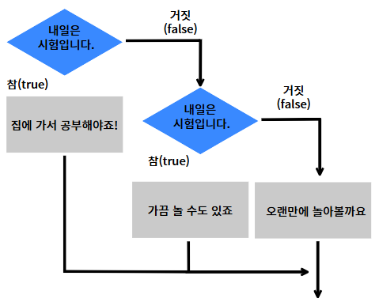

# 제어문
- 프로그램의 실행 흐름을 조절하는 문법이다.
- 기본적으로 자바 프로그램은 위에서 아래로 한 줄씩 실행된다.
- 제어문을 사용하면 특정 조건에 따라 실행할 코드의 순서나 횟수를 바꿀 수 있다.




## 조건문
- 조건식에 따라서 프로그램의 흐름을 제어할 수 있는 문법이다.
- 삼항연산자에서 미리 살펴봤듯이, 조건식의 true 또는 false라는 결과에 따라서 어떤 구문을 실행할지 결정한다.

### 조건문의 종류
- 조건문에는 크게 if문과 switch문이 있다.
- 고려해야 하는 조건이 적으면 if, 많으면 switch를 사용하는것이 효율적이다.
- 하지만 특정 개수에 따라 반드시 둘 중 하나를 선택해야 하는 것인 아니다.

## 단순 if문
- 조건문 중에서도 가장 기본이 되는 명령문이다.

```java
// 조건식에는 논리형으로 결과를 확인할 수 있는 모든 식을 넣을 수 있다.
// 조건식의 값이 true라면 {}안에 있는 코드를 실행한다.
기본형
if(조건식){
  조건식이 참일 때 실행할 문장.
}

//만약 실행해야 하는 명령이 하나라면 중괄호를 생략할 수 있다.
if(조건식)
  조건식이 참일 때 실행할 문장.

if(조건식)조건식이 참일 때 실행할 문장;

```

### 자바에서 간결하고 가독성이 좋은 코드를 만드는 중괄호와 들여쓰기
- 중괄호({})블록은 여러 개의 수행문을 하나로 묶기위해 작성한다.
- 수행문이 하나일경우 생략할 수 있지만 중괄호를 사용하면 가독성이 좋을 뿐 아니라 코드의 해석이 용이하고 버그를 찾아 수정하는데 도움이 되므로 중괄호를 사용하는 습관을 길러두는것이 좋다.
- 중괄호를 사용할 때는 들여쓰기를 하는 것이 좋다. 들여쓰기는 공백이나 탭을 이용하는데 혼용하여 사용하지 않고 한가지 방법으로 일관되게 사용하는 것이 좋다.

```java
package ch04.sec02;

public class IfExample {
	public static void main(String[] args) {
		int score = 93;
		
		if(score >= 90) {
			System.out.println("점수가 90보다 큽니다.");
			System.out.println("등급은 A입니다.");
		}
		
		if(score < 90)
			System.out.println("점수가 90보다 작습니다.");
			System.out.println("등급은 B입니다.");
	}
}
```

## if - else문
- if문을 사용하면 조건이 참(true)일때만 흐름을 제어할 수 있다.
- 조건이 거짓일때도 흐름을 제어하고 싶다면 if-else문을 사용한다.
- "만약 ~라면 A하고 아니면 B하겠다"라는 의미를 코드로 작성한 것으로 보면 된다.

### 기본 구조
```java
기본형
if(조건식){
  조건식이 참일 때 실행할 문장.
} else {
  조건식이 거짓일 때 실행할 문장.
}
```

```java
package ch04.sec02;

public class IfElseExample {
	public static void main(String[] args) {
		int score = 85;

		if(score>=90) {
			System.out.println("점수가 90보다 큽니다.");
			System.out.println("등급은 A입니다.");
		} else {
			System.out.println("점수가 90보다 작습니다.");
			System.out.println("등급은 B입니다.");
		}
	}
}
```

### 예제
- 키보드에서 나이를 입력받아 age라는 변수에 저장한다.
- 나이가 20살 이상이면 성인입니다.
- 나이가 20살 보다 어리면 미성년자 입니다. 출력하기.

```java
Scanner sc = new Scanner(System.in);
System.out.print("나이를 입력하세요 : ");
int age = sc.nextInt();

if(age > 19) {
	System.out.println("성인입니다.");
}else {
	System.out.println("미성년자입니다.");
}
```

## if - else if
- 비교해야할 조건이 여러개 있는 경우 사용하는 문법
- 물론 if문안에 두 개 이상의 조건식과 논리연산자를 사용할 수도 있지만
- 더욱 코드를 간결하게 하고 가독성을 높이기 위한 방법으로 if - else if문을 구현합니다.
```java
기본형
if(조건식1){
  조건식1이 참일 때 실행할 문장.
} else if(조건식2) {
  조건식1이 거짓이고 조건식2가 참일 때 실행할 문장.
} else if(조건식3){
  조건식1,2가 거짓이고 조건식3이 참일 때 실행할 문장.
} else {
  위의 조건이 모두 거짓일 때 실행할 문장
}
```
- else - if문의 개수에는 제한이 없습니다.
- 하지만 너무 많은 else - if문을 사용한다면 프로그램의 실행 속도가 현저히 느려질 수 있기 때문에 다른 방법을 함께 고려해야 한다.
- if - else if문의 가장 마지막에 작성하는 else블록은 필요없다면 생략이 가능하다.

```java
package ch04.sec02;

public class IfElseIfElseExample {
	public static void main(String[] args) {
		int score = 75;

		if(score>=90) {
			System.out.println("점수가 100~90입니다.");
			System.out.println("등급은 A입니다.");
		} else if(score>=80) {
			System.out.println("점수가 80~89입니다.");
			System.out.println("등급은 B입니다.");
		} else if(score>=70) {
			System.out.println("점수가 70~79입니다.");
			System.out.println("등급은 C입니다.");
		} else {
			System.out.println("점수가 70 미만입니다.");
			System.out.println("등급은 D입니다.");
		}
	}
}
```


### if_elseif03클래스 생성하기
```java
Scanner sc = new Scanner(System.in);
System.out.print("나이를 입력하세요 : ");
int age = sc.nextInt();
if(age > 19) {
	System.out.println("성인입니다.");
} else if(age > 13) {
	System.out.println("청소년입니다.");
} else if(age > 6) {
	System.out.println("어린이입니다.");
} else {
	System.out.println("유아입니다.");
}
```
- 주사위를 굴려서 나올 수 있는 1,2,3,4,5,6 중에서 하나의 수를 뽑아서 출력하는 코드를 작성해보자.
- 먼저 임의의 정수를 뽑기 위해 Math.random()메서드를 활용할 수 있다.
- 이 메소드는 0.0 <= ~ < 1.0 사이의 double 타입 난수를 반환한다.
```java
0.0 <= Math.random() < 1.0
```
- 여기에 각 변에 6을 곱하면 0.0 <= ~ <6.0 사이의 double 타입의 난수를 얻게 된다.
```java
(0.0 * 6) <= (Math.random() * 6) < (1.0 * 6)
```
- 마지막으로 각 변에 1을 더하면 비로소 1,2,3,4,5,6 중에서 하나의 난수를 얻게 된다.
```java
(0.0 + 1) <= ((int)(Math.random() * 6) +1)< ((1.0 * 6) + 1)
```
- 그렇다면 start부터 시작하는 n개의 정수 중 하나에서 정수를 얻기 위한 코드는 다음과 같이 작성할 수 있다.
```java
int num = (int)(Math.random() * n) + start
```
- 로또 번호(1, ... 45)중 하나를 뽑기 위해서도 다음 코드를 사용할 수 있다.
```java
int num = (int)(Math.random() * 45) + 1
```

```java
package ch04.sec02;

public class IfDiceExample {
	public static void main(String[] args) {
		int num = (int)(Math.random()*6) + 1;
		
		if(num==1) {
			System.out.println("1번이 나왔습니다.");
		} else if(num==2) {	
			System.out.println("2번이 나왔습니다.");
		} else if(num==3) {
			System.out.println("3번이 나왔습니다.");
		} else if(num==4) {
			System.out.println("4번이 나왔습니다.");
		} else if(num==5) {
			System.out.println("5번이 나왔습니다.");
		} else {
			System.out.println("6번이 나왔습니다.");
		}
	}
}
```

### if문의 중첩
- 제어문은 자유롭게 중첩해서 사용할 수 있습니다.
- if문 안에 if문이 있는 경우

```java
if(조건식1){
  if(조건식2){
      조건식1,2가 모두 참일 때 실행할 문장 
  }
}
```
- 실제 프로그램에서는 여러 단계로 중첩되는 경우가 많기 때문에 코드의 실행 흐름을 이해하지 못한다면 프로그램 작성은 물론, 이미 작성된 프로그램도 분석이 어려워진다.
```java
package ch04.sec02;

public class IfNestedExample {
	public static void main(String[] args) {
		int score = (int)(Math.random()*20) + 81;
		System.out.println("점수: " + score);
		
		String grade;
		
		if(score>=90) {
			if(score>=95) {
				grade = "A+";
			} else {
				grade = "A";
			}
		} else {	
			if(score>=85) {
				grade = "B+";
			} else {
				grade = "B";
			}
		}
		
		System.out.println("학점: " + grade);
	}
}
```
- 중첩의 단계에는 제한이 없습니다.

## switch문
- if문과 비슷하지만 if문은 괄호안에 인자값이 true, 혹은 false로 결정되는 조건식이 들어가야 한다.
- switch문에 조건으로 사용될 수 있는 연산자는 '==' 밖에 없다.
- 즉, 두 개의 피연산자 값이 같을때만 조건으로 활용할 수 있다.
- 따라서 하나의 변수 안에 저장되어 있는 값을 다수의 값과 비교해야 할때 주로 사용한다.

```java
기본형
switch(비교값){
case 조건값1 :
    비교값과 조건값이 일치할 때 실행할 문장.
    break;
case 조건값2 :
    비교값과 조건값이 일치할 때 실행할 문장.
    break;
case 조건값3 :
    비교값과 조건값이 일치할 때 실행할 문장.
    break;
default ://비교값과 일치하는 조건값이 없을 때 실행된다. 
	코드;
}
```

- switch문은 괄호 안의 변수값에 따라 해당 case로 가서 실행문을 실행시킨다.
- 만약 변수값과 동일한 값을 갖는 case가 없으면 default로 가서 실행문을 실행시킨다.
- default가 필요 없다면 생략이 가능하다.
```java
package ch04.sec03;

public class SwitchExample {
	public static void main(String[] args) {
		int num = (int)(Math.random()*6) + 1;
		
		switch(num) {
			case 1:
				System.out.println("1번이 나왔습니다.");
				break;
			case 2:
				System.out.println("2번이 나왔습니다.");
				break;
			case 3:
				System.out.println("3번이 나왔습니다.");
				break;
			case 4:
				System.out.println("4번이 나왔습니다.");
				break;
			case 5:
				System.out.println("5번이 나왔습니다.");
				break;
			default:
				System.out.println("6번이 나왔습니다.");
		}
	}
}
```
- case 끝에 있는 break는 다음 case를 실행하지 않고 switch문을 빠져나가기 위해 필요하다.
- 만약 break가 없다면 다음 case가 연달아 실행되는데, 이때는 case 값과는 상관없이 실행된다.
```java
package ch04.sec03;

public class SwitchNoBreakCaseExample {
	public static void main(String[] args) {
		int time = (int)(Math.random()*4) + 8;  
		System.out.println("[현재시간: " + time + " 시]");
		
		switch(time) {
			case 8:
				System.out.println("출근합니다.");
			case 9:
				System.out.println("회의를 합니다.");
			case 10:
				System.out.println("업무를 봅니다.");
			default:
				System.out.println("외근을 나갑니다.");
		}
	}
}
```

```java
package ch04.sec03;

public class SwitchCharExample {
	public static void main(String[] args) {
		char grade = 'B';
		
		switch(grade) {
			case 'A':
			case 'a':
				System.out.println("우수 회원입니다.");
				break;
			case 'B':
			case 'b':
				System.out.println("일반 회원입니다.");
				break;							
			default:
				System.out.println("손님입니다.");
		}
	}
}
```

# java 12 이상의 switch문
- 조건절에 복수개의 값을 사용하는것이 가능해졌다.
- 화살표 표현식을 이용하는게 가능하다.
- 기존 switch문과 달리 case에 해당하는 절만 실행되고, 그 이후 case들은 실행되지 않는다.

### Switch04클래스 생성하기
```java
package ch04.sec03;

public class SwitchExpressionsExample {
	public static void main(String[] args) {
		char grade = 'B';
		
		switch(grade) {
			case 'A', 'a' -> {
				System.out.println("우수 회원입니다.");
			}
			case 'B', 'b' -> {
				System.out.println("일반 회원입니다.");
			}						
			default -> {
				System.out.println("손님입니다.");
			}
		}

		switch(grade) {
			case 'A', 'a' -> System.out.println("우수 회원입니다.");
			case 'B', 'b' -> System.out.println("일반 회원입니다.");						
			default -> System.out.println("손님입니다.");
		}
	}
}
```
- 화살표 표현식을 사용하면 스위치된 값을 변수에 바로 대입할 수도 있다.
- 단일 값일 경우에는 화살표 오른쪽에 값을 기술하면 되고, 중괄호를 사용할 경우에는 yield키워드로 값을 지정하면 된다.
- 단, 이 경우에는 default가 반드시 존재해야 한다.

```java
타입 변수 = switch(grade) {
	case "값1" -> 변수값;
	case "값2" -> {
		...;
		yield 변수값;
	}
	default -> 변수값;
}
```

### SwitchValueExample.java
```java
package ch04.sec03;

public class SwitchValueExample {
	public static void main(String[] args) {
		String grade = "B";
		
		//Java 11 이전 문법
		int score1 = 0;
		switch(grade) {
		    case "A":
		    	score1 = 100;
		    	break;
		    case "B":
		    	int result = 100 - 20;
		    	score1 = result;
		    	break;
		    default:
		    	score1 = 60;
		}
		System.out.println("score1: " + score1);
		
		//Java 12부터 가능
		int score2 = switch(grade) {
			case "A" -> 100;
			case "B" -> {
				int result = 100 - 20;
				//Java 13부터 가능
				yield result;
			}
			default -> 60;
		};
		System.out.println("score2: " + score2);
	}
}
```


# 반복문
- 프로그램을 작성하다 보면 똑같은 실행문을 반복적으로 실행해야 할 경우가 많이 발생한다.
```java
int sum = 0;
sum = sum + 1;
sum = sum + 2;
sum = sum + 3;
sum = sum + 4;
sum = sum + 5;
System.out.println("1~5까지의 합 : " + sum);
```
- 만약 1부터 100까지 합을 구하는 코드를 같은 방법으로 작성한다면 코드의 양이 엄청 늘어날 것이다.
- 이런경우 반복문을 사용하면 코드를 획기적으로 줄일 수 있다.
### 반복문의 종류
- for, while

## for문
- 주로 반복 횟수가 정해져 있을 때 사용하는 문법
```java
for(초기식; 조건식; 증감식){
	조건식에 해당할때 반복할 명령
}
```
### 초기식
- 조건식과 실행문에서 사용할 변수를 초기화 하는 역할을 한다.
- 어떤 경우에는 초기식이 둘 이상 있을 수도 있고, 증감식도 둘 이상 있을 수 있다.
### 조건식
- 조건을 평가하여 true면 실행문을 실행시키고, false면 for문을 종료하고 블록을 건너뛴다.
### 증감식
- 조건이 true일 때 안에 있는 명령들이 모두 실행되면 증감식이 실행된다.

<br>

※후행증감이나 선행증감이나 영향은 없지만 개발자들이 다들 후행증감을 사용하므로 후행증감으로 사용하도록 하자.<br>

```java
package ch04.sec04;

public class PrintFrom1To10Example {
	public static void main(String[] args) {
		for(int i=1; i<=10; i++) {
			System.out.print(i + " ");
		}
	}
}
```


### for문을 작성할 때 주의할 점
#### 1. 부동 소수점을 쓰는 float타입을 사용하지 말아야 한다.
```java
package ch04.sec04;

public class FloatCounterExample {
	public static void main(String[] args) {
		for(float x=0.1f; x<=1.0f; x+=0.1f) {
			System.out.println(x);
		}
	}
}

0.1
0.2
0.3
0.4
0.5
0.6
0.70000005
0.8000001
0.9000001
```
- 부동 소수점 방식의 float타입은 연산 과정에서 정확히 0.1을 표현하지 못하기 때문에 증감식에서 x에 더해지는 실제 값은 0.1보다 약간 클 수 있다.
- 따라서 최종 반복 횟수는 9번이 된다.

#### 2. 초기값 변수
- 초기화식에서 선언된 변수는 for문 블록 안에서만 사용되는 지역변수이다.
- for문을 벗어나서도 사용하고 싶다면 초기화식에서 변수를 선언하지 말고 for문 이전에 선언해야 한다.
```java
int i;
for(int i = 1; i <= 100; i++){...};
System.out.println("최종 i값 : " + i);
```
```java
package ch04.sec04;

public class SumFrom1To100Example {
	public static void main(String[] args) {
		int sum = 0;
		int i;
			
		for(i=1; i<=100; i++) {
			sum += i;
		}
			
		System.out.println("1~" + (i-1) + " 합 : " + sum);
	}
 }
 ```
## 다중 for문
- for문안에 또 다른 for문을 사용하는 경우를 말한다.
- for문을 중첩하여 사용하기 때문에 코드가 어려워 보일 수 있으나 반복문의 원리는 같다.
```java
for(초기식;조건식;증감식){
	for(초기식;조건식;증감식){
		
	}
}
```

```java
package ch04.sec04;

public class MultiplicationTableExample {
	public static void main(String[] args) {
		for (int m=2; m<=9; m++) {
			System.out.println("*** " + m + "단 ***");
			for (int n=1; n<=9; n++) {
				System.out.println(m + " x " + n + " = " + (m*n));
			}
		}
	}
}
```

# while문
- for문은 정해진 횟수만큼 반복하는 문법이다.
- 반면 while문은 반복 횟수가 정해져 있지 않고, 조건식이 true일 경우 계속해서 반복하는 문법이다.
- 부여된 조건식이 true이면 반복문이 실행되고 false면 종료된다.
- **주의하지 않으면 무한루프에 빠질수 있다.**

```java
while(조건식){
    조건식이 참일때 반복할 명령
}
```
- while문은 for문처럼 시작값과 증감값을 가지고 있지 않기 때문에 값을 변화시켜주지 않으면 무한반복이 일어나게된다.

```java
package ch04.sec05;

public class PrintFrom1To10Example {
	public static void main(String[] args) {
		int i = 1;
		while (i<=10) {
			System.out.print(i + " ");
			i++;
		}
	}
}
```
- 1부터 100까지 합을 구하기 위해 while문을 사용한다.
- while문 내에서 계속 누적되는 값을 갖는 sum 변수는 while문 시작 전에 미리 선언해 놓아야 한다.
```java
package ch04.sec05;

public class SumFrom1To100Example {
	public static void main(String[] args) {
		int sum = 0;
		
		int i = 1;
		
		while(i<=100) {
			sum += i;
			i++;
		}

		System.out.println("1~" + (i-1) + " 합 : " + sum);
	}
}
```

- 만약 조건식에 true를 사용하면 while(true){...}가 되어서 무한 반복하게 된다.
- 이 경우, 언젠가는 while문을 빠져나가기 위한 코드가 필요하다.
- 다음은 키보드에서 1,2를 입력했을 때 속도를 증속, 감속시키고, 3을 입력하면 프로그램을 종료시키는 예제이다.

```java
package ch04.sec05;

import java.util.Scanner;

public class KeyControlExample {
	public static void main(String[] args) {
		Scanner scanner = new Scanner(System.in);
		boolean run = true;
		int speed = 0;

		while(run) {
			System.out.println("-----------------------------");
			System.out.println("1. 증속 | 2. 감속 | 3. 중지");
			System.out.println("-----------------------------");
			System.out.print("선택: ");

			String strNum = scanner.nextLine();

			if(strNum.equals("1")) {
				speed++;
				System.out.println("현재 속도 = " + speed);
			} else if(strNum.equals("2")) {
				speed--;
				System.out.println("현재 속도 = " + speed);
			} else if(strNum.equals("3")) {
				run = false;
			}
		}

		System.out.println("프로그램 종료");
	}
}
```

## do-while문
- while문과 같이 조건을 만족할 때까지 반복한다.
- 다만, while문과 다른 점은 먼저 루프를 한 번 실행한 후 조건식을 검사한다는 점이다.
- 즉, 조건식의 결과와 상관없이 무조건 한 번은 실행을 한다.

```java
package ch04.sec06;

import java.util.Scanner;

public class DoWhileExample {
	public static void main(String[] args) {
		System.out.println("메시지를 입력하세요.");
		System.out.println("프로그램을 종료하려면 q를 입력하세요.");

		Scanner scanner = new Scanner(System.in);
		String inputString;

		do {
			System.out.print(">");
			inputString = scanner.nextLine();
			System.out.println(inputString);
		} while( ! inputString.equals("q") );

		System.out.println();
		System.out.println("프로그램 종료");
	}
}
```

### 상황에 따라 반복문 사용하기
- 반복횟수가 지정되는 경우 -> 횟수를 만족할 때 까지 반복
    - ex) 물통에 물을 10번 채워라 -> for문
- 특정 조건이 부여되는 경우 -> 조건이 만족할 때까지 반복(물이 다 차기 전까지)
    - ex) 물통에 물이 가득 찰 때까지 채워라 -> while문
- 특정 조건과 옵션이 부여되는 경우 -> 한 번 실행한 후 반복 여부 판단
    - ex) 물통에 물을 따라보고 새지 않으면 끝까지 채워라 -> do - while문

# 기타제어문
- 반복문(for,while,do-while)은 각각 정해진 횟수 또는 조건에 의해 반복을 진행한다.
- 하지만 숫자가 표시된 100개의 공에서 특정 숫자가 적힌 공을 찾는데, 10번만에 찾았다면 더이상 반복을 할 필요가 없을 것이다.
- 기타제어문은 반복문을 좀 더 개발자의 입맞에 맞게 다룰 수 있게 해준다.

## 1. break
- break문은 이전에 switch문을 학습할 때 나왔던 구문으로 case문을 종료할 때 사용되었다.
- break라는 단어의 의미와 동일하게 반복문을 미리 종료할 때 사용한다.
- 반복문이 진행되는 도중, 특정 조건을 만족해 더이상 반복문을 실행할 필요 없이 종료하려고 할 때 사용한다.

```java
package ch04.sec07;

public class BreakExample {
	public static void main(String[] args) throws Exception {
		while(true) {
			int num = (int)(Math.random()*6) + 1;
			System.out.println(num);
			if(num == 6) {
				break;
			}
		}
		System.out.println("프로그램 종료");
	}
}
```

### Break01클래스 생성하기
```java
package control_stat;

import java.util.Scanner;

public class Break01 {
	public static void main(String[] args) {
		int magicNumber = (int)(Math.random() * 50) + 1;
		Scanner scan = new Scanner(System.in);
		boolean isMatched = false;
		
		for(int i = 0 ; i < 10; i++) {
			System.out.print("찾는 숫자를 입력 >>  ");
			int guess = scan.nextInt();
			
			if(guess == magicNumber) {
				System.out.println((i+1) + "번째에 맞췄습니다!");
				isMatched = true;
				break;
			} else if(guess > magicNumber) {
				System.out.println("맞춰야할 숫자가 더 작습니다.");
			} else if(guess < magicNumber) {
				System.out.println("맞춰야할 숫자가 더 큽니다.");
			}
		}
		
		if(!isMatched) {
			System.out.println("정답을 맞추지 못했습니다.");
		}
	}
}
```
- 만약 반복문이 중첩되어 있을 경우 break 문은 가장 가까운 반복문만 종료하고 바깥쪽 반복문은 종료시키지 않는다.
- 중첩된 반복문에서 바깥쪽 반복문까지 종료시키려면 바깥쪽 반복문에 이름(레이블)을 붙이고, break 이름;을 사용하면 된다.

```java
package ch04.sec07;

public class BreakOutterExample {
	public static void main(String[] args) throws Exception {
		Outter: for(char upper='A'; upper<='Z'; upper++) {
			for(char lower='a'; lower<='z'; lower++) {
				System.out.println(upper + "-" + lower);
				if(lower=='g') {
					break Outter;
				}
			}
		}
		System.out.println("프로그램 실행 종료");
	}
}
```

## 2. continue
- 반복문 안에서 continue를 만나게 되면 이후의 실행 코드는 수행되지 않고, 반복문의 처음으로 돌아가 반복문을 진행하게 된다.
- for문의 증감식으로 이동하며, while문과 do-while의 경우 조건식으로 이동한다.

```java
package ch04.sec08;

public class ContinueExample {
	public static void main(String[] args) throws Exception {
		for(int i=1; i<=10; i++) {
			if(i%2 != 0) {
				continue;
			}
			System.out.print(i + " ");
		}
	}
}
```


