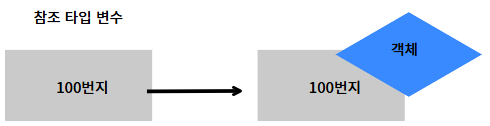
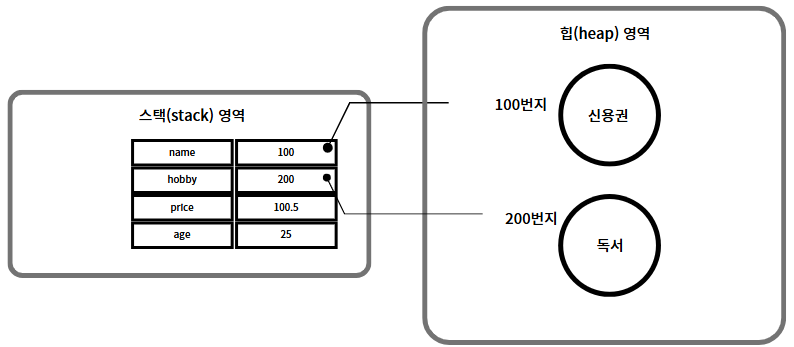
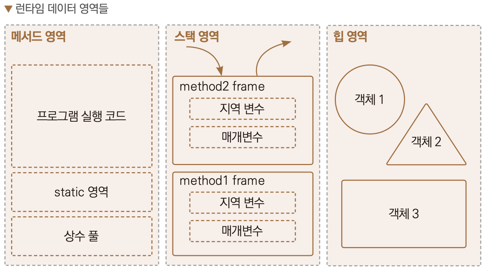
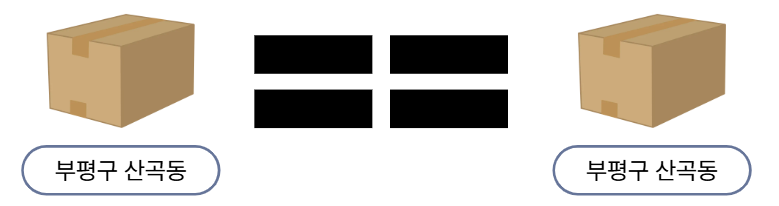
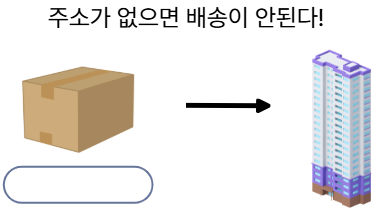
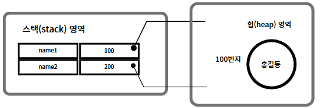
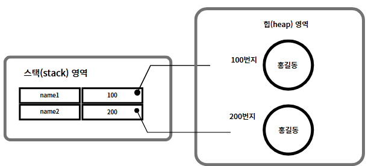
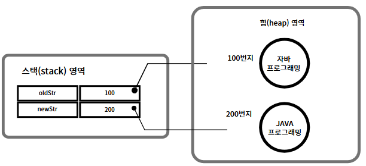
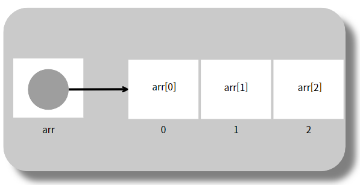
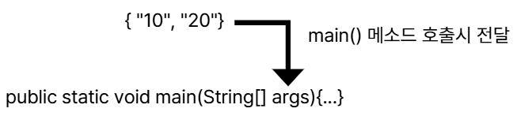

# 데이터 타입 분류
- 기본 타입으로 선언된 변수는 값 자체를 저장하고 있지만, 참조타입으로 선언된 변수는 객체가 생성된 메모리 번지(주소)를 저장한다.



```java
[기본타입변수]
int age = 25;
double price = 100.5;

[참조타입변수]
String name = "신용권";
String hobby = "독서";
```



- 변수들은 모두 스택(stack)메모리 영역에 생성된다.
- 기본타입 변수인 age와 price는 직접 값을 저장하고 있지만, 참조 타입 변수인 name과 hobby는 힙 메모리 영역의 String 객체 주소를 저장하고 이 주소를 통해 String 객체를 참조한다.

## 메모리 영역
- java 명령어로 JVM이 구동되면 운영체제에서 할당받은 메모리 영역을 다음과 같이 구분해서 사용한다.




### 메소드 영역
- 바이트코드 파일을 읽은 내용이 저장되는 영역으로 클래스별로 상수, 정적 필드, 메소드 코드, 생성자 코드 등이 저장된다.
- 어렵다고 생각이 되면 바이트코드 파일의 내용이 저장되는 영역이라고 알고 있자.

### 힙 영역
- 객체가 생성되는 영역이다. 객체의 번지는 메서드 영역과 스택 영역의 상수와 변수에서 참조할 수 있다.

### 스택 영역
- 변수들이 만들어지면 저장되는 영역이다.
- 기본 타입의 변수들은 값을 저장하고 있고, 참조 타입 변수들은 주소값을 가지고 있다.

## null
- 참조 타입 변수는 아직 주소를 저장하고 있지 않다는 뜻으로 null(널)값을 가질 수 있다.
- null은 아무것도 참조하지 않는 상태를 나타내는 값이다.
- 참조형 변수에서만 사용이 가능하다.

## 참조 타입 변수의  ==, != 연산
- ==, != 연산자는 변수의 값이 같은지, 아닌지를 조사한다.
- 참조 타입 변수의 값은 객체의 주소값(번지)이므로 참조 타입 변수의 ==, != 연산자는 번지를 비교하는 것이 된다.
- 번지가 같다면 동일한 객체를 참조하는 것이고, 다르다면 다른 객체를 참조하는 것이다.



```java
package ch05.sec03;

public class ReferenceVariableCompareExample {
	public static void main(String[] args) {
		int[] arr1; //배열 변수 arr1 선언
		int[] arr2; //배열 변수 arr2 선언
		int[] arr3; //배열 변수 arr3 선언
			
		arr1 = new int[] { 1, 2, 3 }; //배열 { 1, 2, 3 }을 생성하고 arr1 변수에 대입
		arr2 = new int[] { 1, 2, 3 }; //배열 { 1, 2, 3 }을 생성하고 arr2 변수에 대입
		arr3 = arr2; //배열 변수 arr2의 값을 배열 변수 arr3에 대입
			
		System.out.println(arr1 == arr2); // arr1과 arr2 변수가 같은 배열을 참조하는지 검사
		System.out.println(arr2 == arr3); // arr2와 arr3 변수가 같은 배열을 참조하는지 검사
	}
}
```

## null과 NullPointerException
- 참조 타입 변수는 아직 번지를 저장하고 있지 않다는 뜻으로 null(널)값을 가질 수 있다.
- null도 초기값으로 사용할 수 있기 때문에 null로 초기화된 참조 변수는 스택영역에 생성된다.
```java
String refVar1 = "자바";
String refVar2 = null;
```
- 참조 타입 변수가 null값을 가지는지 확인하려면 다음과 같이 ==, != 연산을 수행할 수 있다.
```java
refVar1 == null; //결과 : false
refVar1 != null; //결과 : true
```
```java
refVar2 == null; //결과 : true
refVar2 != null; //결과 : false
```
- 자바는 프로그램 실행 도중에 발생하는 오류를 예외(Exception)라고 부른다.
- 참조 변수를 사용하면서 가장 많이 발생하는 예외 중 하나는 NullPointerException이다.
- 변수가 null인 상태에서 객체의 데이터나 메소드를 사용하려 할 때 이 예외가 발생한다.

	

```java
package ch05.sec04;

public class NullPointerExceptionExample {
	public static void main(String[] args) {
		String str = null;
		//System.out.println("총 문자 수: " + str.length() );//NullPointerException
	}
}
```


## 문자열(String)타입
- 자바의 문자열은 String 객체로 생성된다.
```java
String name;
name = "홍길동";
String hobby = "여행";
```


- name, hobby 변수에 문자열 리터럴이 대입되면 문자열은 String 객체로 생성되고, 객체의 번지가 변수의 값으로 들어가게 된다.

### 문자열의 비교
- 자바는 문자열 리터럴이 동일하다면 String 객체를 공유하도록 설계되어 있다.
```java
String name1 = "홍길동";
String name2 = "홍길동";
```



- String 변수에 문자열 리터럴을 대입하는 것이 일반적이지만, new 연산자로 직접 String 객체를 생성하고 대입할 수도 있다. new 연산자는 새로운 객체를 만드는 객체 생성 연산자라고 생각하면 된다.

```java
String name1 = new String("홍길동");
String name2 = new String("홍길동");
```



- 문자열 리터럴로 생성하느냐 new 연산자로 생성하느냐에 따라 비교 연산자의 결과가 달라질 수 있다.

```java
String name1 = "홍길동";
String name2 = "홍길동";
String name3 = new String("홍길동");

name1 == name2; //true
name1 == name3; //false
```
- 동일한 String 객체든 다른 String 객체든 상관없이 내부 문자열만 비교할 경우에는 String 객체의 equals()메서드를 사용한다.

```java
boolean result = str1.equals(str2); //문자열 값이 같은지 검사
```

#### <span style="color:red">메소드</span>
- 클래스 안에서 특정 기능을 수행하는 코드 묶음이다.
- 여러 줄의 코드를 하나의 이름으로 묶어서 필요할 때마다 실행할 수 있다.
- 메서드는 값을 입력받을 수 있고, 결과값을 반환할 수도 있다.

```java
package ch05.sec05;

public class EqualsExample {
	public static void main(String[] args) {
		String strVar1 = "홍길동";
		String strVar2 = "홍길동";

		if(strVar1 == strVar2) {
			System.out.println("strVar1과 strVar2는 참조가 같음");
		} else {
			System.out.println("strVar1과 strVar2는 참조가 다름");
		}

		if(strVar1.equals(strVar2)) {
			System.out.println("strVar1과 strVar2는 문자열이 같음");
		}
			
		String strVar3 = new String("홍길동");
		String strVar4 = new String("홍길동");

		if(strVar3 == strVar4) {
			System.out.println("strVar3과 strVar4는 참조가 같음");
		} else {
			System.out.println("strVar3과 strVar4는 참조가 다름");
		}

		if(strVar3.equals(strVar4)) {
			System.out.println("strVar3과 strVar4는 문자열이 같음");
		}
	}
}
```

### 문자 추출
- 문자열에서 특정 위치의 문자를 얻고 싶다면 charAt()메서드를 이용할 수 있다.
- charAt()메서드는 매개값으로 주어진 인덱스의 문자를 반환한다.
- 여기서 인덱스란 0에서부터 순차적으로 증가하는 숫자를 말한다.
```java
String subject = "자바 프로그래밍";
char charValue = subject.charAt(3);
```
- "자바 프로그래밍"이라는 문자열은 다음과 같이 인덱스를 매길 수 있다.
```
자바  프로그래밍
0 1 2 34 5 6 7
```
- 3번은 프에 해당한다.

```java
package ch05.sec05;

public class CharAtExample {
	public static void main(String[] args) {
		String ssn = "9506241230123";
		char sex = ssn.charAt(6);
		switch (sex) {
			case '1':
			case '3':
				System.out.println("남자입니다.");
				break;
			case '2':
			case '4':
				System.out.println("여자입니다.");
				break;
		}
	}
}
```

### 문자열 길이
- 문자열에서 문자의 개수를 얻고 싶다면 length() 메소드를 사용한다.
```java
String subject = "자바 프로그래밍";
int length = subject.length();
```
- 문자열의 길이는 공백을 포함하기 때문에 길이는 8이된다.

```java
package ch05.sec05;

public class LengthExample {
	public static void main(String[] args) {
		String ssn = "9506241230123";
		int length = ssn.length();
		if(length == 13) {
			System.out.println("주민등록번호 자릿수가 맞습니다.");
		} else {
			System.out.println("주민등록번호 자릿수가 틀립니다.");
		}
	}
}
```

### 문자열 대체
- 특정 문자열을 다른 문자열로 교체하고 싶다면 replace()메소드를 사용한다.
- replace() 메소드는 기존 문자열은 그대로 두고, 대체한 새로운 문자열을 반환한다.

```java
String oldStr = "자바 프로그래밍";
String newStr = oldStr.replace("자바","JAVA");
```
- 문자열은 수정이 일어나면 새롭게 생성을 합니다.



```java
package ch05.sec05;

public class ReplaceExample {
	public static void main(String[] args) {
		String oldStr = "자바 문자열은 불변입니다. 자바 문자열은 String입니다.";
		String newStr = oldStr.replace("자바", "JAVA");

		System.out.println(oldStr);
		System.out.println(newStr);
	}
}
```

### 문자열 잘라내기
- 문자열에서 특정 위치의 문자열을 잘라내어 가져오고 싶다면 substring()메소드를 사용한다.

|메소드|설명|
|----|----|
|substring(int beginIndex) | beginIndex부터 끝까지 잘라내기|
|substring(int beginIndex, int endIndex) | beginIndex부터 endIndex앞까지 잘라내기|

```java
String ssn = "880815-1234567";
String firstNum = ssn.substring(0,6);
String secondNum = ssn.substring(7);
```

```java
package ch05.sec05;

public class SubStringExample {
	public static void main(String[] args) {
		String ssn = "880815-1234567";
			
		String firstNum = ssn.substring(0, 6);
		System.out.println(firstNum);

		String secondNum = ssn.substring(7);
		System.out.println(secondNum);
	}
}
```

### 문자열 찾기
- 문자열에서 특정 문자열의 위치를 찾고자 할 때 indexOf()메서드를 사용한다.
```java
String subject = "자바 프로그래밍";
int index = subject.indexOf("프로그래밍");

결과 : 3
```
- 만약 주어진 문자열이 포함되어 있지 않으면 indexOf() 메소드는 -1을 리턴한다.

```java
package ch05.sec05;

public class IndexOfContainsExample {
	public static void main(String[] args) {
		String subject = "자바 프로그래밍";

		int location = subject.indexOf("프로그래밍");
		System.out.println(location);
		String substring = subject.substring(location);
		System.out.println(substring);

		location = subject.indexOf("자바");
		if(location != -1) {
			System.out.println("자바와 관련된 책이군요.");
		} else {
			System.out.println("자바와 관련 없는 책이군요.");
		}

		boolean result = subject.contains("자바");
		if(result) {
			System.out.println("자바와 관련된 책이군요.");
		} else {
			System.out.println("자바와 관련 없는 책이군요.");
		}
	}
}
```

### 문자열 분리
- 문자열이 구분자를 사용하여 여러 개의 문자열로 구성되어 있을 경우, 이를 따로 분리해서 얻고 싶다면 split()메소드를 사용한다.
```java
String board = "번호,제목,내용,성명";
String[] arr = board.split(",");

결과 : ["번호","제목","내용","성명"];
```

```java
package ch05.sec05;

public class SplitExample {
	public static void main(String[] args) {
		String board = "1,자바 학습,참조 타입 String을 학습합니다.,홍길동";

		//문자열 분리
		String[] tokens = board.split(",");

		//인덱스별로 읽기
		System.out.println("번호: " + tokens[0]);
		System.out.println("제목: " + tokens[1]);
		System.out.println("내용: " + tokens[2]);
		System.out.println("성명: " + tokens[3]);
		System.out.println();
			
		//for 문을 이용한 읽기
		for(int i=0; i<tokens.length; i++) {
			System.out.println(tokens[i]);
		}
	}
}
```

# 배열(Array)
- 변수는 하나의 값만 저장할 수 있다.
- 따라서 저장해야 할 값의 수가 많아지면 그만큼 많은 변수가 필요하다.
- ```배열```은 같은 자료형의 변수를 지정하여 여러 데이터를 저장할 수 있는 저장공간을 의미한다.
- 이렇게 여러 데이터를 담을 수 있는 구조를 자료구조(data structure)라고 한다.
- 배열을 사용하면 같은 자료형의 데이터를 효율적으로 다룰 수 있다.

## 배열이 필요한 이유
- 10개의 데이터를 저장하려면 해당 자료형의 변수를 10개 만들어서 저장해야 했다.
- 물론 이런방법으로 데이터를 저장할 수 있지만 데이터가 많아질수록 관리를 하기 힘들어진다.

## 배열의 특징
- 배열 선언 시 크기를 지정한다.
- 배열 선언 후 공간의 크기를 늘리거나 삭제할 수 없다.
- 지정된 자료형의 값만 저장할 수 있다.

## 배열의 선언
- 배열을 사용하려면 변수와 마찬가지로 선언을 먼저 해야 한다.
```
자료형[] 배열명;
자료형 배열명[];
```
- 대괄호[]는 배열의 연산자를 의미한다.
- 자료형 뒤에 붙이거나 변수명 뒤에 붙이면 해당 자료형은 배열이라는 의미로 선언된다.
- 자료형 뒤에 붙이는것이 가독성이 좋아 자주 사용된다.
- 배열 변수는 참조 변수이다.
- 배열도 객체이므로 힙 영역에 생성되고 배열 변수는 힙 영역의 배열 주소를 저장한다.
- 참조할 배열이 없다면 배열 변수도 null로 초기화할 수 있다.

```java
타입[] 변수 = null;
```
- 만약 배열 변수가 null 값을 가진 상태에서 변수[인덱스]로 값을 읽거나 저장하게 되면 NullPointerException이 발생한다.

- 배열에 저장될 값을 미리 부여해 선언하는 방법이 있다.
```java
int[] arr = {1,2,3,4,5}
```
- 위와 같이 배열을 선언할 때 값을 지정할 수 있다.
- 5개의 값을 대입했기 때문에, 배열의 크기는 5가 되며 각 순서에 맞게 데이터가 삽입된다.

- 위와 같은 방법들을 통해서 배열을 선언하면 실제 시스템 메모리에는 선언된 크기와 값 만큼 각각의 독립적인 저장 공간이 연속적으로 배치되어 생성된다.


- 메모리에 지정한 크기만큼의 저장 공간을 생성하고 그 저장 공간이 있는 위치 값을 arr 변수에 대입한다.
- 배열의 변수는 그 주소 값을 통해서 배열에 접근하는 데이터를 가져오게 된다.

```java
package ch05.sec06;

public class ArrayCreateByValueListExample1 {
	public static void main(String[] args) {
		//배열 변수 선언과 배열 생성
		String[] season = { "Spring", "Summer", "Fall", "Winter" };

		//배열의 항목값 읽기
		System.out.println("season[0] : " + season[0]);
		System.out.println("season[1] : " + season[1]);
		System.out.println("season[2] : " + season[2]);
		System.out.println("season[3] : " + season[3]);

		//인덱스 1번 항목의 값 변경
		season[1] = "여름";
		System.out.println("season[1] : " + season[1]);
		System.out.println();

		//배열 변수 선언과 배열 생성
		int[] scores = { 83, 90, 87 };

		//총합과 평균 구하기
		int sum = 0;
		for(int i=0; i<3; i++) {
			sum += scores[i];
		}
		System.out.println("총합 : " + sum);
		double avg = (double) sum / 3;
		System.out.println("평균 : " + avg);
	}
}
```
- 중괄호로 감싼 값의 목록을 배열 변수에 대입할 때 주의할 점이 있다.
- 배열 변수를 미리 선언한 후에는 값 목록을 변수에 대입할 수 없다.

```java
int[] arr; //배열선언
arr = {1,2,3,4,5} //오류
```
- 배열을 선언한 후 다시 값을 대입해야할 경우에는 이미 선언된 배열을 다시 정의하여 값을 대입하면 가능하다.

```java
int [] arr; //배열선언
arr = new int[]{1,2,3,4,5}; //배열 재정의
```

## new 연산자를 이용한 배열의 생성
- 값의 목록은 없지만 향후 값들을 저장할 목적으로 배열을 미리 생성할 수도 있다.
- new 연산자를 다음과 같이 사용하면 배열 객체를 생성시킨다.
- 길이는 배열이 저장할 수 있는 항목 수를 말한다.
```java
타입 [] 변수 = new 타입 [길이];
```
- 메모리에 배열의 데이터를 저장하기 위한 4개의 공간을 만들어라 라는 명령이다.

#### <span style="color:red">new</span>
- new는 객체를 생성할 때 사용하는 키워드이다.
- new 연산자는 메모리에 공간을 만들고, 주소를 반환한다.
- 클래스에 속한 변수나 메소드를 사용하려면 객체가 먼저 필요하다.

```java
타입[] 변수 = null;
변수 = new 타입[길이];
```
- 다음은 길이가 5인 int[] 배열을 생성하고, 배열 번지를 intArray변수에 대입한다.

```java
int[] intArray = new int[5];
```
- new 연산자로 배열을 처음 생성하면 배열 항목은 기본값으로 초기화된다.

|자료형|초기값|
|------|------|
|정수형|0|
|실수형|0.0|
|문자형|''|
|객체형|null|


## 배열의 구조
### 1. 인덱스(index)
- 배열을 만든 후에는 값을 넣거나 꺼내야 한다.
- 배열은 각 공간마다 위치를 알려주는 위치 값이 존재한다.
- 우리는 배열이 지니는 값들의 위치를 인덱스(index)라고 부른다.
- 인덱스(index)는 배열의 공간마다 붙여진 번호로 0부터 시작하여 순차적으로 증가한다.



- 배열의 값을 저장하고 가져오는 방법은 변수와 같다.
- 단지 변수명 대신 인덱스(index)를 사용한다는점이 다르다.

```java
package ch05.sec06;

public class ArrayCreateByNewExample {
	public static void main(String[] args) {
		//배열 변수 선언과 배열 생성
		int[] arr1 = new int[3];
		//배열 항목의 초기값 출력
		for(int i=0; i<3; i++) {
			System.out.print("arr1[" + i + "] : " + arr1[i] + ", ");
		}
		System.out.println();
		//배열 항목의 값 변경
		arr1[0] = 10;
		arr1[1] = 20;
		arr1[2] = 30;
		//배열 항목의 변경 값 출력
		for(int i=0; i<3; i++) {
			System.out.print("arr1[" + i + "] : " + arr1[i] + ", ");
		}
		System.out.println("\n");

		//배열 변수 선언과 배열 생성
		double[] arr2 = new double[3];
		//배열 항목의 초기값 출력
		for(int i=0; i<3; i++) {
			System.out.print("arr2[" + i + "] : " + arr2[i] + ", ");
		}
		System.out.println();
		//배열 항목의 값 변경
		arr2[0] = 0.1;
		arr2[1] = 0.2;
		arr2[2] = 0.3;
		//배열 항목의 변경 값 출력
		for(int i=0; i<3; i++) {
			System.out.print("arr2[" + i + "] : " + arr2[i] + ", ");
		}
		System.out.println("\n");

		//배열 변수 선언과 배열 생성
		String[] arr3 = new String[3];
		//배열 항목의 초기값 출력
		for(int i=0; i<3; i++) {
			System.out.print("arr3[" + i + "] : " + arr3[i] + ", ");
		}
		System.out.println();
		//배열 항목의 값 변경
		arr3[0] = "1월";
		arr3[1] = "2월";
		arr3[2] = "3월";
		//배열 항목의 변경값 출력
		for(int i=0; i<3; i++) {
			System.out.print("arr3[" + i + "] : " + arr3[i] + ", ");
		}
	}
}
```

### 2. 배열의 길이
- 배열을 생성할 때 대괄호[]안에 배열의 길이를 작성했다.
- 배열을 사용하면서 종종 배열의 길이가 필요할 때가 있다.
- 배열은 내부적으로 length라는 변수를 지니는데, 해당 변수는 배열의 길이 값을 가지고 있다.
- 배열의 길이를 알고싶을 때는 ```배열명.length```를 하면 된다.
- 이 변수의 값은 배열이 생성될 때 지정되며 변경할 수 없다.

```java
package ch05.sec06;

public class ArrayLengthExample {
	public static void main(String[] args) {
		//배열 변수 선언과 배열 대입
		int[] scores = { 84, 90, 96 };

		//배열 항목의 총합 구하기
		int sum = 0;
		for(int i=0; i<scores.length; i++) {
			sum += scores[i];
		}
		System.out.println("총합 : " + sum);

		//배열 항목의 평균 구하기
		double avg = (double) sum / scores.length;
		System.out.println("평균 : " + avg);
	}
}
```

## 배열 사용하기
```java
package array;

public class Array03 {
	public static void main(String[] args) {
		//10개의 배열을 생성
		int [] numbers = new int[10];
		
		//배열에 랜덤 함수를 이용해 값을 넣는다.
		for(int i = 0 ; i < numbers.length; i++) {
			numbers[i] = (int)(Math.random()*30)+1;
		}
		
		//배열 안에서 짝수의 합 구하기
		int sum = 0;
		for(int i = 0; i<numbers.length; i++) {
			sum += numbers[i];
		}
		
		//출력해보기
		for(int i = 0 ; i < numbers.length; i++) {
			//numbers배열의 랜덤값 출력
			System.out.print(numbers[i] + " ");
		}
		
		//줄 바꾸기
		System.out.println();
		System.out.println("배열의 짝수들의 합 : " + sum);

		//배열의 정렬
		//배열의 값이 순서 없이 저장되는 경우, 배열의 값을 오름차순, 내림차순으로 정렬해야 할 때가 있다.
		int [] arr = {1,6,2,3,10,7,4,8,5,9};
		
		int temp = 0;
		
		for(int i = arr.length - 1; i > 0; i--) {
			for(int j = 0; j < i; j++) {
				//앞의 값이 뒤의 값보다 크다면 정렬
				if(arr[j] > arr[j+1]) {
					//뒤의 값을 임시 변수에 저장
					temp = arr[j+1];
					arr[j+1] = arr[j];
					arr[j] = temp;
				}
			}
		}
		
		System.out.println("정렬 후 출력 : ");
		for(int i = 0 ; i < arr.length; i++) {
			System.out.print(arr[i] + " ");
		}
	}
}

```

## 다차원배열
- 다차원 배열이란 2차원 이상의 배열을 의미하며, 배열의 요소로 또 다른 배열을 가지는것을 의미합니다.
- 2차원 배열은 배열의 요소로 1차원 배열을 가지고,
- 3차원 배열은 배열의 요소로 2차원 배열을 가지게 됩니다.

### 이차원 배열의 초기값 지정
```
int [][] arr = { {1,2},{3,4},{5,6}};
```
- 이와 같은 방법은 배열을 최초 선언할 때만 가능하다.

## 2차원 배열의 구조
- 2차원 배열의 행은 독립된 공간으로 분리되어 있고, 그 행들이 각각 독립된 열을 가지고 있다.


```java
package ch05.sec07;

public class MultidimensionalArrayByValueListExample {
	public static void main(String[] args) {
		//2차원 배열 생성
		int[][] scores = {
				{ 80, 90, 96 },
				{ 76, 88 }
		};

		//배열의 길이
		System.out.println("1차원 배열 길이(반의 수): " + scores.length);
		System.out.println("2차원 배열 길이(첫 번째 반의 학생 수): " + scores[0].length);
		System.out.println("2차원 배열 길이(두 번째 반의 학생 수): " + scores[1].length);

		//첫 번째 반의 세 번째 학생의 점수 읽기
		System.out.println("scores[0][2]: " + scores[0][2]);
			
		//두 번째 반의 두 번째 학생의 점수 읽기
		System.out.println("scores[1][1]: " + scores[1][1]);
			
		//첫 번째 반의 평균 점수 구하기
		int class1Sum = 0;
		for(int i=0; i<scores[0].length; i++) {
			class1Sum += scores[0][i];
		}
		double class1Avg = (double) class1Sum / scores[0].length;
		System.out.println("첫 번째 반의 평균 점수: " + class1Avg);
			
		//두 번째 반의 평균 점수 구하기
		int class2Sum = 0;
		for(int i=0; i<scores[1].length; i++) {
			class2Sum += scores[1][i];
		}
		double class2Avg = (double) class2Sum / scores[1].length;
		System.out.println("두 번째 반의 평균 점수: " + class2Avg);
			
		//전체 학생의 평균 점수 구하기
		int totalStudent = 0;
		int totalSum = 0;
		for(int i=0; i<scores.length; i++) { 			//반의 수만큼 반복
			totalStudent += scores[i].length; 			//반의 학생 수 합산
			for(int k=0; k<scores[i].length; k++) { 	//해당 반의 학생 수만큼 반복
				totalSum += scores[i][k]; 				//학생 점수 합산
			}
		}
		double totalAvg = (double) totalSum / totalStudent;
		System.out.println("전체 학생의 평균 점수: " + totalAvg);
	}
}
```
## 2차원 배열의 선언
- 2차원 배열을 선언하는 방법은 1차원방법과 근본적으로는 동일합니다.
- 다만 대괄호[]가 하나 더 추가됩니다.
```
int [][] arr = new int [크기][크기];
```

### 2차원 배열은 다양한 방식으로 선언할 수 있는데, 다음과 같이 열을 지정하지 않고 선언할 수 있다.
```java
int[][] arr = new int[크기][];
```
### 열의 크기를 지정하지 않고 선언한 뒤, 각 행의 열을 각각 선언하여 사용할 수 있다.
```java
int[][] arr = new int[3][];
arr[0] = new int[2];
arr[1] = new int[3];
arr[2] = new int[1];
```
```java
int num[][] = new int[2][];
num[0] = new int[3];
num[1] = new int[2];
int n = 0;
		
for(int i = 0; i < num.length; i++){
			
	for(int j = 0; j < num[i].length; j++){
				
		System.out.print((num[i][j] = n += 100) + " ");
				
	}
	System.out.println();		
}
```
```java
package ch05.sec07;

public class MultidimensionalArrayByNewExample {
	public static void main(String[] args) {
		//각 반의 학생 수가 3명으로 동일할 경우 점수 저장을 위한 2차원 배열 생성
		int[][] mathScores = new int[2][3];
		//배열 항목 초기값 출력
		for (int i = 0; i < mathScores.length; i++) { 				//반의 수만큼 반복
			for (int k = 0; k < mathScores[i].length; k++) { 		// 해당 반의 학생 수만큼 반복
				System.out.println("mathScores[" + i + "][" + k + "]: " + mathScores[i][k]);
			}
		}
		System.out.println();
		//배열 항목 값 변경
		mathScores[0][0] = 80;
		mathScores[0][1] = 83;
		mathScores[0][2] = 85;
		mathScores[1][0] = 86;
		mathScores[1][1] = 90;
		mathScores[1][2] = 92;
		//전체 학생의 수학 평균 구하기
		int totalStudent = 0;
		int totalMathSum = 0;
		for (int i = 0; i < mathScores.length; i++) {
			totalStudent += mathScores[i].length; 					//반의 학생 수 합산
			for (int k = 0; k < mathScores[i].length; k++) { 		//해당 반의 학생 수만큼 반복
				totalMathSum += mathScores[i][k]; 					//학생 점수 합산
			}
		}
		double totalMathAvg = (double) totalMathSum / totalStudent;
		System.out.println("전체 학생의 수학 평균 점수: " + totalMathAvg);
		System.out.println();
	
		//각 반의 학생 수가 다를 경우 점수 저장을 위한 2차원 배열 생성
		int[][] englishScores = new int[2][];
		englishScores[0] = new int[2];
		englishScores[1] = new int[3];
		//배열 항목 초기값 출력
		for (int i = 0; i < englishScores.length; i++) { 			//반의 수만큼 반복
			for (int k = 0; k < englishScores[i].length; k++) { 	// 해당 반의 학생 수만큼 반복
				System.out.println("englishScores[" + i + "][" + k + "]: " + englishScores[i][k]);
			}
		}
		System.out.println();
		//배열 항목 값 변경
		englishScores[0][0] = 90;
		englishScores[0][1] = 91;
		englishScores[1][0] = 92;
		englishScores[1][1] = 93;
		englishScores[1][2] = 94;
		//전체 학생의 영어 평균 구하기
		totalStudent = 0;
		int totalEnglishSum = 0;
		for (int i = 0; i < englishScores.length; i++) { 			//반의 수만큼 반복
			totalStudent += englishScores[i].length;				//반의 학생 수 합산
			for (int k = 0; k < englishScores[i].length; k++) { 	// 해당 반의 학생 수만큼 반복
				totalEnglishSum += englishScores[i][k]; 			//학생 점수 합산
			}
		}
		double totalEnglishAvg = (double) totalEnglishSum / totalStudent;
		System.out.println("전체 학생의 영어 평균 점수: " + totalEnglishAvg);
	}
}			
```

## 객체를 참조하는 배열
- 기본타입(byte,char,short,int,long,float,double,boolean) 배열은 각 항목에 값을 직접 저장하지만, 참조 타입(클래스,인터페이스)배열은 각 항목에 객체의 번지를 저장한다.

```java
package ch05.sec08;

public class ArrayReferenceObjectExample {
	public static void main(String[] args) {		
		String[] strArray = new String[3];
		strArray[0] = "Java";
		strArray[1] = "Java";
		strArray[2] = new String("Java");

		System.out.println( strArray[0] == strArray[1] );		//true: 같은 객체 참조
		System.out.println( strArray[0] == strArray[2] );    	//false: 다른 객체를 참조
		System.out.println( strArray[0].equals(strArray[2]) );	//true: 문자열이 동일
	} 
}
```
```
※ 문자열 타입 변수는 리터럴값이 같을 때 같은 주소를 참조한다고 했다.
```
## 배열의 복사
- 배열은 한 번 생성하면 길이를 변경할 수 없다.
- 더 많은 저장 공간이 필요하다면 더 큰 길이의 배열을 새로 만들고 이전 배열로부터 항목들을 복사해야 한다.
- 가장 기본적인 방법은 for문을 이용하여 항목을 하나하나 읽고 새로운 배열에 저장하는 것이다.
```java
package ch05.sec09;

public class ArrayCopyByForExample {
	public static void main(String[] args) {
		//길이 3인 배열 
		int[] oldIntArray = { 1, 2, 3 };
		//길이 5인 배열을 새로 생성
		int[] newIntArray = new int[5];
		//배열 항목 복사
		for(int i=0; i<oldIntArray.length; i++) {
			newIntArray[i] = oldIntArray[i];
		}
		//배열 항목 출력
		for(int i=0; i<newIntArray.length; i++) {
			System.out.print(newIntArray[i] + ", ");
		}
	}
}
```
### arraycopy()
- 배열을 복사하기 위해서 System 클래스의 arraycopy()메소드를 이용하면 한 줄 만드로도 복사를 할 수 있다.
```java
System.arraycopy(원본배열, 원본배열 복사 시작 인덱스, 새 배열, 새 배열 붙여넣기 시작 인덱스, 복사 항목 수);
```
```java
package ch05.sec09;

public class ArrayCopyExample {
	public static void main(String[] args) {
		//길이 3인 배열
		String[] oldStrArray = { "java", "array", "copy" };
		//길이 5인 배열을 새로 생성
		String[] newStrArray = new String[5];
		//배열 항목 복사
		System.arraycopy( oldStrArray, 0, newStrArray, 0, oldStrArray.length);
		//배열 항목 출력
		for(int i=0; i<newStrArray.length; i++) {
			System.out.print(newStrArray[i] + ", ");
		}
	}
}
```

## 향상된 for문
- 자바는 배열 및 컬렉션을 좀 더 쉽게 처리할 목적으로 다음과 같은 for문을 제공한다.
- 카운터 변수와 증감식을 사용하지 않고, 항목의 개수만큼 반복한 후 자동으로 for문을 빠져나간다.

```java
for(자료형 변수 : 배열){
    실행코드
}
```
- for문을 실행할 반복 대상이 있으면 변수는 반복대상이 지닌 자료형과 같은 타입으로 지정해야 한다.
- 반복 대상의 요소를 하나씩 꺼내서 변수에 대입하면서 진행하고, 반복 대상의 길이만큼 꺼내어 반복한다.

```java
package ch05.sec10;

public class AdvancedForExample {
	public static void main(String[] args) {
		//배열 변수 선언과 배열 생성
		int[] scores = { 95, 71, 84, 93, 87 };
		//배열 항목 전체 합 구하기
		int sum = 0; 
		for (int score : scores) {
			sum = sum + score;
		}
		System.out.println("점수 총합 = " + sum);
		//배열 항목 전체 평균 구하기
		double avg = (double) sum / scores.length;
		System.out.println("점수 평균 = " + avg);
	} 
}
```
## main()메소드의 String[] 매개변수 용도
- 자바 프로그램을 실행하기 위해 지금까지 main()메소드를 작성했는데, 여기에서 문자열 배열 형태인 String[] args 매개변수가 왜 필요한지 알아보자.
- 윈도우의 명령 프롬프트나 macOS의 터미널에서 프로그램을 실행할 때는 요구하는 값이 있을 수 있다.
- 예를 들어 두 수를 입력받고 덧셈을 수행하는 Sum 프로그램은 실행할 때마다 다음과 같이 두 수를 요구할 수 있다.
```java
java Sum 10 20
```
- 공백으로 구분된 10과 20은 문자열로 취급되며 String[] 배열의 항목 값으로 구성된다.
- 그리고 main()메소드 호출 시 매개값으로 전달된다.



- main() 메소드 중괄호 {} 내에서 문자열 "10"과 "20"은 다음과 같이 얻을 수 있다.
```java
String x = args[0];
String y = args[1];
```
- 문자열 "10"과 "20"을 int 타입으로 변환하려면 다음과 같이 강제 타입 변환을 한다.
```java
int x = Integer.parseInt(args[0]);
int y = Integer.parseInt(args[1]);
```
- Sum을 실행할 때 몇 개의 값이 입력되었는지 확인하려면 main()메소드에서 배열의 length필드를 읽으면 된다.
- 두 개의 값이 입력되지 않았다면 다음과 같이 출력 메시지를 보여줄 수도 있다.
```java
if(args.length != 2){
	System.out.println("실행 시 두 개의 값이 필요합니다.");
}
```
```java
package ch05.sec11;
	
public class MainStringArrayArgument {
	public static void main(String[] args) {
		if(args.length != 2) {
			System.out.println("프로그램 입력값이 부족");
			System.exit(0);
		}

		String strNum1 = args[0];
		String strNum2 = args[1];
			
		int num1 = Integer.parseInt(strNum1);
		int num2 = Integer.parseInt(strNum2);

		int result = num1 + num2;
		System.out.println(num1 + " + " + num2 + " = " + result);
	}
}

프로그램 입력값이 부족
```
- 이클립스에서 입력값을 주고 실행하려면 다음 순서대로 진행한다.
- 상단 메뉴에서 [Run] - [Run Configurations]을 선택하면 나오는 대화상자에서 Project 입력란에 프로젝트 이름, Main class란에 패키지와 클래스 이름이 잘 적혀있는지 확인한다.
- [Arguments]탭을 클릭하고 Program arguments 입력란에 10과 20을 입력한다.
- 그리고 [Run] 버튼을 클릭한다.

## Arrays
- Arrays 클래스는 배열의 복사, 항목 정렬, 항목 검색 등 배열을 다루기 위한 다양한 메서드를 제공한다.
- 지금 당장은 배열의 도우미 기능을 지닌것으로만 생각하자.
- Arrays클래스를 이용하면 배열의 기능을 더욱 쉽게 사용할 수 있다.
- Arrays에 속해있는 기능을 사용할 때는 'Arrays.함수명()'로 작성하여 기능을 호출한다.

### Arrays01클래스 생성하기

### 배열의 출력
- toString()은 반복문의 도움 없이 배열을 출력할 수 있도록 도와준다.
- 배열에 정의된 값을 문자열(String)형태로 변환하여 출력해준다.
```java
public class Test{
	public static void main(String[] args) {
		
		int[] arr = {1,6,2,3,10,7,4,5,8,9};
		
		System.out.println(Arrays.toString(arr));
	}
}
```

### 배열의 정렬
- sort()는 배열을 정렬해주는 기능이 있다.
- 기본적으로 오름차순으로 정렬이 된다.
```java
public class Test{
	public static void main(String[] args) {
		
		int[] arr = {1,6,2,3,10,7,4,5,8,9};
		
		//정렬전
		System.out.println(Arrays.toString(arr));
		
		//정렬후
		Arrays.sort(arr);
		System.out.println(Arrays.toString(arr));
	}
}
```
- Comparator.reverseOrder()를 통해서 내림차순으로 정렬이 가능하다.
- 하지만 기본자료형 배열로는 불가능하다.
- 기본자료형의 클래스타입이 필요한데 이를 Wrapper클래스 라고 한다.

```java
public class Test{
	public static void main(String[] args) {
		
		Integer[] arr = {1,6,2,3,10,7,4,5,8,9};
		
		//정렬후
		Arrays.sort(arr, Comparator.reverseOrder());
		System.out.println(Arrays.toString(arr));
	}
}
```

### 배열의 복사
- 자바에서 배열은 한 번 생성하면 그 길이를 변경할 수 없다.
- 따라서 더 많은 데이터를 저장하거나 기존의 배열과 똑같은 배열을 새로 만드려면 배열을 복사해야 한다.
- 배열을 복사하는 방법에는 얕은 복사와 깊은 복사 두가지가 있다.
    - 얕은 복사(Shallow Copy) : 복사된 배열이나 원본 배열이 변경될 때 서로 간의 값이 함께 변경된다.
    - 깊은 복사(Deep Copy) : 복사된 배열이나 원본 배열이 변경될 때 서로 간의 값은 바뀌지 않는다.

### Arrays02클래스 생성
 
```java
//얕은복사
public class Test{
	public static void main(String[] args) {
		
		int[] arr01 = {1,2,3};
		
		//배열의 얕은 복사
		int[] arr02 = arr01;
		
		System.out.println("arr01 배열 : " + Arrays.toString(arr01));
		
		//배열 arr02의 값 변경
		arr02[1] = 10;
		
		//arr01변경 후 배열 출력
		System.out.println("arr01 배열 : " + Arrays.toString(arr01));
		System.out.println("arr02 배열 : " + Arrays.toString(arr02));
	}
}
```

```java
//깊은 복사
//배열의 깊은 복사는 반복문을 이용해 새로운 배열에 값을 직접 넣어주거나
//Arrays클래스 또는 System 클래스가 가진 기능을 이용한다.
public class Test{
	public static void main(String[] args) {
		
		int [] cards = {1,6,4,5,3,2};
		int [] newCards = new int[cards.length];
		
		//Arrays클래스를 이용한 깊은 복사
		int [] newCards2 = Arrays.copyOf(cards, cards.length);
		
		//반복문을 이용한 깊은 복사
		for(int i =0; i < cards.length; i++) {
			newCards[i] = cards[i];
		}


		//System클래스를 이용한 깊은 복사
		int[] newCards3 = new int[5];

		System.arraycopy(cards, 0, newCards3, 0, cards.length);
		
		newCards[1] = 100;
		
		System.out.println("cards 배열 : " + Arrays.toString(cards));
		System.out.println("newCards 배열 : " + Arrays.toString(newCards));
		System.out.println("newCards2 배열 : " + Arrays.toString(newCards2));
		System.out.println("newCards3 배열 : " + Arrays.toString(newCards3));
	}
}
```

# 열거형(Enum)타입
- 데이터 중에는 몇 가지로 한정된 값을 갖는 경우가 있다.
- 예를 들어 월,화,수,목,금,토,일이라는 7개의 값을, 계절은 봄, 여름,가을,겨울이라는 4개의 값을 갖는다.
- 이와 같이 한정된 값을 갖는 타입을 열거 타입이라고 한다.
- 열거 타입을 사용하기 위해서는 먼저 열거 타입 이름으로 소스파일(.java)을 생성하고 한정된 값을 코드로 정의해야 한다.
- 열거 타입 이름은 첫 문자를 대문자로 작성하고 다음과 같이 카멜 스타일로 지어주는것이 관례이다.
```java
Week.java
MemberGrade.java
ProductKind.java
```
- 요일을 저장할 수 있는 열거 타입인 Week를 이클립스에서 생성해보자.
```java
package ch05.sec12;

public enum Week {
	MONDAY,
	TUESDAY,
	WEDNESDAY,
	THURSDAY,
	FRIDAY,
	SATURDAY,
	SUNDAY
}
```
- 열거 상수는 열거 타입으로 사용할 수 있는 한정된 값을 말한다.
- 관례적으로 알파벳으로 정의하며, 모두 대문자로 작성한다.
- 만약 열거 상수가 여러 단어로 구성될 경우에는 다음과 같이 단어와 단어 사이를 언더바(_)로 연결하는 것이 좋다.
```java
public enum LoginResult{
	LOGIN_SUCCESS,
	LOGIN_FALED
}
```
- 열거 타입도 하나의 데이터 타입이므로 변수를 선언하고 사용해야 한다.
- 열거 타입 Week로 변수를 선언하면 다음과 같다.
```java
Week today;
Week reservationDay;
```
- 열거 타입 변수에는 열거 상수를 대입할 수 있는데, '열거타입.열거상수'형태로 작성한다.
- Week 변수에 열거 상수인 SUNDAY를 대입하는 코드는 다음과 같다.
```java
Week today = Week.SUNDAY;
```
- 열거 타입은 참조 타입이므로 Week 변수에 다음과 같이 null도 대입할 수 있다.
```java
Week birthday = null;
```
- 열거 변수의 값이 특정 열거 상수인지 비교할 때는 ==와 !=연산자를 사용한다.
- Week 변수값이 SUNDAY인지 비교하는 코드는 다음과 같다.
```java
Week today = Week.SUNDAY;
today == Week.SUNDAY; //결과: true
```
```java
package ch05.sec12;

import java.util.Calendar;

public class WeekExample {
	public static void main(String[] args) {
		//Week 열거 타입 변수 선언
		Week today = null;
 
		//Calendar 얻기
		Calendar cal = Calendar.getInstance();
		
		//오늘의 요일 얻기(1~7)
		int week = cal.get(Calendar.DAY_OF_WEEK);

		//숫자를 열거 상수로 변환해서 변수에 대입
		switch(week) {
			case 1: today = Week.SUNDAY ; break;
			case 2: today = Week.MONDAY ; break;
			case 3: today = Week.TUESDAY ; break;
			case 4: today = Week.WEDNESDAY ; break;
			case 5: today = Week.THURSDAY ; break;
			case 6: today = Week.FRIDAY ; break;
			case 7: today = Week.SATURDAY ; break;
		}
		
		//열거 타입 변수를 사용
		if(today == Week.SUNDAY) {
			System.out.println("일요일에는 축구를 합니다.");
		} else {
			System.out.println("열심히 자바를 공부합니다.");
		}
	}
}
```

