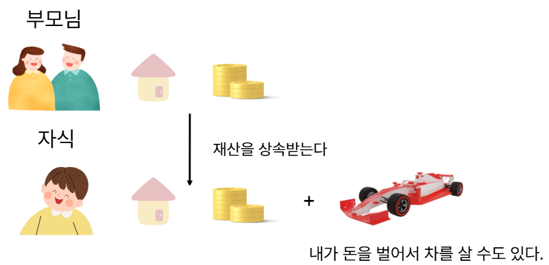

# 클래스

## 객체지향 프로그래밍(OOP : Object-Oriented Programming)
- 객체 지향 프로그래밍이란, 말 그대로 객체를 지향하는 프로그래밍 방법을 말한다.
- 객체란 우리 실생활에 존재하는 모든것으로 생각할 수 있다.
- 객체는 일반적으로 상태를 표현할 수 있고, 우리가 행동으로 실행할 수 있는 모든것들을 의미한다.
- 이런 객체를 중심으로 프로그램 구조를 설계하고 프로그래밍 하는 것을 객체 지향 프로그래밍이라고 한다.

### 객체란?
- 물리적으로 존재하거나 개념적인 것 중에서 다른 것과 식별 가능한 것을 말한다.
- 예를 들어 물리적으로 존재하는 자동차, 자전거, 책, 사람은 물론 개념적인 학과나 강의, 주문 등도 모두 객체가 될 수 있다.
- 객체는 속성과 동작으로 구성된다. 사람은 이름, 나이 등의 속성과 웃다, 걷다 등의 동작이 있고, 자동차는 생상, 모델명 등의 속성과 달린다, 멈춘다 등의 동작이 있다.
- 자바는 이러한 속성과 동작을 각각 ```필드(field)```와 ```메소드(method)```라고 부른다.


- 현실 세계의 객체를 소프트웨어 객체로 설계하는 것을 객체 모델링이라고 한다.
- 객체 모델링은 현실 세계 객체의 대표 속성과 동작을 추려 내어 소프트웨어 객체의 필드와 메소드로 정의하는 과정이다.
  
### 객체의 상호작용
- 현실 세계에서 일어나나 모든 현상은 객체와 객체 간의 상호작용으로 이루어져 있다.
- 예를 들어 사람은 전자계산기의 기능을 이용하고, 전자계산기는 계산 결과를 반환하는 상호작용을 한다.

	

### 객체간의 관계
- 객체는 단독으로 존재할 수 있지만 대부분 다른 객체와 관계를 맺고 있다.
- 관계의 종류에는 집합 관계, 사용 관계, 상속 관계가 있다.

#### 집합 관계
- 완성품과 부품관의 관계를 말한다.
- 예를 들어, 자동차는 엔진, 타이어, 핸들 등으로 구성되므로 자동차와 푸품들은 집합 관계라고 볼 수 있다.

#### 사용 관계
- 다른 객체의 필드를 읽고 변경하거나 메소드를 호출하는 관계를 말한다.
- 예를 들어 사람이 자동차에게 달린다, 멈춘다 등의 메소드를 호출하면 사람과 자동차는 사용관계라고 볼 수 있다.

#### 상속 관계
- 부모와 자식 관계를 말한다.
- 자동차가 기계의 특징(필드,메소드)을 물려받는다면 기계(부모)와 자동차(자식)는 상속 관계에 있다고 볼 수 있다.

### 객체지향 프로그래밍의 특징
#### 캡슐화
- 객체의 데이터(필드),동작(메소드)을 하나로 묶고 실제 구현 내용을 외부에 감추는 것을 말한다.
- 외부 객체는 객체 내부의 구조를 알지 못하며 객체가 노출해서 제공하는 필드와 메소드만 이용할 수 있다.

	

- 필드와 메소드를 캡슐화 하여 보호하는 이유는 외부의 잘못된 사용으로 인해 객체가 손상되지 않도록 하는 데 있다.

#### 상속
- 객체지향 프로그래밍에서는 부모 역할의 상위 객체와 자식 역할의 하위 객체가 있다.
- 부모 객체는 자기가 가지고 있는 필드와 메소드를 자식 객체에게 물려주어 자식 객체가 사용할 수 있도록 한다.
##### 상속을 하는 이유
- 코드의 재사용성을 높여 준다.
- 유지 보수 시간을 최소화 시켜준다.

	


#### 다형성
- 사용방법은 동일하지만 실제 결과가 다양하게 나오는 성질을 말한다.
- 자동차 부품을 교환하면 성능이 다르게 나오듯이 프로그램을 구성하는 객체(부품)를 바꾸면 프로그램의 실행 성능이 다르게 나올 수 있다.

	

## 객체와 클래스
- 객체를 생성할 때는 설계도가 필요하다.
- 현실 세계에서 자동차를 생성하려면 자동차의 설계도가 필요하듯이, 객체지향 프로그래밍에서도 객체를 생성하려면 설계도에 해당하는 클래스가 필요하다.
- 클래스로 부터 생성된 객체를 해당 클래스의 인스턴스라고 부른다.
- 그리고 클래스로부터 객체를 만드는 과정을 인스턴스화라고 한다.
- 동일한 클래스로부터 여러 개의 인스턴스를 만들 수 있는데, 이것은 동일한 설계도로 여러 대의 자동차를 만드는것과 동일하다.

	

- 우리는 지금까지 많은 클래스를 선언해봤다.
- 클래스는 객체를 생성하기 위한 설계도이지만 객체를 만들지는 않았고, main()메소드만 작성해서 실행할 목적으로 클래스를 이용했다.
- 이제부터 main()메소드가 없는 클래스를 선언하고 생성해보자.

## 클래스의 선언
- 첫날부터 클래스를 만들어서 사용해왔다.
- 자바 프로그래밍의 기반이 클래스이기 때문이다.
- 우리가 사용해온 클래스의 기본 구조는 다음과 같다.

```java
접근제한자 class 클래스명{

}

접근제한자 : 클래스의 접근 범위를 제한한다.
class : class를 선언함을 뜻한다.
클래스명 : 변수처럼 이름을 가지고, 객체를 생성할 때 사용한다.
```
- 클래스는 일반적으로 하나의 소스 파일에 하나의 클래스를 선언합니다.
- 하나의 파일에서 여러개의 클래스를 선언한다면 파일이름과 같은 클래스에만 public을 사용해야 한다.

### Main01 클래스 작성
```java
package ch06.sec03;

public class SportsCar {
}

class Tire {
}
```
- 하지만 코드를 컴파일한 결과물은 코드 파일을 각각 작성한 것과 동일하게 각 class별로 도출되어 2개가 생성된다.
- 파일 분리 여부와 상관 없이 결과물이 같기 때문에, 분리 여부는 개발자가 원하는 대로 작성해도 무방하다.
- 그러나 추후 유지보수의 편리성과 클래스 재사용을 고려해 하나의 파일에 한 개의 클래스를 작성하는 것을 추천합니다.

### 클래스 이름을 작성하는 규칙
- 영어 대소문자를 사용할 수 있으며 보통 첫 글자는 대문자를 사용한다.
- 숫자를 사용할 수 있으나 첫 글자로는 사용할 수 없습니다.
- 특수문자는 $,_만 가능합니다.
- 자바 예약어(키워드)는 사용할 수 없습니다.

```java
package ch06.sec04;

public class Student {

}
```

## 객체 생성과 클래스 변수
- 클래스로부터 객체를 생성하려면 객체 생성 연산자인 new가 필요하다.
```java
new 클래스명();
```
- new 연산자 뒤에는 생성자 호출 코드가 있는데, ```클래스명()```형태를 가진다.
- new 연산자는 객체를 생성시킨 후 객체의 주소를 반환하기 때문에 클래스 변수에 다음과 같이 대입할 수 있다.

```java
클래스명 변수명 = new 클래스명();
```

```java
package ch06.sec04;

public class StudentExample {
	public static void main(String[] args) {
		Student s1 = new Student();
		System.out.println("s1 변수가 Student 객체를 참조합니다.");

		Student s2 = new Student();
		System.out.println("s2 변수가 또 다른 Student 객체를 참조합니다.");
	}
}
```

## 클래스의 종류

### 실행용 클래스 
- 프로그램 전체에서 단 하나의 클래스로, 프로그램의 실행을 맡고 있다.
- main메서드를 갖고 있으며, 다른 클래스에서 사용하지 않는다.
```java
public class Main{
	public static void main(String[] args){
		//실행하려는 코드
	}
}
```
### 객체 생성용 클래스
- 다른 클래스에서 사용할 목적으로 선언되는 클래스 입니다.
```java
public class Car{
	//속성

	//행위
}
```

```
하나의 클래스가 위 두 가지 용도의 역할을 모두 수행할 수 도 있다.
하지만 유지 보수와 객체 지향 프로그래밍의 특징인 모듈화를 고려해 별도로 분리하여 작성하는 것이 좋다.
일반적으로 하나의 프로그램에서 실행용 클래스 1개를 제외한 나머지 클래스는 모두 참조용 클래스이다.
```


## 클래스의 구성
- 클래스를 구성하는 요소는 필드,메서드, 생성자 3가지가 있다.

## 필드(field)
- 객체가 가져야할 데이터의 상태를 저장하는 변수를 말한다.
- 필드, 전역변수, 멤버 변수 라고 부르는데 다 같은말이다.
- 필드의 값을 초기화 하지 않으면 객체 생성시 자동으로 기본값으로 초기화 된다.

```java
package ch06.sec06.exam01;

public class Car {
	//필드 선언
	String model;
	boolean start;
	int speed;
}
```
- 만약 클래스를 선언할 때, 필드의 값을 초기화 하지 않으면 객체 생성 시 자동으로 기본값으로 초기화된다.
<table>
	<tr>
		<th>구분</th>
		<th>분류</th>
		<th>자료형</th>
		<th>초기값</th>
	</tr>
	<tr>
		<td rowspan="4">기본 자료형</td>
		<td>정수형</td>
		<td>byte<br>short<br>int<br>long<br></td>
		<td>0<br>0<br>0<br>0L</td>
	</tr>
	<tr>
		<td>문자형(정수)</td>
		<td>char</td>
		<td>\u0000(공백)</td>
	</tr>
	<tr>
		<td>실수형</td>
		<td>float<br>double</td>
		<td>0.0F<br>0.0</td>
	</tr>
	<tr>
		<td>논리형</td>
		<td>boolean</td>
		<td>false</td>
	</tr>
	<tr>
		<td rowspan="2" colspan="2" align="center">참조 자료형</td>
		<td>배열</td>
		<td>null</td>
	</tr>
	<tr>
		<td>클래스</td>
		<td>null</td>
</table>

- 필드는 클래스에 포함된 요소이자, 객체를 생성한 후 객체가 가지는 데이터이기도 하다.
- 따라서 객체를 생성한 후 그 객체의 필드를 사용할 수 있다.
```java
객체명.필드명

객체명 : 클래스를 이용해 만든 객체의 이름
필드명 : 만든 객체가 가지고 있는 필드의 이름
```
```java
package ch06.sec06.exam01;

public class CarExample {
	public static void main(String[] args) {
		//Car 객체 생성
		Car myCar = new Car();

		//Car 객체의 필드값 읽기
		System.out.println("모델명: " + myCar.model);
		System.out.println("시동여부: " + myCar.start);
		System.out.println("현재속도: " + myCar.speed);
	}
}
```

### 필드의 사용
- 필드를 사용한다는 것은 필드값을 읽고 변경하는 것을 말한다.
- 클래스에서 필드를 선언했다고 해서 바로 사용할 수 있는 것은 아니다.
- 필드는 객체의 데이터이므로 객체가 존재하지 않으면 필드도 존재하지 않는다.
- 클래스로부터 객체가 생성된 후에 필드를 사용할 수 있다.
- 필드는 객체 내부의 생성자와 메소드 내부에서 사용할 수 있고, 객체 외부에서도 접근해서 사용할 수 있다.

```java
package ch06.sec06.exam02;

public class Car {
	//필드 선언
	String company = "현대자동차";
	String model = "그랜저";
	String color = "검정";
	int maxSpeed = 350;
	int speed;
}
```
```java
package ch06.sec06.exam02;

public class CarExample {
	public static void main(String[] args) {
		//Car 객체 생성
		Car myCar = new Car();

		//Car 객체의 필드값 읽기
		System.out.println("제작회사: " + myCar.company);
		System.out.println("모델명: " + myCar.model);
		System.out.println("색깔: " + myCar.color);
		System.out.println("최고속도: " + myCar.maxSpeed);
		System.out.println("현재속도: " + myCar.speed);

		//Car 객체의 필드값 변경
		myCar.speed = 60;
		System.out.println("수정된 속도: " + myCar.speed);
	}
}
```

# 생성자

## 생성자의 선언과 호출
- 클래스를 구성하는 구성요소중 하나인 생성자는, 객체를 생성할 때 호출되어 객체의 초기화를 담당하는 특별한 메서드이다.
- 객체를 생성하고 초기화하기 위해서는 반드시 생성자를 호출해야 한다.

```java
클래스명 변수명 = new 클래스명();
				    ---------
						↓
					생성자의 호출

```

- 생성자가 성곡적으로 실행이 끝나면 new 연산자는 객체의 주소를 반환한다.
- 반환된 주소는 클래스 변수에 대입되어 객체의 필드나 메소드에 접근할 때 이용된다.

## 기본생성자
- 자바의 모든 클래스에는 ```하나 이상의 생성자가 정의```되어야 있어야 한다.
- 클래스를 생성하면서 개발자가 직접 생성자를 선언하지 않았지만, 자바 컴파일러가 다음과 같은 기본생성자를 자동으로 제공해주고 있다.
```java
public 클래스명() { }
```
- 다만, 컴파일러의 눈에만 보일 뿐 우리가 보는 코드에는 생략되어 있다.
- 클래스가 public class로 선언되면 기본 생성자도 public이 붙지만, 클래스가 public없이 class로만 선언되면 기본 생성자에도 public이 붙지 않는다.
- 예를 들어 Car클래스를 설계할 때 생성자를 생략하면 기본생성자가 다음과 같이 생성된다.
```java
public class Car{

}

↓ 컴파일

public class Car{

	public Car(){ //자동 추가

	}
}
```
- 그렇기 때문에 다음과 같이 new 연산자 뒤에 기본 생성자를 호출할 수 있다.
```java
Car myCar = new Car();
				------
					↓ 
				기본 생성자의 호출
```


## 생성자 선언
- 객체를 다양하게 초기화하기 위해 개발자는 생성자를 다음과 같이 직접 선언할 수 있다.
```java
접근제어자 클래스명 (매개변수1,매개변수2...){
	//객체의 초기화 코드
}
```
- 생성자는 반환값이 없지만, 반환 타입을 아예 작성하지 않는다.(void로도 적지 않는다.)
- 매개변수는 new 연산자로 생성자를 호출할 때 매개값을 생성자 블록 내부로 전달하는 역할을 한다.
- 예를 들어 다음과 같이 Car 생성자를 호출할 때 3개의 매개값을 블록 내부로 전달한다고 가정해보자.
```java
Car myCar = new Car("그랜저","검정",300);
```
- 3개의 매개값을 순서대로 매개변수로 대입받기 위해서는 다음과 같이 생성자가 선언되어야 한다.
```java
public class Car{
	//생성자 선언
	Car(String model, String color, int maxSpeed){
		...
	}
}
```
- 매개변수의 타입은 매개값의 종류에 맞게 작성하면 된다.
```java
package ch06.sec07.exam01;

public class Car {
	//생성자 선언
	Car(String model, String color, int maxSpeed) {
	}
}
```
```java
package ch06.sec07.exam01;

public class CarExample {
	public static void main(String[] args) {
		Car myCar = new Car("그랜저", "검정", 250);
		//Car myCar = new Car();  //기본 생성자 호출 못함
	}
}
```

## 필드 초기화
- 객체마다 동일한 값을 갖고 있다면 필드 선언 시 초기값을 대입하는 것이 좋고, 객체마다 다른 값을 가져야 한다면 생성자에서 필드를 초기화 하는 것이 좋다.
- 예를 들어 Korean 클래스를 선언한다고 가정해보자.
- 한국인이므로 nation(국가)은 대한민국으로 동일한 값을 갖지만, name(이름)과ssn(주민등록번호)은 한국인마다 다르므로 생성자에서 초기화 하는것이 좋다.
```java
package ch06.sec07.exam02;

public class Korean {
	//필드 선언
	String nation = "대한민국";
	String name;
	String ssn;

	//생성자 선언
	public Korean(String n, String s) {
	  name = n;
	  ssn = s;
	}
}
```
- 생성자의 매개변수에 들어가는 값은 생성자를 호출할 때 주어진다.
```java
package ch06.sec07.exam02;

public class KoreanExample {
	public static void main(String[] args) {
		//Korean 객체 생성
		Korean k1 = new Korean("박자바", "011225-1234567");
		//Korean 객체 데이터 읽기
		System.out.println("k1.nation : " + k1.nation);
		System.out.println("k1.name : " + k1.name);
		System.out.println("k1.ssn : " + k1.ssn);
		System.out.println();

		//또 다른 Korean 객체 생성
		Korean k2 = new Korean("김자바", "930525-0654321");
		//또 다른 Korean 객체 데이터 읽기
		System.out.println("k2.nation : " + k2.nation);
		System.out.println("k2.name : " + k2.name);
		System.out.println("k2.ssn : " + k2.ssn);
	}
}
```
- 위 예제의 Korean 생성자를 보면 매개변수 이름으로 각 n과 s를 사용했다.
- 매개변수의 이름이 너무 짧으면 가독성이 좋지 않기 때문에 가능하면 초기화시킬 필드명과 동일한 이름을 사용하는 것이 좋다.
```java
package ch06.sec07.exam03;

public class Korean {
	// 필드 선언
	String nation = "대한민국";
	String name;
	String ssn;

	// 생성자 선언
	public Korean(String name, String ssn) {
		this.name = name;
		this.ssn = ssn;
	}
}
```
- 매개변수명이 필드명과 동일하기 때문에 필드임을 구분하기 위해 this키워드를 필드명 앞에 붙여 주었다.
- this는 현재 객체를 말하며, this.name은 현재 객체의데이터(필드)로서의 name을 뜻한다.

## Person 클래스
```java
public class Person {
	int age;
	String name;

	//예를들어서 나이와 이름, 전화번호를 알아야 친구가 된다고 가정을 해볼게요.
	//이중에 한가지라도 빼먹고 안쓰면 문제가 있는거에요 써먹기 불가능한 객체가 될수도 있다는거죠.

	//똑같은걸 계속 만드려고 한다면 기본생성자에 값을 넣어놓는것도 좋은 방법
	//pbulic Person() {
	//	age = 40;
	//	name = "노태문";
	//}

	//빈공간에서 cntl + space bar 기본생성자 생성
	//임의로 새로운 생성자를 정의한 순간부터 기본생성자는 쓸 수 없다.
	public Person(int age, String) {
		this.age = age;
		this.name = name;

	}

	public void introduce() {
		System.out.printf("안녕하세요. 저는 %d살 %s입니다.", age,name);
	}
}
```
## PMain 클래스
```java
public class PMain{
	public static void main(String[] args) {
		
		Person p1 = new Person(20,"홍길동");
		Person p2 = new Person(30,"김자바");

		p1.introduce();
		p2.introduce();
		
}
```

## 생성자 오버로딩
- 매개값으로 객체의 필드를 다양하게 초기화하려면 생성자 오버로딩이 필요하다.
- 생성자 오버로딩이란 매개변수를 달리하는 생성자를 여러 개 선언하는 것을 말한다.

### 오버로딩 규칙
1. 매개변수의 개수가 다를 때
2. 매개변수의 개수가 같아도 자료형이 다를 때
3. 생성자나 메서드의 이름은 그대로 사용해야 한다.

```java
public class Car{
	Car(){ ... }
	Car(String model){ ... }
	Car(String model, String color) { ... }
	Car(String model, String color, int maxSpeed) { ... }
}
```
- 매개변수의 타입과 개수 그리고 선언된 순서가 똑같을 경우 매개변수 이름만 바꾸는 것은 생성자 오버로딩이 아니다.
```java
Car(String model, String color) { ... }
Car(String color, String model) { ... } //오버로딩이 아님 컴파일 에러 발생
```

```java
package ch06.sec07.exam04;

public class Car {
	//필드 선언
	String company = "현대자동차";
	String model;
	String color;
	int maxSpeed;
	
	//생성자 선언
	Car() {}
	
	Car(String model) { 
		this.model = model; 
	}
	
	Car(String model, String color) {
		this.model = model;
		this.color = color;
	}
	
	Car(String model, String color, int maxSpeed) {
		this.model = model;
		this.color = color;
		this.maxSpeed = maxSpeed;
	}
}
```
```java
package ch06.sec07.exam04;

public class CarExample {
	public static void main(String[] args) {
		Car car1 = new Car();
		System.out.println("car1.company : " + car1.company);
		System.out.println();

		Car car2 = new Car("자가용");
		System.out.println("car2.company : " + car2.company);
		System.out.println("car2.model : " + car2.model);
		System.out.println();
		
		Car car3 = new Car("자가용", "빨강");
		System.out.println("car3.company : " + car3.company);
		System.out.println("car3.model : " + car3.model);
		System.out.println("car3.color : " + car3.color);
		System.out.println();
		
		Car car4 = new Car("택시", "검정", 200);
		System.out.println("car4.company : " + car4.company);
		System.out.println("car4.model : " + car4.model);
		System.out.println("car4.color : " + car4.color);
		System.out.println("car4.maxSpeed : " + car4.maxSpeed);
	}
}
```
### 다른 생성자 호출
- 생성자 오버로딩이 많아질 경우 생성자 간의 중복된 코드가 발생할 수 있다.
- 매개변수의 수만 달리하고 필드 초기화 내용이 비슷한 생성자에서 이러한 중복 코드를 많이 볼 수 있다.
```java
Car(String model){
	this.model = model;
	this.color = "은색";
	this.maxSpeed = 250;
}

Car(String model, String color){
	this.model = model;
	this.color = color;
	this.maxSpeed = 250;
}

Car(String model, String color, int maxSpeed){
	this.model = model;
	this.color = color;
	this.maxSpeed = maxSpeed;
}
```
- 이 경우에는 공통 코드를 한 생성자에만 집중적으로 작성하고, 나머지 생성자는 this(...)를 사용하여 공통 코드를 가지고 있는 생성자를 호출하는 방법으로 개선할 수 있다.
```java
Car(String model){
	this(model,"은색",250);
}

Car(String model, String color){
	this(model,color,250);
}

Car(String model, String color, int maxSpeed){
	this.model = model;
	this.color = color;
	this.maxSpeed = maxSpeed;
}
```
```java
package ch06.sec07.exam05;

public class Car {
	// 필드 선언
	String company = "현대자동차";
	String model;
	String color;
	int maxSpeed;
	
	Car(String model) {
		//20라인 생성자 호출
		this(model, "은색", 250);
	}

	Car(String model, String color) {
		//20라인 생성자 호출
		this(model, color, 250);
	}

	Car(String model, String color, int maxSpeed) {
		this.model = model;
		this.color = color;
		this.maxSpeed = maxSpeed;
	}
}

package ch06.sec07.exam05;

public class CarExample {
	public static void main(String[] args) {
		Car car1 = new Car("자가용");
		System.out.println("car1.company : " + car1.company);
		System.out.println("car1.model : " + car1.model);
		System.out.println();

		Car car2 = new Car("자가용", "빨강");
		System.out.println("car2.company : " + car2.company);
		System.out.println("car2.model : " + car2.model);
		System.out.println("car2.color : " + car2.color);
		System.out.println();
		
		Car car3 = new Car("택시", "검정", 200);
		System.out.println("car3.company : " + car3.company);
		System.out.println("car3.model : " + car3.model);
		System.out.println("car3.color : " + car3.color);
		System.out.println("car3.maxSpeed : " + car3.maxSpeed);
	}
}
```

# 메서드

## 메서드 선언과 호출
- 메소드 선언은 객체의 동작을 실행하는 블록으로 정의하는 것을 말하고, 메소드 호출은 실행 블록을 실제로 실행하는 것을 말한다.
- 메소드는 객체 내부에서도 호출되지만 다른 객체에서도 호출될 수 있기 때문에 객체 간의 상호작용 방법을 정의하는 것이라고 볼 수 있다.

### 메서드 선언
- 메서드는 크게 선언부(signature)와 실제 영역(body)로 구성되어 있다.
```java
접근 제한자 반환타입 메서드명(){
	//기능을 수행하는 코드
}
```
#### 반환타입(return Type)
- 메서드를 호출하면 메서드는 블록 안에 있는 코드들을 실행한 후 결과값을 반환한다.
- 이때 결과값을 어떤타입으로 반환할것인지 미리 정해주는것이다.
- 반환값이 없는 경우 타입으로 'void'를 쓰면 된다.
```java
void powerOn() { ... } //리턴값이 없는 메소드 선언
double divide(int x, int y) { ... } //double 타입 값을 리턴하는 메소드 선언
```

#### 메서드명(함수명)
- 메서드명은 말그대로 메서드의 이름(첫글자는 소문자로 시작한다.)
- 메서드를 호출할 때 사용한다.
```java
void run() { ... }
void setSpeed(int speed) { ... }
String getName() { ... }
```

#### 매개변수
- 메소드를 호출할 때 전달한 매개값을 받기 위해 사용된다.
- 다음 예에서 divide() 메소드는 연산할 두 수를 전달받아야 하므로 매개변수가 2개 필요하다.
- 전달할 매개값이 없다면 매개변수는 생략할 수 있다.

```java
double divide(int x, int y) { ... }
```
- 매개변수는 '매개변수의 자료형'과'매개 변수명'으로 선언할 수 있다.
```java
				  int number;
전달받을 값의 자료형 ┘ 	  └ 메서드 안에서 사용할 이름

```
#### 실행블록
- 메소드 호출 시 실행되는 부분이다.
```java
package ch06.sec08.exam01;

public class Calculator {
	//리턴값이 없는 메소드 선언
	void powerOn() {
		System.out.println("전원을 켭니다.");
	}

	//리턴값이 없는 메소드 선언
	void powerOff() {
		System.out.println("전원을 끕니다.");
	}

	//호출 시 두 정수 값을 전달받고,
	//호출한 곳으로 결과값 int를 리턴하는 메소드 선언
	int plus(int x, int y) {
		int result = x + y;
		return result; //리턴값 지정;
	}

	//호출 시 두 정수 값을 전달받고,
	//호출한 곳으로 결과값 double을 리턴하는 메소드 선언
	double divide(int x, int y) {
		double result = (double)x / (double)y;
		return result; //리턴값 지정;
	}
}
```
### 메소드의 호출
- 메소드를 호출한다는 것은 <b style="color:red">메소드 블록을 실행</b>하는 것을 말한다.
- 클래스에서 메소드를 선언했다고해서 바로 호출할 수 있는 것은 아니다.
- 메소드는 객체의 동작이므로 <b style="color:red">객체가 존재하지 않으면 메소드를 호출할 수 없다.</b>
- 클래스로부터 객체가 생성된 후에 <b style="color:red">메소드는 생성자와 다른 메소드 내부에서 호출될 수 있고, 객체 외부에서도 호출될 수 있다.</b>
- 객체 내부에서는 단훈시 메소드명으로 호출하면 되지만, 외부 객체에서는 참조 변수와 도트( . )연산자를 이용해서 호출한다.
- 또한 메소드가 매개변수를 가지고 있을 때는 호출할 때 매개변수의 타입과 수에 맞게 매개값을 제공해야 한다.
- 메소드가 리턴값이 있을 경우에는 대입 연산자를 사용해서 다음과 같이 리턴값을 변수에 저장할 수 있다.

	<br>

	```java
	타입 변수 = 메소드();
	```
	<br>

```java
package ch06.sec08.exam01;

public class CalculatorExample {
	public static void main(String[] args) {
		//Calculator 객체 생성
		Calculator myCalc = new Calculator();
		
		//리턴값이 없는 powerOn() 메소드 호출
		myCalc.powerOn();

		//plus 메소드 호출 시 5와 6을 매개값으로 제공하고,
		//덧셈 결과를 리턴 받아 result1 변수에 대입
		int result1 = myCalc.plus(5, 6);
		System.out.println("result1: " + result1);

		int x = 10;
		int y = 4;
		//divide() 메소드 호출 시 변수 x와 y의 값을 매개값으로 제공하고,
		//나눗셈 결과를 리턴 받아 result2 변수에 대입
		double result2 = myCalc.divide(x, y);
		System.out.println("result2: " + result2);

		//리턴값이 없는 powerOff() 메소드 호출
		myCalc.powerOff();
	}
}
```
### 가변길이 매개변수
- 메소드를 호출할 때에는 매개변수의 개수에 맞게 매개값을 제공해야 한다.
- 만약 메소드가 가변길이 매개변수를 가지고 있다면 매개변수의 개수와 상관없이 매개값을 줄 수 있다.
- 가변길이 매개변수는 다음과 같이 선언한다.
```java
int sum(int ... values){

}
```
- 가변 길이 매개변수는 메소드 호출 시 매개값을 쉼표로 구분해서 개수와 상관없이 제공할 수 있다.
```java
int result = sum(1,2,3);
int result = sum(1,2,3,4,5);
```
- 매개값들은 자동으로 배열 항목으로 변환되어 메소드에서 사용된다.
```java	
int[] values = {1,2,3};		
int result = sum(values);

int result = sum(new int[] {1,2,3});
```

<br>

```java
package ch06.sec08.exam02;

public class Computer {
	//가변길이 매개변수를 갖는 메소드 선언
	int sum(int ... values) {
		//sum 변수 선언
		int sum = 0;
		
		//values는 배열 타입의 변수처럼 사용
		for (int i = 0; i < values.length; i++) {
			sum += values[i];
		}

		//합산 결과를 리턴
		return sum;
	}
}

package ch06.sec08.exam02;

public class ComputerExample {
	public static void main(String[] args) {
		//Computer 객체 생성
		Computer myCom = new Computer();

		//sum() 메소드 호출 시 매개값 1, 2, 3을 제공하고
		//합산 결과를 리턴 받아 result1 변수에 대입
		int result1 = myCom.sum(1, 2, 3);
		System.out.println("result1: " + result1);

		//sum() 메소드 호출 시 매개값 1, 2, 3, 4, 5를 제공하고
		//합산 결과를 리턴 받아 result2 변수에 대입
		int result2 = myCom.sum(1, 2, 3, 4, 5);
		System.out.println("result2: " + result2);

		//sum() 메소드 호출 시 배열을 제공하고
		//합산 결과를 리턴 받아 result3 변수에 대입
		int[] values = { 1, 2, 3, 4, 5 };
		int result3 = myCom.sum(values);
		System.out.println("result3: " + result3);

		//sum() 메소드 호출 시 배열을 제공하고
		//합산 결과를 리턴 받아 result4 변수에 대입
		int result4 = myCom.sum(new int[] { 1, 2, 3, 4, 5 });
		System.out.println("result4: " + result4);
	}
}
```

### return
- return 문은 메소드의 실행을 강제 종료하고 호출한 곳으로 돌아간다는 의미이다.
- 메소드 선언에 반환타입이 있을 경우에는 return문 뒤에 리턴값을 추가로 지정해야 한다.

```java
접근제한자 반환타입 메서드명(){
	//기능을 수행할 코드들
	...
	return 리턴값;
}
```
- return 문 이후에 실행문을 작성하면 'Unreachable code'라는 컴파일 에러가 발생한다.
- 왜냐하면 return문 이후의 실행문은 결코 실행되지 않기 때문이다.
```java
int plus(int x, int y){
	int result = x + y;
	return result;
	//System.out.println(result) Unreachable code
}
```
- 하지만 다음과 같은 경우에는 컴파일 에러가 발생하지 않는다.
```java
boolean isLeftGas(){
	if(gas == 0){
		System.out.println("gas가 없습니다."); // 1
		return false;
	}
	System.out.println("gas가 있습니다."); // 2
	return true;
}
```
- if 문의 조건식이 false가 되면 정상적으로 2가 실행되기 때문에 2는 'Unreachable code'에러를 발생시키지 않는다.
- if문의 조건식이 true가 되면 1이 실행되고 return false가 실행되어 메소드는 즉시 종료되므로 당연히 2는 실행되지 않는다.

<br>

```java
package ch06.sec08.exam03;

public class Car {
	//필드 선언
	int gas;

	//리턴값이 없는 메소드로 매개값을 받아서 gas 필드값을 변경
	void setGas(int gas) {
		this.gas = gas;
	}

	//리턴값이 boolean인 메소드로 gas 필드값이 0이면 false를, 0이 아니면 true를 리턴
	boolean isLeftGas() {
		if (gas == 0) {
			System.out.println("gas가 없습니다.");
			return false; // false를 리턴하고 메소드 종료
		}
		System.out.println("gas가 있습니다.");
		return true; // true를 리턴하고 메소드 종료
	}

	//리턴값이 없는 메소드로 gas 필드값이 0이면 return 문으로 메소드를 종료
	void run() {
		while (true) {
			if (gas > 0) {
				System.out.println("달립니다.(gas잔량:" + gas + ")");
				gas -= 1;
			} else {
				System.out.println("멈춥니다.(gas잔량:" + gas + ")");
				return; // 메소드 종료
			}
		}
	}
}
```
<br>

```java
package ch06.sec08.exam03;

public class CarExample {
	public static void main(String[] args) {
		//Car 객체 생성
		Car myCar = new Car();

		//리턴값이 없는 setGas() 메소드 호출
		myCar.setGas(5);

		//isLeftGas() 메소드를 호출해서 받은 리턴값이 true일 경우 if 블록 실행
		if(myCar.isLeftGas()) {
			System.out.println("출발합니다.");
			
			//리턴값이 없는 run() 메소드 호출
			myCar.run();
		}
		
		System.out.println("gas를 주입하세요.");
	}
}
```

### 메소드 오버로딩
- 생성자 오버로딩과 같이 매개변수의 타입, 개수, 순서가 다른 메소드를 여러 개 선언하는 것을 말한다.
```
class 클래스 {
	리턴 타입	메소드명	(타입 변수, ...) {...}
		↕		↕			↕
	  무관		동일		타입,개수,순서가 다른 메소드를 여러개 선언
		↕		↕			↕
	리턴 타입	메소드명	(타입 변수, ...) {...}
}
```
- 메소드 오버로딩의 목적은 다양한 매개값을 처리하기 위해서이다.
- 다음 예에서 plus() 메소드는 두 개의 int 타입 매개값만 처리하고 double 타입 매개 값은 처리할 수 없다.
```java
int plus(int x, int y){
	int result = x + y;
	return result;
}
```
- 만약 double 타입 값도 처리하고 싶다면 다음과 같이 plus()메소드를 오버로딩하면 된다.
```java
int plus(double x, double y){
	double result = x + y;
	return result;
}
```
- 메소드 오버로딩의 대표적인 예는 콘솔에 출력하는 System.out.println()메소드로, 호출할 때 주어진 매개값의 타입에 따라서 오버로딩된 println() 메소드 중 하나를 실행한다.

```java
void println() { ... }
void println(double x) { ... }
void println(int x) { ... }
void println(String x) { ... }
```

<br>

```java
package ch06.sec08.exam04;

public class Calculator {
	//정사각형의 넓이
	double areaRectangle(double width) {
		return width * width;
	}
	
	//직사각형의 넓이
	double areaRectangle(double width, double height) {
		return width * height;
	}
}
```
<br>

```java
package ch06.sec08.exam04;

public class CalculatorExample {
	public static void main(String[] args) {
		//객체 생성
		Calculator myCalcu = new Calculator();

		//정사각형의 넓이 구하기
		double result1 = myCalcu.areaRectangle(10);
		
		//직사각형의 넓이 구하기
		double result2 = myCalcu.areaRectangle(10, 20);

		System.out.println("정사각형 넓이=" + result1);
		System.out.println("직사각형 넓이=" + result2);
	}
}
```

## 인스턴스 멤버
- 필드와 메소드는 선언 방법에 따라 인스턴스 멤버와 정적 멤버로 분류할 수 있다.
- 인스턴스 멤버로 선언되면 객체 생성 후 사용할 수 있고, 정적 멤버로 선언되면 객체 생성 없이도 사용할 수 있다.

|구분|설명|
|----|----|
|인스턴스(instance)멤버|객체에 소속된 멤버(객체를 생성해야만 사용할 수 있는 멤버)|
|정적(static멤버|클래스에 고정인 멤버(객체 없이도 사용할 수 있는 멤버)|

### 인스턴스 멤버 선언 및 사용
- 인스턴스 멤버란 객체에 소속된 멤버를 말한다.
- 따라서 <span style="color:red">객체가 있어야만 사용할 수 있는 멤버다.</b>
- 우리가 지금까지 선언한 필드와 메서드를 멤버라고 할 수 있다.
```java
public class Car{
	//인스턴스 필드 선언
	int gas;

	//인스턴스 메소드 선언
	void setSpeed(int speed) { ... }
}
```
- gas 필드와 setSpeed() 메소드는 인스턴스 멤버이기 때문에 외부 클래스에서 사용하기 위해서는 Car객체를 먼저 생성하고 참조변수로 접근해서 사용해야 한다.
```java
Car myCar = new Car();
myCar.gas = 10;
myCar.setSpeed(60);

Car yourCar = new Car();
myCar.gas = 20;
myCar.setSpeed(80);
```
- gas 필드는 객체마다 따로 존재하며, setSpeed()메소드는 각 객체마다 존재하지 않고 메소드영역에 저장되고 공유된다.
- 메소드는 코드의 덩어리이므로 <b style="color:red">객체마다 저장한다면 중복 저장으로 인해 메모리 효율이 떨어진다.</b>
- 따라서 <b style="color:red">메소드 코드는 메소드 영역에 두되 공유해서 사용</b>하고, 이때 <b style="color:red">객체 없이는 사용하지 못하도록 제한</b>을 걸어둔 것이다.


### this
- 우리가 자신을 '나'라고 하듯이, <b style="color:red">객체는 자신을 'this'라고 한다.</b>
- 생성자와 메소드의 매개변수명이 인스턴스 멤버인 필드명과 동일한 경우, 인스턴스 필드임을 강조하고자 할 때 this를 주로 사용한다.
- this를 필드에 붙여서 사용하면, 중괄호{}안에서도 같은 이름의 매개변수와 필드를 구분해서 사용할 수 있다.
```java
this.필드 = 매개변수명;
```

```java
package ch06.sec09;

public class Car {
	//필드 선언
	String model;
	int speed;

	//생성자 선언
	Car(String model) {
		this.model = model; //매개변수를 필드에 대입(this 생략 불가)
	}
	
	//메소드 선언
	void setSpeed(int speed) {
		this.speed = speed; //매개변수를 필드에 대입(this 생략 불가)
	}

	void run() {
		this.setSpeed(100);
		System.out.println(this.model + "가 달립니다.(시속:" + this.speed + "km/h)");
	}
}
```

<br>

```java
package ch06.sec09;

public class CarExample {
	public static void main(String[] args) {
		Car myCar = new Car("포르쉐");
		Car yourCar = new Car("벤츠");

		myCar.run();
		yourCar.run();
	}
}
```

## 정적 멤버 (static)
- 자바는 클래스 로더(loader)를 이용해서 클래스를 메소드 영역에 저장학 사용한다.
- 정적 멤버란 메소드 영역의 <b style="color:red">클래스에 고정적으로 위치하는 멤버를 말한다.</b>
- 그렇기 때문에 정적 멤버는 객체를 생성할 필요 없이 클래스를 통해 바로 사용이 가능하다.

### 정적 멤버 선언
- 필드와 메소드는 모두 정적 멤버가 될 수 있다.
- 정적 필드와 메소드로 선언하려면 <b style="color:red">static키워드를 추가하면 된다.</b>
```java
public class 클래스{
	//정적 필드 선언
	static 타입 필드 [= 초기값];

	//정적 메소드
	static 리턴타입 메소드명(매개변수, ...){ ... }
}
```
- 객체마다 가지고 있을 필요성이 없는 공용적인 필드는 정적필드로 선언하는 것이 좋다.
- 정적필드나 메서드는 자바의 메모리 영역중 static 영역에 저장되기 때문이다.
- static영역은 프로그램 실행 시 <b style="color:red">딱 하나만 생성되어 모든 객체가 공유한다.</b>

```java
public class Calculator{
	String color;	//계산기별로 색깔이 다를 수 있다.
	static double pi = 3.14159; //계산기에서 사용하는 파이값은 동일하다.
}
```
- 인스턴스 필드를 이용하지 않는 메소드는 정적 메소드로 선언하는 것이 좋다.

```java
public class Calculator{
	String color;
	void setColor(String color) {this.color = color;}
	static int plus(int x, int y) {return x + y;} //정적 메소드
	static int minus(int x, int y) {return x - y;} //정적 메소드
}
```

### 정적 멤버 사용
- 클래스가 메모리로 로딩되면 정적 멤버를 바로 사용할 수 있는데, 클래스 이름과 함께 도트( . ) 연산자로 접근하면 된다.
```java
public class Calculator{
	static double pi = 3.14159;
	static int plus(int x, int y) {return x + y;} //정적 메소드
	static int minus(int x, int y) {return x - y;} //정적 메소드
}
```
- 정적 필드 pi와 정적 메소드 plus(), minus()는 다음과 같이 사용할 수 있다.
```java
double result1 = 10 * 10 * Calculator.pi;
int result2 = Calculator.plus(10,5);
int result3 = Calculator.minus(10,5);
```
```java
package ch06.sec10.exam01;

public class Calculator {
	static double pi = 3.14159;

	static int plus(int x, int y) {
		return x + y;
	}
	
	static int minus(int x, int y) {
		return x - y;
	}
}

package ch06.sec10.exam01;

public class CalculatorExample {
	public static void main(String[] args) {
		double result1 = 10 * 10 * Calculator.pi;
		int result2 = Calculator.plus(10, 5);
		int result3 = Calculator.minus(10, 5);

		System.out.println("result1 : " + result1);
		System.out.println("result2 : " + result2);
		System.out.println("result3 : " + result3);
	}
}
```
### 정적 블록
- 정적 필드는 다음과 같이 필드 선언과 동시에 초기값을 주는 것이 일반적이다.
```java
static double pi = 3.14159;
```
- 하지만 복잡한 초기화 작업이 필요하다면 정적 블록을 이용해야 한다.
```java
static {

}
```
- 정적 블록은 클래스가 <b style="color:red">메모리로 로딩될 때 단 한 번 실행된다.</b>
- 정적 블록이 클래스 내부에 여러 개가 선언되어 있을 경우에는 선언된 순서대로 실행된다.

```java
package ch06.sec10.exam02;

public class Television {
	static String company = "MyCompany";
	static String model = "LCD";
	static String info;

	static {
		System.out.println("정적 블록 실행됨!");
		info = company + "-" + model;
		}
}

package ch06.sec10.exam02;

public class TelevisionExample {
	public static void main(String[] args) {
		System.out.println(Television.info);
		}	
}
```

### 인스턴스 멤버 사용 불가
- 정적 메소드와 정적 블록은 객체가 없어도 실행된다는 특징 때문에 내부에 인스턴스 필드나 인스턴스 메소드를 사용할 수 없다.
- 또한 객체 자신의 참조인 this도 쓸 수 없다.
- main()메소드 또한 정적 메소드이므로 객체 생성 없이 인스턴스 필드와 인스턴스 메소드를 main()메소드에서 바로 사용할 수 없다.

```java
package ch06.sec10.exam03;

public class Car {
	//인스턴스 필드 선언
	int speed;

	//인스턴스 메소드 선언
	void run() {
		System.out.println(speed + "으로 달립니다.");
	}

	static void simulate() {
		//객체 생성
		Car myCar = new Car();
		//인스턴스 멤버 사용
		myCar.speed = 200;
		myCar.run();
	}

	public static void main(String[] args) {
		//정적 메소드 호출
		simulate();
		
		//객체 생성
		Car myCar = new Car();
		//인스턴스 멤버 사용
		myCar.speed = 60;
		myCar.run();
	}
}
```

## final 필드와 상수
- 인스턴스 필드와 정적 필드는 언제든지 값을 변경할 수 있다.
- 그러나 경우에 따라서는 값을 변경하는 것을 막고 읽기만 허용해야 할 때가 있다.

### final 필드 선언
- final은 '최종적'이라는 뜻을 가지고 있다.
- final 필드는 초기값이 저장되면 <b style="color:red">이것이 최종적인 값이 되어서 프로그램 실행 도중에 수정할 수 없게 된다.</b>
```java
final 타입 필드명 [= 초기값];
```
- final 필드에 초기값을 줄 수 있는 방법은 다음 두 가지밖에 없다.

```java
1. 필드 선언 시에 초기값 대입
2. 생성자에서 초기값 대입
```
- 고정된 값이라면 필드 선언 시에 주는것이 간단하나, 복잡한 초기화 코드가 필요하거나 객체 생성 시에 외부에서 전달된 값으로 초기화한다면 생성자에서 해야 한다.
- 위 두 방법을 사용하지 않고 final 필드를 그대로 남겨 두면 컴파일 에러가 발생한다.

```java
package ch06.sec11.exam01;

public class Korean {
	//인스턴스 final 필드 선언
	final String nation = "대한민국";
	final String ssn;
	
	//인스턴스 필드 선언
	String name;

	//생성자 선언
	public Korean(String ssn, String name) {
		this.ssn = ssn;
		this.name = name;
	}
}
```

<br>

```java
package ch06.sec11.exam01;

public class KoreanExample {
	public static void main(String[] args) {
		//객체 생성 시 주민등록번호와 이름 전달
		Korean k1 = new Korean("123456-1234567", "감자바");
		
		//필드값 읽기
		System.out.println(k1.nation);
		System.out.println(k1.ssn);
		System.out.println(k1.name);

		//Final 필드는 값을 변경할 수 없음
		//k1.nation = "USA";
		//k1.ssn = "123-12-1234";

		//비 final 필드는 값 변경 가능
		k1.name = "김자바";
	}
}
```

### 상수 선언
- 우리 주변에는 불변의 값이 있다.
- 불변의 값은 수학에서 사용하는 원주율 파이나 지구의 무게 및 둘레 등이 해당된다.
- 이런 <b style="color:red">불변의 값을 저장하는 필드를 자바에서는 상수라고 한다.</b>
- 상수는 객체마다 저장할 필요가 없고, 여러 개의 값을 가져도 안되기 때문에 <b style="color:red">static이면서 final인 특성</b>을 가져야 한다.
- 초기값은 선언 시에 주는 것이 일반적이지만,복잡한 초기화가 필요한 경우에는 정적 블록에서초기화 할 수도 있다.
```java
static final 타입 상수;
static {
	상수 = 초기값;
}
```
- 상수 이름은 <b style="color:red">모두 대문자로 작성</b>하는 것이 관례이다.
- 서로 다른 단어가 혼합된 이름이라면 언더바로 단어들을 연결한다.
```java
package ch06.sec11.exam02;

public class Earth {
	//상수 선언 및 초기화
	static final double EARTH_RADIUS = 6400;

	//상수 선언
	static final double EARTH_SURFACE_AREA;
	
	//정적 블록에서 상수 초기화
	static {
		EARTH_SURFACE_AREA = 4 * Math.PI * EARTH_RADIUS * EARTH_RADIUS;
	}
}
```
<br>

```java
package ch06.sec11.exam02;

public class EarthExample {
	public static void main(String[] args) {
		//상수 읽기
		System.out.println("지구의 반지름: " + Earth.EARTH_RADIUS + "km");
		System.out.println("지구의 표면적: " + Earth.EARTH_SURFACE_AREA + "km^2");
	}
}
```

## 패키지
- 지금까지 장별, 절별 예제 클래스를 패키지 안에 생성해서 관리했다.
- 자바의 패키지는 단순히 디렉토리만을 의미하지는 않는다.
- 패키지는 클래스의 일부분이며, 클래스를 식별하는 용도로 사용된다.
- 패키지는 주로 개발 회사 도메인 이름의 역순으로 만든다.
```
mycompany.com
yourcompany.com

com
|
|-- mycompany
|		|-- Car.class
|
|-- yourcompany
		|-- Car.class
```
- 패키지는 상위 패키지와 하위 패키지를 <b style="color:red">도트 ( . )로 구분한다.</b>
- 도트는 물리적으로 하위 디렉토리임을 뜻한다.
- 예를 들어 com.mycompany 패키지의 com은 상위 디렉토리, mycompany는 하위 디렉토리이다.
- 패키지는 <b style="color:red">클래스를 식별하는 용도</b>로 사용되기 때문에 클래스의 전체 이름에 포함된다.
- 예를 들어 Car클래스가 com.mycompany 패키지에 속해 있다면 Car 클래스의 전체 이름은 com.mycompany.Car가 된다.

### 패키지 선언
- 패키지 디렉토리는 <b style="color:red">클래스를 컴파일하는 과정에서 자동으로 생성</b>된다.
- <b style="color:red">컴파일러는 클래스의 패키지 선언을 보고 디렉토리를 자동 생성</b>시킨다.
```java
package 상위패키지.하위패키지;

public class 클래스명 { ... }
```
- 이클립스에서는 패키지를 먼저 생성하고 클래스를 나중에 추가하는 방식을 사용한다.
- 만약 패키지 선언이 없다면 이클립스는 클래스를 (default package)에 포함시킨다.
- (default package)란 패키지가 없다는 뜻이다.
- 그러나 어떤 프로젝트든 패키지 없이 클래스를 만드는 경우는 드물다.

### import
- 같은 패키지에 있는 클래스는 아무런 조건 없이 사용할 수 있지만, 다른 패키지에 있는 클래스를 사용하려면 import문을 이용해서 어떤 패키지의 클래스를 사용하는지 명시해야 한다.
- import 문이 작성되는 위치는 패키지 선언과 클래스 선언 사이이다.
- import 키워드 뒤에는 사용하고자 하는 클래스의 전체 이름을 기술한다.
- 만약 동일한 패키지에 포함된 다수의 클래스를 사용해야 한다면 클래스 이름을 생략하고 *를 사용할 수 있다.
```java
package com.mycompany

import com.hankook.Tire;

public class Car {
	Tire tire = new Tire();
}
```
- import 문은 하위 패키지를 포함하지 않는다.
- 따라서 com.hankook 패키지에 있는 클래스도 사용해야 하고, com.hankook.project 패키지에 있는 클래스도 사용해야 한다면 다음과 같이 두 개의 import 문이 필요하다.
```java
import com.hankook.*; //com.hankook 패키지에 들어있는 모든 클래스
import com.hankook.project.*; //com.hankook.project 패키지에 들어있는 모든 클래스
```
- 만약 서로 다른 패키지에 동일한 클래스 이름이 존재한다고 가정해보자.
```java
package com.hankook;

public class Tire { ... };

---

package com.kumho;

public class Tire { ... };
```
- 두 패키지를 모두 import하고 Tire 클래스를 사용할 경우, 컴파일러는 어떤 패키지의 클래스를 사용할 지 결정할 수 없기 때문에 컴파일 에러를 발생시킨다.

```java
package com.hyundai;

import com.hankook.*;
import com.kumho.*;

public class Car{
	//필드 선언
	//Tire tire = new Tire(); // 컴파일 에러

	//클래스의 전체 이름을 사용해서 정확히 어떤 패키지의 클래스를 사용하는지 알려야 한다.
	com.hankook.Tire tire = new com.hankook.Tire();
}
```
<br>

```java
package ch06.sec12.hankook;

public class SnowTire {
}

package ch06.sec12.hankook;

public class Tire {
}

package ch06.sec12.kumho;

public class AllSeasonTire {
}

package ch06.sec12.kumho;

public class Tire {
}


package ch06.sec12.hyundai;

//import 문으로 다른 패키지 클래스 사용을 명시
import ch06.sec12.hankook.SnowTire;
import ch06.sec12.kumho.AllSeasonTire;
	
public class Car {
	//부품 필드 선언
	ch06.sec12.hankook.Tire tire1 = new ch06.sec12.hankook.Tire();
	ch06.sec12.kumho.Tire tire2 = new ch06.sec12.kumho.Tire();
	SnowTire tire3 = new SnowTire();
	AllSeasonTire tire4 = new AllSeasonTire();
}

```

### 접근제한자
- 접근제한자는 클래스/메서드/필드에 대한 접근을 어디범위까지 제한하느냐에 대한 지시어이다.
1. public : 모든 접근을 허용. 같은 프로젝트 내의 모든 객체들이 사용할 수 있도록 허용.
2. private : 현재 클래스 내에서만 사용을 허가.
3. protected : 상속관계의 객체들에만 사용을 허가.
4. default : 같은 패키지(폴더)내의 객체에만 사용을 허가(아무것도 쓰지 않으면 default)

```java
package ch06.sec13.exam01.package1;

class A { //default 접근 제한
}

package ch06.sec13.exam01.package1;
	
public class B {
	//필드 선언
	A a; 	//o
}

package ch06.sec13.exam01.package2;
	
import ch06.sec13.exam01.package1.*;
	
public class C {
	//필드 선언
	//A a; //x
	B b;   //o
}
```
### 생성자의 접근 제한
- 객체를 생성하기 위해 생성자를 어디에서나 호출할 수 있는 것은 아니다.
- 생성자가 어떤 접근 제한을 갖느냐에 따라 호출 가능 여부가 결정된다.
- 생성자는 public,default,private 접근 제한을 가질 수 있다.
```java
package ch06.sec13.exam02.package1;

public class A {
	//필드 선언
	A a1 = new A(true);
	A a2 = new A(1);
	A a3 = new A("문자열");

	//public 접근 제한 생성자 선언
	public A(boolean b) {
	}
	
	//default 접근 제한 생성자 선언
	A(int b) {
	}

	//private 접근 제한 생성자 선언
	private A(String s) {
	}
}

package ch06.sec13.exam02.package1;

public class B {
	// 필드 선언
	A a1 = new A(true); 	//o
	A a2 = new A(1); 		//o
	//A a3 = new A("문자열");	//x
}

package ch06.sec13.exam02.package2;

import ch06.sec13.exam02.package1.*;
	
public class C {
	//필드 선언
	A a1 = new A(true); 	//o
	//A a2 = new A(1); 		//x
	//A a3 = new A("문자열"); 	//x
}
``` 

### 필드와 메소드의 접근 제한
- 필드와 메소드도 어디에서나 읽고 호출할 수 있는 것은 아니고, 어떤 접근 제한을 갖느냐에 따라 호출 여부가 결정된다.
- 필드와 메소드는 public, default, private 접근제한을 가질 수 있다.

```java
package ch06.sec13.exam03.package1;

public class A {
	//public 접근 제한을 갖는 필드 선언
	public int field1;
	//default 접근 제한을 갖는 필드 선언
	int field2;
	//private 접근 제한을 갖는 필드 선언
	private int field3;

	//생성자 선언
	public A() {
		field1 = 1; 		//o
		field2 = 1; 		//o
		field3 = 1; 		//o

		method1(); 			//o
		method2(); 			//o
		method3(); 			//o
	}

	//public 접근 제한을 갖는 메소드 선언
	public void method1() {
	}
	
	//default 접근 제한을 갖는 메소드 선언
	void method2() {
	}
	
	//private 접근 제한을 갖는 메소드 선언
	private void method3() {
	}
}

package ch06.sec13.exam03.package1;

public class B {
	public void method() {
		//객체 생성
		A a = new A();

		//필드값 변경
		a.field1 = 1; 		// o
		a.field2 = 1; 		// o
		//a.field3 = 1;		// x

		//메소드 호출
		a.method1(); 		// o
		a.method2(); 		// o
		//a.method3(); 		// x
	}
}

package ch06.sec13.exam03.package2;

import ch06.sec13.exam03.package1.*;

public class C {
	public C() {
		//객체 생성 
		A a = new A();
		
		//필드값 변경 
		a.field1 = 1; 		// (o)
		//a.field2 = 1; 	// (x)
		//a.field3 = 1; 	// (x)

		//메소드 호출 
		a.method1(); 		// (o)
		//a.method2(); 		// (x)
		//a.method3(); 		// (x)
	}
}
```

# setter&getter
- 지금까지 객체의 필드를 객체의 내부뿐만 아니라 객체 밖에서도 마음껏 사용할 수 있었고, 마음대로 값을 바꿀수도 있었다.
- 하지만 이런 경우 객체의 무결성이 깨질 수 있다.
- 예를 들어 자동차의 속력은 음수가 될 수 없는데, 외부에서 음수로 변경하면 객체의 무결성이 깨진다.
```java
Car myCar = new Car();
myCar.speed = -100;
```
- 이러한 문제점 때문에 객체지향 프로그래밍에서는 직접적인 외부에서의 필드 접근을 막고, 그 대신 메소드를 통해 필드에 접근하는 것을 선호한다.
- 그 이유는 메소드가 데이터를 검증해서 유효한 값만 필드에 저장할 수 있기 때문이다.

### setter
- 외부에서 메서드를 통해 데이터에 접근하고 검증할 수 있도록 유도하는 메서드의 개념

### Person클래스에 코드 추가하기
```java
public void setAge(int num) {
	if(num <= 0) {// 만약, age에 넣으려는 값이 0보다 작거나 같다면
		System.out.println("잘못된 수를 입력하셨습니다. 1 이상의 값으로 설정하세요");
		return; //메서드 종료
	} else {
		age = num; //age필드에 num을 저장
	}
}
```
- 일반적으로 setter메서드를 사용할 때는, 필드의 값을 객체 외부에서 직접 넣지 못하도록 필드에 접근을 제한한다.
- 필드가 선언되어 있는 클래스에서만 접근이 가능하도록 private 접근제한자를 붙힌다.
```java
private int age;
```
- 필드를 private으로 선언함으로써 필드를 한층 더 보호할 수 있으나, 객체의 외부에서 그 필드에 대한 값을 불러오는 것 또한 불가능해졌다.

## getter
- private 필드를 객체 외부에서 값을 불러오기 위해 구현하는 메서드를 getter라고한다.
- private 필드는 객체 외부에서는 접근이 불가능하지만, 필드가 선언된 클래스에서는 어디서든 접근이 가능하다.
- 따라서 메서드를 통해서 값을 전달해 줄 수 있다.

### Person클래스에 코드 추가하기
```java
public int getAge() {
	return age;
}
```

### PersonMaim클래스 코드 수정하기
```java
package method;

public class PersonMain {
	public static void main(String[] args) {
		Person hong = new Person();
//		hong.introduce("홍길동", 20);
//		hong.hello();
		//hong.age = -30;
		hong.setAge(-30);
		hong.setAge(30);
		System.out.println("hong의 나이는 " + hong.getAge()+"세입니다.");
	}
}
```

## setter&getter 실습
```java
package test3;

public class Car {
	//필드(인스턴스 변수, 객체 변수, 멤버 변수)
	private int speed;
	private boolean stop;
	
	public int getSpeed() {
		return speed;
	}
	
	public void setSpeed(int speed) {
		if(speed < 0) {
			this.speed = 0;
			return;
		} else {
			this.speed = speed;
		}
		
	}
	
	public boolean isStop() {
		return stop;
	}
	
	public void setStop(boolean stop) {
		this.stop = stop;
		this.speed = 0;
	}
}
```
```java
package test3;

public class CarTest {
	public static void main(String[] args) {
		Car myCar = new Car();
		
		//잘못된 속도 변경
		myCar.setSpeed(-50);
		
		System.out.println("현재 속도 : " + myCar.getSpeed());
		
		//올바른 속도 변경
		myCar.setSpeed(60);
		
		//멈춤
		if(!myCar.isStop()) {
			myCar.setStop(true);
		}
		
		System.out.println("현재 속도 : " + myCar.getSpeed());
	}
}

```
