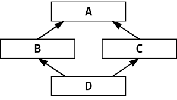

# 상속
- 상속이란 우리가 일반적으로 알고있는 의미와 비슷하다.
- 부모가 자식에게 무언가를 물려주는 것을 상속이라고 부르는 것처럼, 자바에서도 부모 역할을 하는 클래스가
- 자식 역할을 하는 클래스에게 <b style="color:red">클래스 멤버와 메서드를 물려주는것</b>을 상속이라고 한다
- 상속은 <b style="color:red">클래스를 재사용하기 때문에 중복을 줄여주고 수정을 최소화하는 특징</b>을 가지고 있다.

```
상속해주는 클래스를 부모클래스, 상위클래스, 기반클래스 라고한다.
상속받는 클래스를 자식클래스, 하위클래스, 파생클래스 라고한다.
```

## 클래스 상속
- 현실에서의 상속은 부모가 자식을 선택해서 물려주지만, 프로그램에서는 자식이 부모를 선택한다.
- 자식 클래스를 선언할 때 어떤 부모로부터 상속받을 것인지를 결정하고, 부모 클래스를 다음과 같이 extends 뒤에 기술한다.

```java
class A{ //부모 클래스는 자식 클래스에서 지명받기 전에는 부모 클래스 역할을 하지 않는다.
    ...
}

class B extends A{//B클래스에서 extends A를 작성함으로써 A는 B의 부모클래스가 되고, B클래스는 A클래스의 자식 클래스가 된다.
    ...
}
```
- 다른 언어와는 달리 자바는 다중 상속을 허용하지 않는다. 즉, 여러 개의 부모 클래스를 상속할 수 없다. 따라서 extends 뒤에는 단 하나의 부모 클래스만이 와야한다
```java
class B extends A,C,D{
    ...
}
```

```java
package ch07.sec02;

public class Phone {
	//필드 선언
	public String model;
	public String color;

	//메소드 선언
	public void bell() {
		System.out.println("벨이 울립니다.");
	}

	public void sendVoice(String message) {
		System.out.println("자기: " + message);
	}
	
	public void receiveVoice(String message) {
		System.out.println("상대방: " + message);
	}

	public void hangUp() {
		System.out.println("전화를 끊습니다.");
	}
}

package ch07.sec02;

public class SmartPhone extends Phone {
	//필드 선언
	public boolean wifi;

	//생성자 선언
	public SmartPhone(String model, String color) {
		this.model = model;
		this.color = color;
	}

	//메소드 선언
	public void setWifi(boolean wifi) {
		this.wifi = wifi;
		System.out.println("와이파이 상태를 변경했습니다.");
	}

	public void internet() {
		System.out.println("인터넷에 연결합니다.");
	}
}

package ch07.sec02;

public class SmartPhoneExample {

	public static void main(String[] args) {
		//SmartPhone 객체 생성
		SmartPhone myPhone = new SmartPhone("갤럭시", "은색");

		//Phone으로부터 상속받은 필드 읽기
		System.out.println("모델: " + myPhone.model);
		System.out.println("색상: " + myPhone.color);

		//SmartPhone의 필드 읽기
		System.out.println("와이파이 상태: " + myPhone.wifi);

		//Phone으로부터 상속받은 메소드 호출
		myPhone.bell();
		myPhone.sendVoice("여보세요.");
		myPhone.receiveVoice("안녕하세요! 저는 홍길동인데요.");
		myPhone.sendVoice("아~ 네, 반갑습니다.");
		myPhone.hangUp();
		
		//SmartPhone의 메소드 호출
		myPhone.setWifi(true);
		myPhone.internet();
	}
}
```
### 다이아몬드 문제
- 자바는 다중상속이 불가능하다.



- A를 상속받은 B,C,클래스가 있고, 이 둘을 상속받는 D가 있다고 가정해보자.
- D클래스가 A의 메서드나 필드를 호출하면 B -> A 경로와 C -> A 경로가 겹치면서 "어느 경로를 따라야 하는지 모호성"이 생긴다.


## 부모 생성자 호출
- 부모 없는 자식이 있을 수 없듯이 자바에서도 자식 객체를 생성하면 부모 객체가 먼저 형성된 다음에 자식 객체가 생성된다.

	<image src="img/메모리구조.png" width="400px">

- 모든 객체는 생성자를 호출해야만 한다.
- 부모 객체도 예외는 아니다.
- 부모 생성자는 자식 생성자의 맨 첫줄에 숨겨져 있는 super()에 의해 호출된다.

### super()
- this()가 같은 클래스의 다른 생성자를 호출할 때 사용된다면, super()메서드는 부모 클래스의 생성자를 호출할 때 사용한다.

```java
public 자식클래스(){
    super();

	...
}
```
- super()는 컴파일 과정에서 자동 추가되는데, 이것은 부모의 기본생성자를 호출한다.
- 만약 부모 클래스에 기본 생성자가 없다면 자식 생성자 선언에서 컴파일 에러가 발생한다.
- 부모 클래스에 기본 생성자가 없고 매개변수를 갖는 생성자만 있다면 개발자는 다음과 같이 super()를 호출하면서 매개값을 전달해야 한다.

<br><br>

```java
//부모클래스에 매개변수가 있는 생성자만 있다면
public 부모클래스(매개변수1,매개변수2){
    this.필드1 = 매개변수1;
    this.필드2 = 매개변수2;
}
```
```java
//자식클래스의 생성자에서 super()를 호출할 때 매개값을 같이 전달해줘야 한다.
public 자식클래스(매개변수1,매개변수2){
    super(매개변수1,매개변수2);
}
```
```java
package ch07.sec03.exam01;

public class Phone {
	//필드 선언
	public String model;
	public String color;

	//기본 생성자 선언
	public Phone() {
		System.out.println("Phone() 생성자 실행");
	}
}

------------------------------------
package ch07.sec03.exam01;

public class SmartPhone extends Phone {
	//자식 생성자 선언
	public SmartPhone(String model, String color) {
		super();
		this.model = model;
		this.color = color;
		System.out.println("SmartPhone(String model, String color) 생성자 실행됨");
	}
}
------------------------------------
package ch07.sec03.exam01;

public class SmartPhoneExample {

	public static void main(String[] args) {
		//SmartPhone 객체 생성
		SmartPhone myPhone = new SmartPhone("갤럭시", "은색");
			
		//Phone으로부터 상속 받은 필드 읽기
		System.out.println("모델: " + myPhone.model);
		System.out.println("색상: " + myPhone.color);
	}
}
```
- 부모 클래스가 매개변수를 갖는 생성자만 갖고있는 경우

```java
package ch07.sec03.exam02;

public class Phone {
	//필드 선언
	public String model;
	public String color;

	//매개변수를 갖는 생성자 선언
	public Phone(String model, String color) {
		this.model = model;
		this.color = color;
		System.out.println("Phone(String model, String color) 생성자 실행");
	}
}

----------

package ch07.sec03.exam02;

public class SmartPhone extends Phone {
	//자식 생성자 선언
	public SmartPhone(String model, String color) {
		super(model, color);
		System.out.println("SmartPhone(String model, String color) 생성자 실행됨");
	}
}

---------

package ch07.sec03.exam02;

public class SmartPhoneExample {
	
	public static void main(String[] args) {
		//SmartPhone 객체 생성
		SmartPhone myPhone = new SmartPhone("갤럭시", "은색");
		
		//Phone으로부터 상속 받은 필드 읽기
		System.out.println("모델: " + myPhone.model);
		System.out.println("색상: " + myPhone.color);
	}
}
```


## 메소드 재정의
- 부모 클래스의 모든 메소드가 자식 클래스에 맞게 설계되어 있다면 가장 이상적인 상속이지만, 어떤 메소드는 자식 클래스가 사용하기에 적합하지 않을 수 있다.
- 이러한 메소드는 <b style="color:red">자식 클래스에서 재정의</b>하여 사용할 수 있다.
- 이를 메소드 오버라이딩이라고 한다.

## 오버라이딩(Overriding)
- 상속된 메소드를 자식 클래스에서 재정의하는 것을 말한다.
- 메소드가 오버라이딩되었다면 해당 부모 메소드는 숨겨지고, 자식 메소드가 우선적으로 사용된다.

### 오버라이딩 규칙
1. 부모클래스의 메서드명, 반환타입, 매개변수가 동일해아 한다.
2. 접근 제한을 더 강하게 오버라이딩 할 수 없다(public -> private으로 변경 불가)

```java
package ch07.sec04.exam01;

public class Calculator {
	//메소드 선언
	public double areaCircle(double r) {
		System.out.println("Calculator 객체의 areaCircle() 실행");
		return 3.14159 * r * r;
	}
}

package ch07.sec04.exam01;

public class Computer extends Calculator {
	//메소드 오버라이딩
	@Override
	public double areaCircle(double r) {
		System.out.println("Computer 객체의 areaCircle() 실행");
		return Math.PI * r * r;
	}
}

package ch07.sec04.exam01;

public class ComputerExample {
	public static void main(String[] args) {
		int r = 10;

		Calculator calculator = new Calculator();
		System.out.println("원 면적: " + calculator.areaCircle(r));
		System.out.println();

		Computer computer = new Computer();
		System.out.println("원 면적: " + computer.areaCircle(r));
	}
}

```
- 자바는 개발자의 실수를 줄여주기 위해 정확히 오버라이딩 되었는지 체크해주는 ```@Orverride``` 어노테이션을 제공한다.
- ```@Override```를 붙이면 컴파일 단계에서 정확히 오버라이딩이 되었는지 체크하고, 문제가 있다면 컴파일 에러를 출력한다.
- 생략해도 괜찮지만, 컴파일러에게 오버라이딩된 메서드라고 한번 더 짚어줌으로써 오타가 났을 때 오류를 발생시켜주기 때문에 실수를 줄일 수 있다.

### 부모 메소드 호출
- 메소드를 재정의하면, 부모 메소드는 숨겨지고 자식 메소드만 사용되기 때문에 비록 부모 메소드의 일부만 변경된다 하더라도 중복된 내용을 자식 메소드도 가지고 있어야 한다.
- 예를 들어 부모 메소드가 100줄의 코드를 가지고 있을 경우, 자식 메소드에서 1줄만 추가하고 싶더라도 100줄의 코드를 자식 메소드에서 다시 작성해야 한다.
- super 키워드를 사용하면 자식 메소드 내에서 부모 메서드를 호출할 수 있다.

```java
package ch07.sec04.exam02;

public class Airplane {
	//메소드 선언
	public void land() {
		System.out.println("착륙합니다.");
}

	public void fly() {
		System.out.println("일반 비행합니다.");
	}

	public void takeOff() {
		System.out.println("이륙합니다.");
	}
}

package ch07.sec04.exam02;

public class SupersonicAirplane extends Airplane {
	//상수 선언
	public static final int NORMAL = 1;
	public static final int SUPERSONIC = 2;
	//상태 필드 선언
	public int flyMode = NORMAL;

	//메소드 재정의
	@Override
	public void fly() {
		if(flyMode == SUPERSONIC) {
			System.out.println("초음속 비행합니다.");
		} else {
			//Airplane 객체의 fly() 메소드 호출
			super.fly();
		}
	}
}

package ch07.sec04.exam02;

public class SupersonicAirplaneExample {
	public static void main(String[] args) {
		SupersonicAirplane sa = new SupersonicAirplane();
		sa.takeOff();
		sa.fly();
		sa.flyMode = SupersonicAirplane.SUPERSONIC;
		sa.fly();
		sa.flyMode = SupersonicAirplane.NORMAL;
		sa.fly();
		sa.land();
	}
}
```

## final 클래스와 final 메서드
- final키워드는 상수를 뜻하는 키워드로, 필드 앞에 선언하여 사용한다.
- 초기화 이후 값을 바꿀 수 없으며 시간이 지나도 처음 정의된 상태가 변하지 않는다는 의미를 가지고 있다.
- 이 키워드는 메서드와 클래스에도 사용할 수 있다.

### final 클래스
- <b style="color:red">클래스 앞에 final을 추가할 경우, 이 클래스는 상속의 마지막 클래스</b>임을 뜻한다.
- <b style="color:red">어떠한 클래스도 이 클래스의 자식 클래스가 될 수 없고</b>, 자연스럽게 이 클래스는 <b style="color:red">어떤 클래스의 부모클래스가 될 수 없다.</b>

```java
package ch07.sec05.exam01;
public final class Parent {

}
```
- final 클래스를 상속받고자 시도한다면 에러가 발생한다.

```java
package ch07.sec05.exam01;
public class Child  extends Parent{

}
```

### final 메소드
- 메서드 앞에 final을 추가하게 되면 상속은 받더라도, <b style="color:red">오버라이딩 할 수 없는 메서드</b>를 뜻한다.
- 즉, 자식 클래스이더라도 부모 클래스에 final로 선언된 메서드는 자식 클래스에서 <b style="color:red">오버라이딩 하지 못하고 있는 그대로 사용해야 한다.</b>

```java
접근제한자 final 반환형 메서드명(매개변수1,매개변수2...){

}
```

```java
package ch07.sec05.exam02;

public class Car {
	//필드 선언
	public int speed;

	//메소드 선언
	public void speedUp() {
		speed += 1;
	}

	//final 메소드
	public final void stop() {
		System.out.println("차를 멈춤");
		speed = 0;
	}
}
```

```java
package ch07.sec05.exam02;

public class SportsCar extends Car {
	@Override
	public void speedUp() {
		speed += 10;
	}

	// 오버라이딩을 할 수 없음
	/*
	@Override
	public void stop() {
		System.out.println("스포츠카를 멈춤");
		speed = 0;
	}
	*/
}
```

### 생성자에는 final을 추가할 수 없다.
- 생성자는 접근제한자(public,protected,private)만 추가할 수 있다.
- 따라서 클래스를 final로 선언하더라도 생성자를 final로 선언할 수 없다.

## protected 접근 제한자
- 같은 패키지에서는 default 처럼 접근이 가능하나, 다른 패키지에서는 자식 클래스만 접근을 허용한다.
- protected 접근제한자는 필드와 생성자 그리고 메서드 선언에 사용될 수 있다.

```java
package ch07.sec06.package1;

public class A {
	//필드 선언
	protected String field;

	//생성자 선언
	protected A() {
	}

	//메소드 선언
	protected void method() {
	}
}
```
```java
package ch07.sec06.package1;

public class B {
	//메소드 선언
	public void method() {
		A a = new A();		//o
		a.field = "value"; 	//o
		a.method(); 			//o
	}
}
```
- B 클래스는 A클래스와 동일한 패키지에 있기 때문에 A의 protected 필드, 생성자, 메소드에 접근이 가능하다.
```java
package ch07.sec06.package2;

import ch07.sec06.package1.A;

public class C {
	//메소드 선언
	public void method() {
		//A a = new A();		//x
		//a.field = "value"; 		//x
		//a.method(); 			//x
	}
}
```
- C클래스는 A 클래스와 다른 패키지에 있기 때문에 A의 protected필드, 생성자, 메소드에 접근할 수 없다.
```java
package ch07.sec06.package2;

import ch07.sec06.package1.A;

public class D extends A {
	//생성자 선언
	public D() {
		//A() 생성자 호출
		super();				//o
	}
	
	//메소드 선언
	public void method1() {
		//A 필드값 변경
		this.field = "value"; 	//o
		//A 메소드 호출
		this.method(); 			//o
	}
	
	//메소드 선언
	public void method2() {
		//A a = new A();		//x
		//a.field = "value"; 	//x
		//a.method(); 			//x
	}	
}
```
- D 클래스는 A 클래스와 다른 패키지에 있지만 A클래스의 자식 클래스 이므로 A의 protected 필드, 생성자, 메소드에 접근이 가능하다.
- 단, new 연산자를 사용해서 생성자를 직접 호출할 수는 없고, 자식 생성자에서 super()로 A 생성자를 호출할 수 있다.

<HR>

# 실무에서 상속의 활용
### 1. 공통 기능을 여러 클래스에 공유할 때
- 웹 어플리케이션에서 기반 클래스를 만들어서 공통된 기능(예를 들어 로그처리, 에러 처리, 인증 로직)을 넣을 수 있다.
- 다른 클래스들은 기반 클래스를 상속받아 공통기능을 재사용하기만 하면 된다.

### 2. 자바에서 제공하는 기능을 사용할 때
- 이미 자바나 스프링부트 프레임워크에서 제공하는 기능을 사용할 때 상속을 사용하거나 조금만 고쳐서 사용한다.

### 3. 템플릿 메서드 패턴 적용
- 상속을 활용해 알고리즘의 구조는 부모 클래스에 정의하고, 세부 구현은 자식 클래스에 오버라이드 한다.
- 실무에서 변하지 않는 공통 흐름과 바뀌는 부분을 분리할 때 많이 쓴다.

#### 주의점
- 부모-자식 클래스가 강하게 묶이면 하나 바꿀 때 전부 영향이 가기 때문에 실제 회사에서는 필요할 때만 제한적으로 사용하는 경우가 많다.