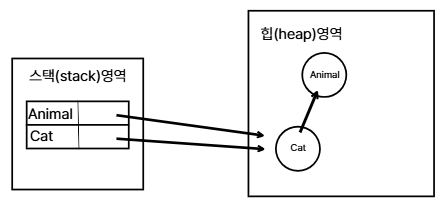
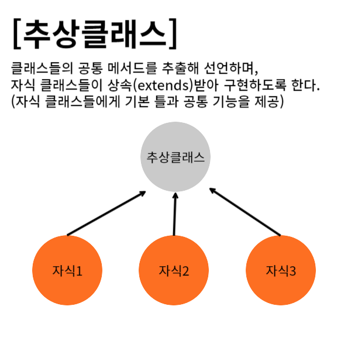
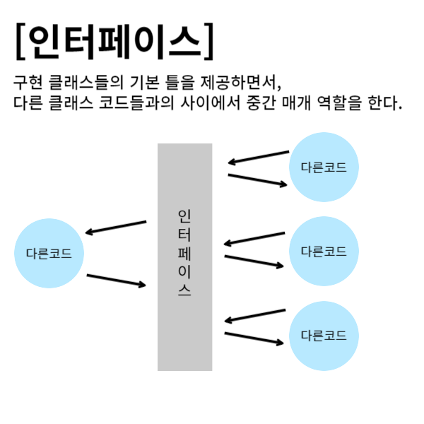

# 클래스에서의 타입변환
- 타입 변환은 타입을 다른 타입으로 변환하는 것이다.
- 자바에서는 다음과 같이 두 가지의 대표적인 타입 변환이 있다.
    1. 자료형 변환 
    2. 클래스의 객체 타입 변환
- 클래스의 타입 변환도 마찬가지로 자동 형 변환과 강제 형 변환이 있다.
- 단, 자료형에 비해 타입 변환이 가능한 범위가 상당이 좁다.
- 클래스의 타입 변환은, 서로 상속 관계에 있는 클래스 사이에서만 변환할 수 있다.

## 클래스의 자동 타입 변환
- 자료형에서의 자동 형 변환과 마찬가지로 개발자가 직접 명시하지 않아도 자동으로 타입 변환이 일어나는 것을 '클래스 자동 타입 변환'이라고 한다.
- 클래스 자동 타입 변환은 상속 관계에 있는 자식 클래스의 객체를 부모 타입의 객체로 변환하는 것을 말한다.
```java
부모클래스명 객체명 = new 자식클래스명();
```
- 이미 만들어진 자식 객체를 부모 타입으로 변환하려고 할 때는 다음과 같이 구현한다.
```java
부모 클래스명 객체명 = 자식객체;
```

```java
class Animal{
	...
}

class Cat extends Animal {
	...
}


Cat cat = new Cat();
Animal animal = cat;
```



```java
package ch07.sec07.exam01;

class A {
}

class B extends A {
}

class C extends A {
}

class D extends B {
}

class E extends C {
}

public class PromotionExample {
	public static void main(String[] args) {
		B b = new B();
		C c = new C();
		D d = new D();
		E e = new E();

		A a1 = b;
		A a2 = c;
		A a3 = d;
		A a4 = e;
		
		B b1 = d;
		C c1 = e;
		
		// B b3 = e;
		// C c2 = d;
	}
}
```

```java
package ch07.sec07.exam02;

public class Parent {
	//메소드 선언
	public void method1() {
		System.out.println("Parent-method1()");
	}

	//메소드 선언
	public void method2() {
		System.out.println("Parent-method2()");
	}
}

package ch07.sec07.exam02;

public class Child extends Parent {
	//메소드 오버라이딩
	@Override
	public void method2() {
		System.out.println("Child-method2()");
	}

	//메소드 선언
	public void method3() {
		System.out.println("Child-method3()");
	}
}

package ch07.sec07.exam02;

public class ChildExample {
	public static void main(String[] args) {
		//자식 객체 생성
		Child child = new Child();

		//자동 타입 변환
		Parent parent = child;

		//메소드 호출
		parent.method1();
		parent.method2();
		//parent.method3(); (호출 불가능)
	}
}
```

### 자식 객체의 메서드가 호출되는 이유
- 메서드가 실행 시점에서 성격이 결정되는 동적바인딩 때문이다.
- 프로그램의 컴파일 시점에는 실행되는 메서드가 부모클래스의 것인지 하위클래스의 것인지 알기 어렵다.
- 실행 시점에 동적 바인딩이 일어나 부모가 자식 클래스의 멤버함수를 접근하여 실행할 수 있다.

### 동적바인딩의 작동
1. 클래스 계층구조
    - 자바에서 동적바인딩은 클래스 계층 구조에서 발생한다.
    - 상속하거나 인터페이스를 구현함으로써 계층을 갖는다.
    - 이 계층에서 메서드 오버라이딩이 가능하기 때문이다.
2. 메서드 오버라이딩
    - 자식 클래스는 부모 클래스의 메서드를 재정의(오버라이딩)할 수 있다.
    - 이 때, 자식 클래스에서 부모 클래스의 동일한 이름과 시그니처(함수명,매개변수 개수, 매개변수의 자료형)를 가진 메서드를 재정의한다.
3. 실행시 동적 바인딩
    - 객체가 생성되고 메서드가 호출될 때, 실제로 실행될 메서드는 객체의 실제 타입에 따라 결정된다.
    - 메서드 호출시 객체의 클래스 타입을 기반으로 어떤 메서드를 호출할지 동적으로 결정된다.
  

## 클래스의 강제 타입변환
- 자식 타입에서 부모 타입으로 타입 변환을 했지만 자식 클래스의 멤버에게 접근하고 싶을 때가 생길 수 있다.
- 자바의 규약으로 자식 클래스의 멤버에 접근할 수 없으므로 이러한 경우 다시 자식타입으로 변경해서 접근할 수 있도록 해야 한다.
- 우리는 이를 '클래스의 강제 타입 변환'이라고 부른다.
- 자식 객체가 부모 타입으로 자동 타입 변환을 한 후, 다시 자식 타입으로 변환하는 것을 말한다.

```java
일회성으로 타입 변환이 필요할 때는
((자식클래스명)객체명).메서드명();

자식클래스의 멤버에 접근이 여러번 필요한 경우
객체명 = (자식클래스명)부모타입;
```

```java
package ch07.sec07.exam03;

public class Parent {
	//필드 선언
	public String field1;

	//메소드 선언
	public void method1() {
		System.out.println("Parent-method1()");
	}

	//메소드 선언
	public void method2() {
		System.out.println("Parent-method2()");
	}
}
```

```java
package ch07.sec07.exam03;

public class Child extends Parent {
	//필드 선언
	public String field2;

	//메소드 선언
	public void method3() {
		System.out.println("Child-method3()");
	}
}
```


```java
package ch07.sec07.exam03;

public class ChildExample {
	public static void main(String[] args) {
		//객체 생성 및 자동 타입 변환
		Parent parent = new Child();
		
		//Parent 타입으로 필드와 메소드 사용
		parent.field1 = "data1";
		parent.method1();
		parent.method2();
		/*
		parent.field2 = "data2";      	//(불가능)
		parent.method3();         		//(불가능)
		*/
		
		//강제 타입 변환
		Child child = (Child) parent;
		
		//Child 타입으로 필드와 메소드 사용
		child.field2 = "data2";  		//(가능)
		child.method3();     			//(가능)
	}
}
```
- 자식 타입으로 다시 변환을 해줌으로써 부모 타입에서는 사용하지 못했던 자식의 멤버들을 모두 사용할 수 있게 되었다.
- 단, 모든 부모 타입 객체를 자식 타입으로 변환할 수 있는 것은 아니다.
- 반드시 부모 타입으로 자동 타입 변환되었던 자식 객체를 다시 자식 타입으로 변환할 때만 강제 타입 변환을 사용할 수 있다.

## 다형성
- 다형성은 사용 방법은 동일하지만 실행 결과가 다양하게 나오는 성질을 말한다.
- 자동차의 부품을 교환하면 성능이 다르게 나오듯이 객체는 부품과 같아서, 프로그램을 구성하는 객체를 바꾸면 프로그램의 실행 성능이 다르게 나올 수 있다.
- 자바에서는 앞에서 학습한 타입 변환을 통해, 부모 클래스의 타입 하나로 여러 가지 자식 객체들을 참조하여 사용함으로써 다형성을 구현할 수 있다.
- 클래스의 타입 변환이 존재하는 이유는 다형성을 구현하기 위함이라고 할 수 있다.
- 완벽한 다형성을 구현하기 위해서는 상속 + 메서드 오버라이딩 + 클래스 타입변환 이 세가지 개념을 합쳐야 한다.


### 필드 다형성
- 필드 타입은 동일하지만(사용 방법은 동일하지만), 대입되는 객체가 달라져서 실행결과가 다양하게 나올 수 있는 것을 말한다.

```java
package ch07.sec08.exam01;

public class Tire {
	//메소드 선언
	public void roll() {
		System.out.println("회전합니다.");
	}
}

package ch07.sec08.exam01;
	
public class HankookTire extends Tire {
	//메소드 재정의(오버라이딩)
	@Override
	public void roll() {
		System.out.println("한국 타이어가 회전합니다.");
	}
}

package ch07.sec08.exam01;

public class KumhoTire extends Tire {
	//메소드 재정의(오버라이딩)
	@Override
	public void roll() {
		System.out.println("금호 타이어가 회전합니다.");
	}
}
```

```java
package ch07.sec08.exam01;

public class Car {
	//필드 선언
	public Tire tire;

	//메소드 선언
	public void run() {
		//tire 필드에 대입된 객체의 roll() 메소드 호출
		tire.roll();
	}
}

package ch07.sec08.exam01;

public class CarExample {
	public static void main(String[] args) {
		//Car 객체 생성
		Car myCar = new Car();

		//Tire 객체 장착
		myCar.tire = new Tire();
		myCar.run();

		//HankookTire 객체 장착
		//HankookTire클래스가 Tire를 상속받기 때문에 가능
		myCar.tire = new HankookTire();
		myCar.run();

		//KumhoTire 객체 장착
		//KumhoTire클래스가 Tire를 상속받기 때문에 가능
		myCar.tire = new KumhoTire();
		myCar.run();
	}
}
```
- Car 클래스의 run() 메소드는 tire 필드에 대입된 객체의 roll()메소드를 호출한다.
- 만약 HankookTire와 KumhoTire가 roll()메소드를 재정의하고 있다면, 재정의된 roll()메소드가 호출된다.

### 매개변수 다형성
- 다형성은 필드보다는 메소드를 호출할 때 많이 발생한다.
- 메소드가 클래스 타입 매개변수를 가지고 있을 경우, 호출할 때 동일한 타입의 객체를 제공하는 것이 정석적이지만 자식 객체를 제공할 수도 있다.

```java
package ch07.sec08.exam02;

public class Vehicle {
	//메소드 선언
	public void run() {
		System.out.println("차량이 달립니다.");
	}
}

package ch07.sec08.exam02;

public class Bus extends Vehicle {
	//메소드 재정의(오버라이딩)
	@Override
	public void run() {
		System.out.println("버스가 달립니다.");
	}
}

package ch07.sec08.exam02;

public class Taxi extends Vehicle {
	//메소드 재정의(오버라이딩)
	@Override
	public void run() {
		System.out.println("택시가 달립니다.");
	}
}

package ch07.sec08.exam02;

public class Driver {
	//메소드 선언(클래스 타입의 매개변수를 가지고 있음)
	//drive()메소드 호출 시 매개 변수의 매개값으로 Vehicle의 자식 객체가 들어올 수 있다.
	public void drive(Vehicle vehicle) {
		vehicle.run();
	}
}

package ch07.sec08.exam02;

public class DriverExample {
	public static void main(String[] args) {
		//Driver 객체 생성
		Driver driver = new Driver();

		//매개값으로 Bus 객체를 제공하고 driver() 메소드 호출
		Bus bus = new Bus();
		driver.drive(bus);

		//매개값으로 Taxi 객체를 제공하고 driver() 메소드 호출
		Taxi taxi = new Taxi();
		driver.drive(taxi);
	}
}
```

### 객체 타입 확인

#### instancdof연산자
- 부모 타입으로 타입이 변환되어 저장된 변수는 안에 어떤 객체가 담겨 있는지 직접 확인하지 않는 이상 내부 객체를 알기 쉽지 않다.
- 오버라이딩된 메서드가 있다면 확인이 쉽겠지만, 부모클래스를 같이 상속받고 있는 다른 클래스 또는 부모클래스와 구별할 수 있는 특정 멤버가 없다면 어떻게 구별해야 할까?
- instanceof연산자의 특징
    -  A instanceof B : A 객체가 생성될 때 B 타입으로 생성되었는지 확인하는 연산자
    -  맞으면 true, 아니면 false를 반환하며 만약 null을 가리키고 있으면 false를 반환한다.

### 객체 instanceof타입(클래스명)
- instanceof 기준으로 왼쪽 객체가 생성될 때 오른쪽 타입으로 생성되었는지 확인하는 연산자이다.
- 맞으면 true, 아니면 false를 반환하며 만약 null을 가리키고 있으면 false를 반환한다.

```java
package ch07.sec09;

public class InstanceofExample {
	//main() 메소드에서 바로 호출하기 위해 정적 메소드 선언
	public static void personInfo(Person person) {
		System.out.println("name: " + person.name);
		person.walk();

		//매가값이 Student인 경우에만 강제 타입 변환해서 studentNo필드와 study()메소드 사용

		//person이 참조하는 객체가 Student 타입인지 확인
		/*if (person instanceof Student) {
 			//Student 객체일 경우 강제 타입 변환
 			Student student = (Student) person;
 			//Student 객체만 가지고 있는 필드 및 메소드 사용
 			System.out.println("studentNo: " + student.studentNo);
 			student.study();
 		}*/

		//person이 참조하는 객체가 Student 타입일 경우
		//student 변수에 대입(타입 변환 발생)
		if(person instanceof Student student) {
			System.out.println("studentNo: " + student.studentNo);
			student.study();
		}
	}

	public static void main(String[] args) {
		//Person 객체를 매개값으로 제공하고 personInfo() 메소드 호출
		Person p1 = new Person("홍길동");
		personInfo(p1);
		
		System.out.println();

		//Student 객체를 매개값으로 제공하고 personInfo() 메소드 호출
		Person p2 = new Student("김길동", 10);
		personInfo(p2);
	}
}

package ch07.sec09;

public class Person {
	//필드 선언
	public String name;

	//생성자 선언
	public Person(String name) {
		this.name = name;
	}

	//메소드 선언
	public void walk() {
		System.out.println("걷습니다.");
	}
}

package ch07.sec09;

public class Student extends Person {
	//필드 선언
	public int studentNo;

	//생성자 선언
	public Student(String name, int studentNo) {
		super(name);
		this.studentNo = studentNo;
	}

	//메소드 선언
	public void study() {
		System.out.println("공부를 합니다.");
	}
}
```
## 추상클래스
- 공통성과 본질을 모아 추출하는것
- 새, 공충, 물고기 등의 공통점은 동물이다.
- 여기서 동물은 실체들의 공통되는 특성을 가지고 있는 추상적인 것이라고 볼 수 있다.

### 추상클래스란?
- 객체를 생성할 수 있는 클래스를 실체 클래스라고 한다면, 이 클래스들의 공통적인 필드나 메소드를 추출해서 선언한 클래스를 추상클래스라고 한다.

### 추상 클래스 선언
- 클래스 선언에 abstract 키워드를 붙이면 추상 클래스 선언이 된다.
- 추상 클래스는 new 연산자를 이용해서 직접 객체를 만들지 못하고 상속을 통해 자식 클래스만 만들 수 있다.
```java
package ch07.sec10.exam01;


public abstract class Phone {
	//필드 선언
	String owner;

	//생성자 선언
	Phone(String owner) {
		this.owner = owner;
	}

	//메소드 선언
	void turnOn() {
		System.out.println("폰 전원을 켭니다.");
	}
	void turnOff() {
		System.out.println("폰 전원을 끕니다.");
	}
}
```
- 추상클래스도 필드, 메소드를 선언할 수 있다.
- 그리고 자식 객체가 생성될 때 super()로 추상 클래스의 생성자가 호출되기 때문에 생성자도 반드시 있어야 한다.

```java
package ch07.sec10.exam01;

public class SmartPhone extends Phone {
	//생성자 선언
	SmartPhone(String owner) {
		//Phone 생성자 호출
		super(owner);
	}

	//메소드 선언
	void internetSearch() {
		System.out.println("인터넷 검색을 합니다.");
	}
}

package ch07.sec10.exam01;

public class PhoneExample {
	public static void main(String[] args) {

		//추상클래스의 객체는 직접 만들 수 없다.
		//Phone phone = new Phone();

		SmartPhone smartPhone = new SmartPhone("홍길동");

		smartPhone.turnOn();
		smartPhone.internetSearch();
		smartPhone.turnOff();
	}
}
```

### 추상메서드와 재정의
- 선번부만 작성하고 구현부는 작성하지 않고 남겨둔 미완성 메서드를 '추상 메서드'라고 한다.
- 다형성을 위해 메서드의 선언은 통일해야 하지만, 실제로 구현하는 내용은 자식클래스마다 달라야 할 때
- 부모 클래스의 메서드는 비워두고 자식 클래스에서 오버라이딩하여 구현을 할 수 있다.
- 추상 메서드를 선언할 때 abstract 키워드를 함께 표기해야 한다.
- 또한 메서드의 구현부인 중괄호{} 대신 구현부가 없다는 의미로 세미콜론(;)를 쓴다.

```java
[접근제한] abstract [반환형] [메서드명](파라미터1,파라미터2);
abstract [접근제한] [반환형] [메서드명](파라미터1,파라미터2);
```
- 추상메소드는 자식 클래스의 공통 메소드라는 것만 정의할 뿐, 실행 내용을 가지지 않는다.
- 추상메소드는 자식 클래스에서 반드시 재정의해서 실행 내용을 채워야 한다.

```java
package ch07.sec10.exam02;

public abstract class Animal {
	//메소드 선언
	public void breathe() {
		System.out.println("숨을 쉽니다.");
	}

	//추상 메소드 선언
	public abstract void sound();
}


package ch07.sec10.exam02;

public class Dog extends Animal {
	//추상 메소드 재정의
	@Override
	public void sound() {
		System.out.println("멍멍");
	}
}

package ch07.sec10.exam02;

public class Cat extends Animal {
	//추상 메소드 재정의
	@Override
	public void sound() {
		System.out.println("야옹");
	}
}

package ch07.sec10.exam02;

public class AbstractMethodExample {
	public static void main(String[] args) {
		Dog dog = new Dog();
		dog.sound();

		Cat cat = new Cat();
		cat.sound();

		//매개변수의 다형성
		animalSound(new Dog());
		animalSound(new Cat());
	}

	public static void animalSound( Animal animal ) {
		animal.sound();
	}
}
```

### 봉인된 클래스
- 기본적으로 final 클래스를 제외한 모든 클래스는 부모 클래스가 될 수 있다.
- 그러나 Java 15부터는 무분별한 자식 클래스의 생성을 방지하기 위해 봉인된(sealed)클래스가 도입되었다.
- sealed 키워드를 사용하면 permits 키워드 뒤에 상속 가능한 자식 클래스를 지정해야 한다.

```java
package ch07.sec11;

public sealed class Person permits Employee, Manager {
	//필드
	public String name;

	//메소드
	public void work() {
		System.out.println("하는 일이 결정되지 않았습니다.");
	}
}
```
- 봉인된 클래스를 상속하는 자식 클래스는 final 또는 non-sealed 키워드로 선언하거나, sealed키워드를 사용해서 또 다른 봉인 클래스로 선언해야 한다.
- **final** : 더이상 상속 불가능
- **non-sealed** : 봉인 해제
```java

package ch07.sec11;

public final class Employee extends Person {
	@Override
	public void work() {
		System.out.println("제품을 생산합니다.");
	}
}

package ch07.sec11;

public non-sealed class Manager extends Person {
	@Override
	public void work() {
		System.out.println("생산 관리를 합니다.");
	}
}

package ch07.sec11;

public class Director extends Manager {
	@Override
	public void work() {
		System.out.println("제품을 기획합니다.");
	}
}

package ch07.sec11;

public class SealedExample {
	public static void main(String[] args) {
		Person p = new Person();
		Employee e = new Employee();
		Manager m = new Manager();
		Director d = new Director();

		p.work();
		e.work();
		m.work();
		d.work();
	}
}
```

# 인터페이스

## 인터페이스의 역할
- 인터페이스는 사전적인 의미로 두 장치를 연결하는 접속기를 말한다.
- 여기서 두 장치를 서로 다른 객체로 본다면, 인터페이스는 두 객체를 연결하는 역할을 한다.
- 





- 인터페이스는 그뿐 아니라 다른 클래스 코드들과의 중간 매개 역할을 하는 것을 중점으로 생각할 수 있다.


## 인터페이스와 구현 클래스 선언
- 
### 인터페이스 선언
- 인터페이스는 클래스가 아니다.
- 추상클래스는 스스로 객체를 생성할 수는 없지만, 자식 클래스의 생성자를 통해 객체를 생성해낼 수 있었다.
- 하지만 인터페이스는 어떤 형태로도 객체를 만들 수 없기 때문에 클래스라고 부를 수 없다.
- 인터페이스는 객체의 매개체, 즉, 객체를 사용하는 방법을 제공하는 새로운 블록이라고 할 수 있다.

```java
[접근제한자]interface 인터페이스명{
	//public 상수 필드
	//public 추상 메소드
	//public 디폴트 메소드
	//public 정적 메소드
	//private 메소드
	//private 정적 메소드

}
```
- 인터페이스를 선언하는 방법은 클래스를 작성하는 방법과 동일하며 class키워드 대신 interface를 작성한다.
- 또한, 인터페이스의 추상 메서드는 다른 클래스들과의 매개체 역할을 하므로 누구나 접근할 수 있다.
- 따라서 항상 public으로 구현한다.
- 만약 접근자를 default로 구현했다면 자동으로 public으로 인식한다.

```java
package ch08.sec02;

public interface RemoteControl {
	//public 추상 메소드
	public void turnOn();
}	
```
- 추상 클래스는 추상 메서드가 비어있기 때문에 객체 생성을 스스로 할 수 없다.
- 대신 자식 클래스의 생성자의 힘을 빌려 객체 생성을 할 수 있었다.
- 인터페이스도 마찬가지로 추상 메서드가 비어있기 때문에 객체 생성을 스스로 할 수 없다.
- 따라서 인터페이스도 자신이 가지고 있는 추상 메서드를 구현해줄 클래스를 작성해야만 한다.
- 인터페이스를 구현해주는 클래스를 '구현 클래스'라고 한다.

### 구현 클래스 선언
- 구현 클래스는 인터페이스에 선언된 추상 메소드와 동일한 선언부를 가진 (재정의된)메소드를 가지고 있어야 한다.

#### implements
- 구현 클래스는 인터페이스를 사용해 구현하겠다는 선언을 해야 한다.
- 구현한다는 의미를 가지고 있는 implements키워드를 사용하여 명시할 수 있다.
```java
[접근제한자]class 클래스명 implements 인터페이스명{
	//필드
	//생성자
	//메서드(추상메서드 오버라이딩)
}
```

```java
package ch08.sec02;

public class Television implements RemoteControl {
	@Override
	public void turnOn() {
		System.out.println("TV를 켭니다.");
	}
}
```

### 변수 선언과 구현 객체 대입
- 인터페이스도 하나의 타입이므로 변수의 타입으로 사용할 수 있다.
- 인터페이스는 참조 타입에 속하므로 인터페이스 변수에는 객체를 참조하고 있지 않다는 뜻으로 null을 대입할 수 있다.

```java
RemoteControl rc;
RemoteControl rc = null;
```
- 인터페이스를 통해 구현 객체를 사용하면, 인터페이스 변수에 구현 객체를 대입해야 한다.

```java
package ch08.sec02;

public class RemoteControlExample {
	public static void main(String[] args) {
		RemoteControl rc;

		//rc 변수에 Television 객체를 대입
		rc = new Television();
		rc.turnOn();
	}
}
```
- rc 변수에는 RemoteControl을 구현한 어떠한 객체든 대입이 가능하다.
- 만약 Audio 객체가 구현 객체라면 다음과 같이 Audio 객체로 교체해서 대입할 수도 있다.
```java
package ch08.sec02;

public class Audio implements RemoteControl {
	@Override
	public void turnOn() {
		System.out.println("Audio를 켭니다.");
	}
}
```
- 그리고 RemoteControlExample을 다음과 같이 수정하고 실행해보자.

```java
package ch08.sec02;

public class RemoteControlExample {
	public static void main(String[] args) {
		RemoteControl rc;

		//rc 변수에 Television 객체를 대입
		rc = new Television();
		rc.turnOn();
		
		//rc 변수에 Audio 객체를 대입(교체시킴)
		rc = new Audio();
		rc.turnOn();
	}
}
```

## 상수 필드
- 인터페이스는 public static final 특성을 갖는 불변의 상수 필드를 멤버로 가질 수 있다.
- 인터페이스에 선언된 필드는 모두 public static final 특성을 갖기 때문에 public static final을 생략하더라도 자동적으로 컴파일 과정에서 붙게 된다.
- 상수명은 대문자로 작성하며, 서로 다른 단어로 구성되어 있을 경우에는 언더바(_)로 연결하는 것이 관례이다.
```java
package ch08.sec03;

public interface RemoteControl {
	int MAX_VOLUME = 10;
	int MIN_VOLUME = 0;
}
```
- 상수는 구현 객체와 관련 없는 인터페이스 소속 멤버이므로 다음과 같이 인터페이스로 바로 접근해서 상수값을 읽을 수 있다.
```java
package ch08.sec03;

public class RemoteControlExample {
	public static void main(String[] args) {
		 System.out.println("리모콘 최대 볼륨: " + RemoteControl.MAX_VOLUME);
		 System.out.println("리모콘 최저 볼륨: " + RemoteControl.MIN_VOLUME);
	}
}
```

## 추상메소드
- 인터페이스는 구현 클래스가 재정의해야 하는 public 추상 메소드를 멤버로 가질 수 있다.
- 추상 메소드는 리턴 타입, 메소드명, 매개변수만 기술되고 중괄호 { }를 붙이지 않는 메소드를 말한다.
- public abstract를 생략하더라도 컴파일 과정에서 자동으로 붙게 된다.
```java
package ch08.sec04;

public interface RemoteControl {
	//상수 필드
	int MAX_VOLUME = 10;
	int MIN_VOLUME = 0;

	//추상 메소드
	void turnOn();
	void turnOff();
	void setVolume(int volume);
}
```
```java
package ch08.sec04;

public class Television implements RemoteControl {
	//필드
	private int volume;

	//turnOn() 추상 메소드 오버라이딩
	@Override
	public void turnOn() {
		System.out.println("TV를 켭니다.");
	}
	
	//turnOff() 추상 메소드 오버라이딩
	@Override
	public void turnOff() {
		System.out.println("TV를 끕니다.");
	}
	
	//setVolume() 추상 메소드 오버라이딩
	//인터페이스 상수 필드를 이용해서 volume 필드의 값을 제한
	@Override
	public void setVolume(int volume) {
		if(volume>RemoteControl.MAX_VOLUME) {
			this.volume = RemoteControl.MAX_VOLUME;
		} else if(volume<RemoteControl.MIN_VOLUME) {
			this.volume = RemoteControl.MIN_VOLUME;
		} else {
			this.volume = volume;
		}
		System.out.println("현재 TV 볼륨: " + this.volume);
	}
}	
```

```java
package ch08.sec04;

public class Audio implements RemoteControl {
	//필드
	private int volume;
	
	//turnOn() 추상 메소드 오버라이딩
	@Override
	public void turnOn() {
		System.out.println("Audio를 켭니다.");
	}

	//turnOff() 추상 메소드 오버라이딩
	@Override
	public void turnOff() {
		System.out.println("Audio를 끕니다.");
	}
	
	//setVolume() 추상 메소드 오버라이딩
	@Override
	public void setVolume(int volume) {
		if(volume>RemoteControl.MAX_VOLUME) {
			this.volume = RemoteControl.MAX_VOLUME;
		} else if(volume<RemoteControl.MIN_VOLUME) {
			this.volume = RemoteControl.MIN_VOLUME;
		} else {
			this.volume = volume;
		}
		System.out.println("현재 Audio 볼륨: " + volume);
	}
}
```
- 구현 클래스에서 추상 메소드를 재정의할 때 주의할 점은 인터페이스의 추상 메소드는 기본적으로 public 접근 제한을 갖기 때문에 public보다 더 낮은 접근 제한으로 재정의할 수 없다.
- 그래서 재정의되는 메소드는 모두 public이 추가되어 있다.

```java
package ch08.sec04;

public class RemoteControlExample {
	public static void main(String[] args) {
		//인터페이스 변수 선언
		RemoteControl rc;
		
		//Television 객체를 생성하고 인터페이스 변수에 대입
		rc = new Television();
		rc.turnOn();
		rc.setVolume(5);
		rc.turnOff();

		//Audio 객체를 생성하고 인터페이스 변수에 대입
		rc = new Audio();
		rc.turnOn();
		rc.setVolume(5);
		rc.turnOff();
	}
}
```

## 디폴트 메소드
- 인터페이스에는 완전한 실행 코드를 가진 디폴트 메서드를 선언할 수 있다.
- 추상 메소드는 실행부가 없지만, 디폴트 메소드는 실행부가 있다.
- 디폴트 메소드의 실행부에는 상수 필드를 읽거나 추상 메소드를 호출하는 코드를 작성할 수 있다.
- RemoteControl 인터페이스에서 무음 처리 기능을 제공하는 setMute() 디폴트 메소드를 선언해보자.

```java
package ch08.sec05;

public interface RemoteControl {
	//상수 필드
	int MAX_VOLUME = 10;
	int MIN_VOLUME = 0;

	//추상 메소드
	void turnOn();
	void turnOff();
	void setVolume(int volume);

	//디폴트 인스턴스 메소드
	default void setMute(boolean mute) {
		if(mute) {
			System.out.println("무음 처리합니다.");
			//추상 메소드 호출하면서 상수 필드 사용
			setVolume(MIN_VOLUME);
		} else {
			System.out.println("무음 해제합니다.");
		}
	}
}
```
- 디폴트 메소드는 구현 객체가 필요한 메소드이다.
- 따라서 RemoteControl의 setMute() 메소드를 호출하려면 구현 객체인 Television 객체를 다음과 같이 인터페이스 변수에 대입하고 나서 setMute()를 호출해야 한다.

```java
package ch08.sec05;

import ch08.sec05.RemoteControl;

public class Television implements RemoteControl {
	//필드
	private int volume;

	//turnOn() 추상 메소드 오버라이딩
	@Override
	public void turnOn() {
		System.out.println("TV를 켭니다.");
	}
	
	//turnOff() 추상 메소드 오버라이딩
	@Override
	public void turnOff() {
		System.out.println("TV를 끕니다.");
	}
	
	//setVolume() 추상 메소드 오버라이딩
	@Override
	public void setVolume(int volume) {
		if(volume>RemoteControl.MAX_VOLUME) {
			this.volume = RemoteControl.MAX_VOLUME;
		} else if(volume<RemoteControl.MIN_VOLUME) {
			this.volume = RemoteControl.MIN_VOLUME;
		} else {
			this.volume = volume;
		}
		System.out.println("현재 TV 볼륨: " + volume);
	}
}	

-------------------------------------
package ch08.sec05;

public class RemoteControlExample {
	public static void main(String[] args) {
		//인터페이스 변수 선언
		RemoteControl rc;
		
		//Television 객체를 생성하고 인터페이스 변수에 대입
		rc = new Television();
		rc.turnOn();
		rc.setVolume(5);

		//디폴트 메소드 호출
		rc.setMute(true);
		rc.setMute(false);
		
	}
}
```
- 구현 클래스는 디폴트 메소드를 재정의해서 자신에게 맞게 수정할 수도 있다.
- 재정의 시 주의할 점은 public 접근 제한자를 반드시 붙여야 하고, default 키워드를 생략해야 한다.

```java
package ch08.sec05;

public class Audio implements RemoteControl {
	//필드
	private int volume;

	//turnOn() 추상 메소드 오버라이딩
	@Override
	public void turnOn() {
		System.out.println("Audio를 켭니다.");
	}

	//turnOff() 추상 메소드 오버라이딩
	@Override
	public void turnOff() {
		System.out.println("Audio를 끕니다.");
	}

	//setVolume() 추상 메소드 오버라이딩
	@Override
	public void setVolume(int volume) {
		if(volume>RemoteControl.MAX_VOLUME) {
			this.volume = RemoteControl.MAX_VOLUME;
		} else if(volume<RemoteControl.MIN_VOLUME) {
			this.volume = RemoteControl.MIN_VOLUME;
		} else {
			this.volume = volume;
		}
		System.out.println("현재 Audio 볼륨: " + volume);
	}
////////////////////////////////추가된 내용///////////////
	//필드
	private int memoryVolume; //추가 필드 선언

	//디폴트 메소드 재정의
	@Override
	public void setMute(boolean mute) {
		if(mute) {
			this.memoryVolume = this.volume;
			System.out.println("무음 처리합니다.");
			setVolume(RemoteControl.MIN_VOLUME);
		} else {
			System.out.println("무음 해제합니다.");
			setVolume(this.memoryVolume);
		}
	}
////////////////////////////////추가된 내용///////////////
}
```
#### RemoteControlExample에 코드 추가하기
```java
package ch08.sec05;

public class RemoteControlExample {
	public static void main(String[] args) {

		...
		
		//Audio 객체를 생성하고 인터페이스 변수에 대입
		rc = new Audio();
		rc.turnOn();
		rc.setVolume(5);

		//디폴트 메소드 호출
		rc.setMute(true);
		rc.setMute(false);				
	}
}

```

## 정적 메소드
- 인터페이스에는 정적 메소드 선언이 가능하다.
- 추상메소드와 디폴트 메소드는 구현 객체가 필요하지만, 정적 메소드는 구현 객체가 없어도 인터페이스만으로 호출할 수 있다.
- 선언 방법은 클래스 정적 메소드와 완전 동일하다.
- 단, public을 생략하더라도 자동으로 컴파일 과정에서 붙는 것이 차이점이다.

```java
package ch08.sec06;

public interface RemoteControl {
	//상수 필드
	int MAX_VOLUME = 10;
	int MIN_VOLUME = 0;

	//추상 메소드
	void turnOn();
	void turnOff();
	void setVolume(int volume);

	//디폴트 메소드
	default void setMute(boolean mute) {
		//이전 예제와 동일한 코드이므로 생략
	}

	//정적 메소드
	static void changeBattery() {
		System.out.println("리모콘 건전지를 교환합니다.");
	}
}
```
- 인터페이스에 선언된 정적 메소드는 구현 객체 없이 인터페이스명으로 접근해서 호출할 수 있다.
- 따라서 RemoteControl의 changeBattery()메소드는 RemoteControl.changeBattery()로 호출할 수 있다.

```java
package ch08.sec06;

import ch08.sec06.RemoteControl;

public class Television implements RemoteControl {
	//필드
	private int volume;

	//turnOn() 추상 메소드 오버라이딩
	@Override
	public void turnOn() {
		System.out.println("TV를 켭니다.");
	}
	
	//turnOff() 추상 메소드 오버라이딩
	@Override
	public void turnOff() {
		System.out.println("TV를 끕니다.");
	}
	
	//setVolume() 추상 메소드 오버라이딩
	@Override
	public void setVolume(int volume) {
		if(volume>RemoteControl.MAX_VOLUME) {
			this.volume = RemoteControl.MAX_VOLUME;
		} else if(volume<RemoteControl.MIN_VOLUME) {
			this.volume = RemoteControl.MIN_VOLUME;
		} else {
			this.volume = volume;
		}
		System.out.println("현재 TV 볼륨: " + volume);
	}
}	

-----------------------
package ch08.sec06;

import ch08.sec06.RemoteControl;

public class Audio implements RemoteControl {
	//필드
	private int volume;

	//turnOn() 추상 메소드 오버라이딩
	@Override
	public void turnOn() {
		System.out.println("Audio를 켭니다.");
	}

	//turnOff() 추상 메소드 오버라이딩
	@Override
	public void turnOff() {
		System.out.println("Audio를 끕니다.");
	}

	//setVolume() 추상 메소드 오버라이딩
	@Override
	public void setVolume(int volume) {
		if(volume>RemoteControl.MAX_VOLUME) {
			this.volume = RemoteControl.MAX_VOLUME;
		} else if(volume<RemoteControl.MIN_VOLUME) {
			this.volume = RemoteControl.MIN_VOLUME;
		} else {
			this.volume = volume;
		}
		System.out.println("현재 Audio 볼륨: " + volume);
	}

	//필드
	private int memoryVolume;

	//디폴트 메소드 재정의
	@Override
	public void setMute(boolean mute) {
		if(mute) {
			this.memoryVolume = this.volume;
			System.out.println("무음 처리합니다.");
			setVolume(RemoteControl.MIN_VOLUME);
		} else {
			System.out.println("무음 해제합니다.");
			setVolume(this.memoryVolume);
		}
	}
}
package ch08.sec06;

public class RemoteControlExample {
	public static void main(String[] args) {
 		//인터페이스 변수 선언
		RemoteControl rc;

		//Television 객체를 생성하고 인터페이스 변수에 대입
		rc = new Television();
		rc.turnOn();
		rc.setVolume(5);

		//디폴트 메소드 호출
		rc.setMute(true);
		rc.setMute(false);

		System.out.println();

		//Audio 객체를 생성하고 인터페이스 변수에 대입
		rc = new Audio();
		rc.turnOn();
		rc.setVolume(5);

		//디폴트 메소드 호출
		rc.setMute(true);
		rc.setMute(false);
		
		System.out.println();

		//정적 메소드 호출
		RemoteControl.changeBattery();
	}
}
```


### ThreeStarPhone클래스
```java
package test3;

public class ThreeStarPhone implements Phone{
	int batteryCapacity = 40;
	boolean isOn = false;
	
	@Override
	public void powerOn() {
		if(batteryCapacity > 30) {
			System.out.println("★★★폰이켜졌습니다.★★★");
			isOn = true;
		} else {
			System.out.println("배터리가 부족합니다...");
		}
		
	}
	
	@Override
	public void powerOff() {
		System.out.println("★★★폰이 꺼졌습니다.★★★\n");
		isOn = false;
		
	}
	
	@Override
	public boolean isOn() {
		if(isOn) {
			return true;
		} else {
			return false;
		}
	}
	
	@Override
	public void watchUtube() {
		if(batteryCapacity > 10) {
			System.out.println("--- U튜브 시청 중 ---");
			batteryCapacity -= 10;
			System.out.println("잔여 배터리" + batteryCapacity + "%\n");
		} else {
			System.out.println("배터리가 부족합니다...");
			powerOff();
		}
		
	}
	
	@Override
	public void charge() {
		if(batteryCapacity < Phone.MAX_BATTERY_CAPACITY - 20) {
			System.out.println("--- 충전중 ---");
			batteryCapacity += 5;
			System.out.println("잔여 배터리" + batteryCapacity + "%\n");
		} else {
			System.out.println("충전할 필요가 없습니다.");
			System.out.println("잔여 배터리..." + batteryCapacity + "%");
		}
		
	}
}
```
### Person클래스
```java
package test3;

public class Person {
	Phone p;
	
	public Person(Phone p) {
		this.p = p;
	}
	
	public void buyNewPhone(Phone p) {
		this.p = p;
		System.out.println(" = = = = = = == =");
		System.out.println("새 폰을 샀습니다.");
	}
	
	public void turnOnPhone() {
		p.powerOn();
	}
	
	public void turnOffPhone() {
		p.powerOff();
	}
	
	public void watchUtube() {
		if(p.isOn()) {
			p.watchUtube();
		}else {
			System.out.println("폰이 꺼져 있기 대문에 U튜브를 볼 수 없습니다.");
		}
	}
	
	public void chargePhone() {
		p.charge();
	}
}
```

### PhoneMain클래스
```java
package test3;

public class PhoneMain {
	public static void main(String[] args) {
		Person jimin = new Person(new PineApplePhone());
		jimin.turnOnPhone();
		for(int i = 1; i < 6; i++) {
			jimin.watchUtube();
			
			if(i % 3 == 0) {
				jimin.chargePhone();
			}
		}
		
		jimin.buyNewPhone(new ThreeStarPhone());
		jimin.turnOnPhone();
		
		for(int i = 1; i < 5; i++) {
			jimin.watchUtube();
			
			if(i % 3 == 0) {
				jimin.chargePhone();
			}
		}
	}
}
```
### 인터페이스의 장점
- 정보은닉 : 실제 구현 클래스의 내용을 전혀 보지 않고도 개발 코드로 객체를 사용할 수 있다.
- 모듈화 : 구현 클래스들이 독립적으로 구현되고 사용될 수 있다. 개발 코드에서 객체 변경이 필요할 때, 개발코드의 수정을 최소화할 수 있다.

### 추상 클래스와 인터페이스의 공통점
- 정보은닉, 모듈화, 추상화 등은 추상클래스와 인터페이스가 공통적으로 가진 장점이다.
- 추상 클래스와 인터페이스 모두 다형성을 구현할 수 있는 기반을 제공하며, 추상 메서드 구현에 대한 강제성을 반영하고 있다.

## 다중 인터페이스 구현
- 우리는 하나의 클래스로 여러 개의 인터페이스를 구현할 수 있다.
- 선언한 모든 인터페이스에 대한 추상 메서드를 모두 구현해 줘야 한다.
```java
[접근제한자]class 클래스명 implements 인터페이스1,인터페이스2{
	//필드
	//생성자
	//인터페이스1에 대한 구현 메서드
	//인터페이스2에 대한 구현 메서드
}
```
### MicroPhone인터페이스 생성
```java
package inter;

public interface MicroPhone {
	abstract void sing();
}
```

### Speaker인터페이스 생성
```java
package inter;

public interface Speaker {
	abstract void music();
}
```

### BluetoothMIC클래스 생성
```java
package inter;

public class BluetoothMIC implements MicroPhone, Speaker{

	@Override
	public void music() {
		// TODO Auto-generated method stub
		
	}

	@Override
	public void sing() {
		// TODO Auto-generated method stub
		
	}

}
```

## 인터페이스 상속
- 인터페이스끼리 상속관계를 만들 수 있다.
- 클래스의 상속과 만찬가지로 extends키워드를 사용하며, 다중 상속이 가능하기 때문에 콤마(,)를 이용해서 다음과 같이 선언한다.
```java
[접근제한자] interface 인터페이스명 extends 인터페이스1, 인터페이스2,...{

}
```
- 인터페이스 상속을 선언하면, 하위 클래스는 상위 클래스의 모든 멤버를 상속받게 된다.
- 따라서 만약 하위 인터페이스를 구현하는 클래스가 있다면, 해당 클래스는 하위 인터페이스의 추상메서드를 포함하여 상위 인터페이스르의 추상 메서드까지 구현해야 한다.

### BluetoothMIC 인터페이스로 수정하기
```java
package inter;

public interface BluetoothMIC extends MicroPhone, Speaker{

	abstract void connect();
}
```

### TJmic클래스 생성하기
```java
package inter;

public class TJmic implements BluetoothMIC{

	@Override
	public void sing() {
		System.out.println("마이크에 대고 노래를 부른다.");
		
	}

	@Override
	public void music() {
		System.out.println("마이크에 장착된 스피커로 반주가 나온다.");
		
	}

	@Override
	public void connect() {
		System.out.println("핸드폰과 블루투스 연결이 되었습니다.");
	}
}
```

### MicMain클래스 수정하기
```java
package inter;

public class MicMain {
	public static void main(String[] args) {
		System.out.println("---TJmic 객체---");
		TJmic tj = new TJmic();
		tj.connect();
		tj.music();
		tj.sing();
		
		System.out.println("\n---TJmic 객체를 BluetoothMIC로 타입 변환---");
		BluetoothMIC bm = tj;
		bm.connect();
		bm.music();
		bm.sing();
		
		System.out.println("\n---TJmic 객체를 Microphone으로 타입 변환---");
		MicroPhone m = tj;
		//m.connect(); 호출불가능
		//m.music(); 호출불가능
		m.sing();
		
		System.out.println("\n--TJmic 객체를 Speaker로 타입 변환---");
		Speaker s = tj;
		//s.connect(); 호출불가능
		s.music();
		//s.sing(); 호출불가능
		
	}
}

결과
---TJmic 객체---
핸드폰과 블루투스 연결이 되었습니다.
마이크에 장착된 스피커로 반주가 나온다.
마이크에 대고 노래를 부른다.

---TJmic 객체를 BluetoothMIC로 타입 변환---
핸드폰과 블루투스 연결이 되었습니다.
마이크에 장착된 스피커로 반주가 나온다.
마이크에 대고 노래를 부른다.

---TJmic 객체를 Microphone으로 타입 변환---
마이크에 대고 노래를 부른다.

--TJmic 객체를 Speaker로 타입 변환---
마이크에 장착된 스피커로 반주가 나온다.
```

## 내부 클래스
- 내부 클래스는 클래스 안에 만들어진 또 다른 클래스로 중첩 클래스라고도 부른다.
- 클래스에 다른 클래스를 선언하는 이유는 두 개의 클래스가 서로 긴밀한 관계를 맺고 있기 때문이다.

### 내부 클래스의 장점
- 두 클래스 멤버들 간에 손쉽게 접근할 수 있다.
- 불필요한 클래스를 감춰서 코드의 복잡성을 줄일 수 있다.

```java
public class OuterClass{ //외부 클래스

	class InnerClass{ //내부 클래스

	}
}
```

### 내부 클래스의 종류
|메서드|설명|
|-----|-----|
|인스턴스 클래스|외부 클래스의 멤버 변수와 같은 위치에 선언<br>주로 외부 클래스의 멤버 변수와 관련된 작업에 사용될 목적으로 선언|
|정적 클래스|외부 클래스의 클래스 변수와 같이 static키워드 부여|
|지역 클래스|외부 클래스의 메서드 내부에서 선언하여 사용<br>메서드 영역에서 선언되기 때문에 메서드 내부에서만 사용 가능|

## 인스턴스 클래스
- 인스턴스 클래스는 외부 클래스 내부에서 생성하고, 선언되어 사용하는 클래스를 의미한다.
- 인스턴스 변수(필드)와 같은 위치에 선언하며, 외부 클래스의 인스턴스 멤버처럼 다루어진다.
- 주로 외부클래스의 멤버들과  관련된 작업에 사용될 목적으로 선언된다.

```java
public class Outer{
	private String name; //필드

	//인스턴스 클래스
	public class Inner{
		private String name;
	}

}
```
- 내부 클래스도 외부 클래스 안에 생성되는 것 외에는 별도의 클래스이기 때문에, 파일이 컴파일되면 별도로 생성된다.

### 인스턴스 클래스의 객체화
- 인스턴스 클래스는 기본적인 내부 클래스이다.
- 외부 클래스 안에 생성되기 때문에, 클래스를 사용하려면 외부 클래스객체가 생성된 상태에서 객체 생성을 할 수 있다.

```java
Outer outer = new Outer(); //외부 클래스 객체 생성
Outer.Inner in = Outer.new Inner(); //외부 클래스를 이용해 내부 클래스 객체 생성
```

### CalculatorExample클래스
```java
package test3;

class Calculator{
	private int val1;
	private int val2;
	
	public Calculator(int val1, int val2) {
		this.val1 = val1;
		this.val2 = val2;
	}
	
	public class Calc{
		public int add() {
			return val1 + val2;
		}
	}
}


public class CalculatorExample {
	public static void main(String[] args) {
		Calculator cal = new Calculator(10, 11);
		Calculator.Calc c = cal.new Calc();
		System.out.println("합 : " + c.add());
	}
}
```
- 하나의 소스파일에 둘 이상의 public class가 존재하면 안된다.
- 각 클래스를 별도의 소스파일에 나눠서 저장하던가 아니면 둘 중 한 클래스에만 public을 붙혀야 한다.

## 정적 내부 클래스(static class)
- 클래스 안에 정적 변수를 선언할 수 있는 것처럼 클래스도 정적 클래스를 만들 수 있다.
- 필드(멤버)와 마찬가지로 static키워드를 사용해 클래스를 선언한 후 정적 내부 클래스를 생성한다.
- 주로 외부 클래스의 static메서드에서 사용될 목적으로 만든다.

```java
public class Outer{
	private String name; -> 필드

	public static class Inner{
		private String name;
	}
}
```
- 외부 클래스의 필드 또는 메서드를 정적 내부 클래스 안에서는 사용할 수 없다.
```java
public class Outer{
	private int val1; //필드

	public static class Inner{
		public void add(){
			int result = val1 + 10; -> 에러
		}
		
	}
}
```
- 정적 내부 클래스는 정적 변수 또는 정적 메서드를 호출하는 것은 가능하다.
```java
public class Outer{
	private int val1; //필드
	private static int cnt = 1; //클래스 변수

	public static class Inner{
		public void displayOuterInfo(){
			System.out.println(val); -> 에러
			System.out.println(cnt);
		}
		
	}
}
```
## 정적 내부 클래스의 객체 생성
- 외부 클래스의 객체를 생성하지 않아도 선언할 수 있다.
```java
Outer.Inner in = new Outer.Inner();
```

## StaticClassExam클래스
```java
package test3;

class PrintOut{
	public static class Out{
		public void println(String str) {
			System.out.println(str);
		}
	}
}

public class StaticClassExample {
	public static void main(String[] args) {
		String str = "정적 내부 클래스 테스트";
		PrintOut.Out out = new PrintOut.Out();
		out.println(str);
	}
}
```

## 지역클래스(local class)
- 지역 클래스는 외부 클래스의 메서드 내에서 선언되어 사용하는 클래스이다.
- 메서드 내에서 선언되기 때문에 해당 클래스는 메서드 내에서만 사용할 수 있다.
- 메서드의 실행이 끝나면 해당 클래스도 사용이 종료된다.
```java
public class LocalClass{
	public void print(){
		///////////////////
		class A{
				지역 클래스 선언
		}

		A a = new A();	메서드 내에서 사용
		//////////////////

	}

}
```
## LocalClassExample클래스
```java
package test3;

public class LocalClassExample {
	private int speed = 10;
	
	public void getUnit(String unitName) {
		
		class Unit{
			public void move() {
				System.out.println(unitName + "이 " + speed + " 속도로 이동합니다.");
			}
		}
		
		Unit unit = new Unit();
		unit.move();
	}
	
	public static void main(String[] args) {
		LocalClassExample local = new LocalClassExample();
		local.getUnit("마린");
	}
}
```

## 내부 클래스의 접근 제한
- 내부 클래스도 클래스이기 때문에 접근 제한자를 붙여서 사용할 수 있다.

### PermitExample클래스
```java
package innerclass;

public class PermitExample {
	private class InClass{
		public void print() {
			System.out.println("접근을 private로 제한한다.");
		}
	}
	
	public InClass getInClass() {
		return new InClass();
	}
	
	public static void main(String[] args) {
		PermitExample permit = new PermitExample();
		permit.getInClass().print();
	}
}

접근을 private로 제한한다.
```

## 지역 클래스의 접근 제한
- 지역 클래스는 메서드 내에서 선언되어 사용한다.
- 보통 메서드가 종료되면 클래스도 함께 종료되지만 메서드와 실행되는 위치가 다르기 때문에 종료되지 않고 남아있을 수도 있다.
- 그래서 지역 클래스에서 메서드 내의 변수를 사용할 때는 변수를 복사해 사용한다.
- 이러한 이유로 지역 클래스에서 메서드의 변수를 사용할 때 해당 변수가 변경되면 오류가 발생한다.

### LoacalClassExample클래스 코드 추가하기
```java
package test3;

public class LocalClassExample {
	private int speed = 10;
	
	public void getUnit(String unitName) {
		unitName = unitName + " 님";
		
		class Unit{
			public void move() {
				//unitName에서 에러 발생
				System.out.println(unitName + "이 " + speed + " 속도로 이동합니다.");
			}
		}
		
		Unit unit = new Unit();
		unit.move();
	}
	
	public static void main(String[] args) {
		LocalClassExample local = new LocalClassExample();
		local.getUnit("마린");
	}
}

```
- 자바 7버전까지는 지역 클래스에서 메서드의 변수를 사용하려면 final키워드를 붙여서 사용하도록 했으나
- 자바 8버전부터는 해당 변수를 변경하지 않는다는 조건하에 effective final이라는 기능이 추가되어 키워드를 사용하지 않아도 final변수로 인정된다.

## 익명클래스(anonymous class)
- 다른 내부 클래스와는 달리 이름이 없는 클래스를 의미한다.
- 익명 클래스는 클래스의 선언과 객체의 생성을 동시에 하므로 한 번만 사용할 수 있다.
- 오직 하나의 객체만을 생성할 수 있는 일회용 클래스이다.
- 따라서 생성자를 선언할 수도 없으며, 둘 이상의 인터페이스를 구현할 수도 없다.

- Person클래스
```java
package test3;

public class Person {
	public void mySelf() {
		System.out.println("나는 인간입니다.");
	}
}
```
- Student클래스
```java
package test3;

public class Student extends Person{
	@Override
	public void mySelf() {
		System.out.println("I'm child");
	}
}
```
- PersonMain
```java
package test3;

public class PersonMain {
	public static void main(String[] args) {
		Student s = new Student();
		s.mySelf();
	}
}
```
- Person클래스를 확장하기 위해 자식 클래스를 만들어서 사용한다.
- 그런데 만약 Person을 상속받아 처리해야 하는 클래스가 또 필요하지만 한번만 사용할 거라면 굳이 상속할 필요가 없다.

### AnonymousExample클래스 생성하기
```java
package innerclass;

interface buttonClickListener{
	public void click();
}

public class AnonymousExample {

	public class Button{
		private buttonClickListener listener;
		
		public void setButtonListener(buttonClickListener listener) {
			this.listener = listener;
		}
		
		public void click() {
			if(listener != null) {
				this.listener.click();
			}
		}
		
	}
	
	public static void main(String[] args) {
		AnonymousExample exam = new AnonymousExample();
		AnonymousExample.Button button = exam.new Button();
		
		button.setButtonListener(new buttonClickListener() {
			
			@Override
			public void click() {
				System.out.println("버튼을 눌렀습니다.");
				
			}
		});
		
		button.click();
	}
}
버튼을 눌렀습니다.
```