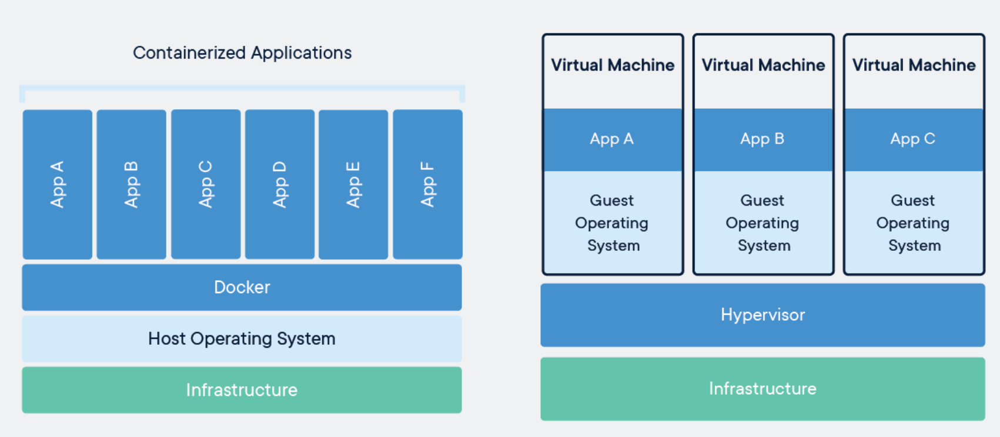
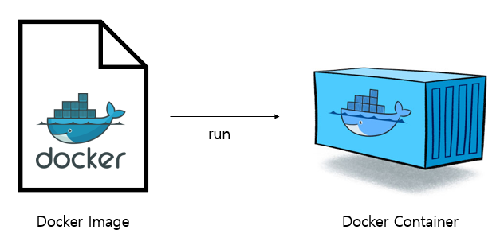
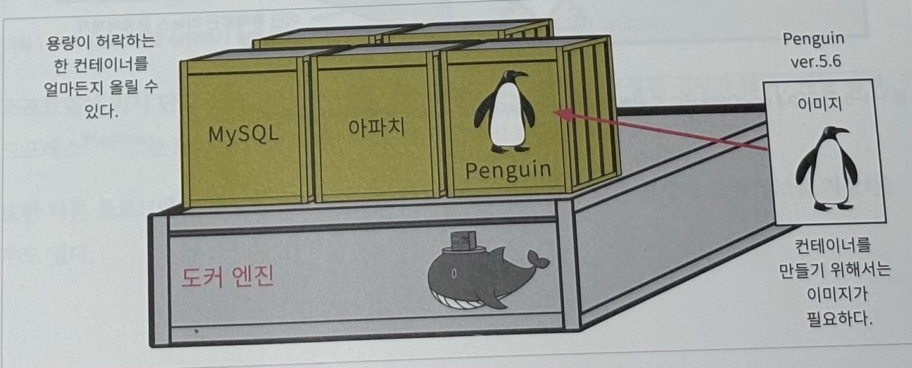

# 도커란 무엇인가?
## 도커란 무엇인가? 
- 도커는 '데이터 또는 프로그램을 격리시키는' 기능을 제공하는 소프트웨어라고 할 수 있다.
- 이 기능은 주로 서버에서 사용이 되는데, 클라이언트 컴퓨터에서도 사용할 수는 있지만 현 시점에서는 서버에서 사용하는 것이 주 용도이다.
- 개인용 컴퓨터나 서버에는 여러 가지 프로그램이 함께 동작한다.
- 워드, 엑셀, 메일 프로그램을 동시에 사용할 수 있다.
- 마찬가지로 서버에서도 아파치, MySQL등 여러 프로그램이 함께 돌고 있을 것이다.
- 도커는 이렇게 다양한 프로그램과 데이터를 각각 독립된 환경에 격리하는 기능을 제공한다.

    

### 컨테이너와 도커 엔진
- 개인용 컴퓨터 또는 서버 상의 환경을 마치 코스트코에서 판매하는 조립형 창고 같은 작은방으로 분할하면 어떻게 될까.
- 그리고 이렇게 작게 쪼갠 독립된 창고에 데이터나 프로그램을 두는것이다.
- 이 조립형창고를 ```컨테이너```라고 한다.
- 그리고 이 컨테이너를 다루는 기능을 제공하는 소프트웨어가 ```도커```다.
- 도커를 사용하려면 도커 소프트웨어의 본체인 ```도커 엔진```을 설치해야 한다.
- 그리고 도커 엔진을 사용해 컨테이너를 생성하고 구동시킬 수 있다.

### 컨테이너를 만들려면 이미지가 필요하다.
- ```도커 엔진```이 있어야 컨테이너를 만들 수 있다고 설명했다.
- 그러나 컨테이너를 만들려면 도커 엔진 외에도 컨테이너의 빵틀과도 같은 역할을 할 ```이미지```가 필요하다.
- 이미지는 종류가 아주 많다. 담고 있는 소프트웨어의 종류에 따라 다양한 이미지를 사용한다.
- 아파치 컨테이너를 만들려면 아파치 이미지를 사용하고, MySQL컨테이너를 만들려면 MySQL 이미지를 사용해야 한다.
- 컨테이너는 여러 개 만들 수도 있다. 용량이 허락하는 한 하나의 도커에서 여러 개를 만들 수 있다.

    

    

### 도커는 리눅스 컴퓨터에서 사용한다.
- 도커를 사용하는 데는 몇가지 제약 사항이 있다.
- 우선 종류와 상관없이 리눅스 운영체제가 필요하다.
- 윈도우나 macOS에서도 도커를 구동할 수는 있지만 이 경우 ```내부적으로 리눅스가 사용된다.```
- 또, ```컨테이너에서 동작시킬 프로그램도 리눅스용 프로그램```이다.
- 이는 도커가 리눅스 운영체제에서 사용하는 것을 전제로 만들어졌기 때문이다.
- 윈도우나 macOS에서 도커를 사용하다 보면 잊기 쉬운데, 이런 경우에도 내부적으로는 리눅스 운영체제가 사용된다는 점을 기억하자.

## 데이터나 프로그램을 독립된 환경에서 격리해야 하는 이유
- 대부분의 프로그램은 단독으로 동작하는 것이 아니라 어떤 실행 환경이나 라이브러리, 다른 프로그램을 이용해 동작한다.
- 예를 들어, PHP로 작성된 프로그램을 실행하려면 PHP 실행 환경이 필요하고, 파이썬으로 작성된 프로그램은 다른 라이브러리를 사용하는 경우가 많다.
    
    

- 소프트웨어 역시 단일 프로그램이 아니라 여러 개의 프로그램으로 구성된 경우가 많다.
- 예를 들어, 워드프레스는 MySQL 데이터베이스를 따로 갖추지 않으면 사용할 수 없다.
- 또한 다른 프로그램과 특정한 폴더 또는 디렉터리(폴더)를 공유하거나 같은 경로에 설정 정보를 저장하는 경우도 있다.
- 이 때문에 프로그램 하나를 업데이트 하면 다른 프로그램에도 영향을 미치게 된다.
- 설계할 때 문제가 없었던 프로그램끼리도 실제로 설치해보면 오류를 일으키는 경우도 있다.
- 이러한 ```문제의 원인은 대부분 프로그램 간 공유```에 있다.
- 프로그램도 한 서버에서 함께 지내려면 사람이 함께 지내는 것 이상으로 신경 쓸 것이 많이 생긴다.

## 프로그램의 격리란?
- 컨테이너 안에 들어있는 프로그램은 다른 프로그램과 격리된 상태가 된다.
- 도커 컨테이너를 사용해 프로그램을 격리하면 여러 프로그램이 한 서버에서 실행되면서 발생하는 문제를 대부분 해결할 수 있다.
- 예를 들어, 시스템 A가 XX프로그램의 5.0버전을 사용하고, 시스템 B는 XX프로그램의 8.0 버전을 사용해야 하는 상황이라면 이들을 세트로 묶어 따로 격리하면 된다.

    

- 일반적인 환경에서는 한 대의 서버 혹은 컴퓨터에서 한 벌만 설치할 수 있는 소프트웨어가 대부분이다.
- 워드나 엑셀처럼 버전별로 여러 벌을 설치할 수 있는 경우도 있으므로 가능하지 않을까 싶기도 하지만, 원칙적으로 불가능하다고 보는 것이 옳다.
- 그러나 도커 컨테이너는 완전히 독립된 환경이므로 여러 컨테이너에서 같은 프로그램을 실행할 수 있다.(버전이 완전히 동일해도 상관없다)

## 서버의 두 가지 의미
- 도커는 서버에서 사용되는 소프트웨어다.
- 서버란 이름 그대로 ```'어떤 서비스(service)를 제공(serve)하는 것'```을 가리킨다.
- 회사에서 파일 서버나 온라인 게임의 서버를 선택하는 경험을 통해 서버라는 용어 자체는 들어본 적이 있을 것이다.

### 기능적 의미의 서버와 물리적 컴퓨터로서의 서버
- 흔히 들을 수 있는 표현인 "웹 서버에 올려줘", "메일 서버가 죽었어"등에서 말하는 서버가 ```기능적 의미의 서버```를 가리킨다.
- 이와 달리 ```물리적 의미의 서버```는 실물을 가리키는 것이다. 최근에는 회사에 서버를 두는 경우가 줄었기 때문에 근무하는 회사에 따라 실물 서버를 본 적이 없을수도 있지만 서버 역시 ```데스크톱 컴퓨터와 마찬가지로 어딘가에 물리적으로 존재하는 컴퓨터다.```
- 서버라고 하면 특별히 복잡할 것 같고 어려운 느낌이 들지만 사실 일반적인 컴퓨터와 다를 것이 없다.
- 일반적인 ```개인용 컴퓨터는 개인이 사용```하지만 ```서버는 여러 사람이 원격으로 접근해 사용```한다는 점이 다를뿐이다

### 서버의 기능은 소프트웨어가 제공한다.
- ```서버의 기능은 소프트웨어가 제공하는 것으로```, 소프트웨어를 설치하면 '서버'의 기능을 갖게 된다.
- 그리고 서버의 기능이 소프트웨어에서 나온다는 말은 ```여러가지 소프트웨어를 한 컴퓨터에 설치할 수도 있다.```라는 말이다.
- 예를 들어 웹 서버와 메일 서버, FTP 서버를 한 컴퓨터에서 제공하는 경우는 흔히 볼 수 있고, 시스템 서버와 데이터베이스 서버가 함께 동작하기도 한다.

### 서버의 대표적인 예

|서버의 종류|설명|
|-----|-----|
|웹서버|웹사이트의 기능을 제공하는 서버.HTML,이미지 파일을 배치하고, 클라이언트 컴퓨터의 브라우저에서 접근해오면 화면을 제공한다. 대표적으로 아파치 Nginx등이 있다.|
|메일서버|메일 송수신을 담당하는 SMTP서버와 클라이언트에 메일을 전달하는 POP 서버로 나뉜다. 이들을 합쳐 메일 서버라고 부르는 경우가 많다.|
|데이터베이스 서버|데이터를 저장하거나 검색하는 데이터베이스 기능을 제공하는 서버다. MySQL,PostgreSQL,MariaDB, SQL Server, Oracle Database가 있다.|
|파일 서버|파일을 저장하고 다른 사람과 공유하기 위한 서버다.|
|DNS서버|IP주소와 도메인을 연결해주는 DNS 기능을 제공하는 서버|
|DHCP 서버|IP 주소를 자동으로 할당하는 기능을 제공하는 서버|
|FTP 서버|FTP프로토콜을 사용해 파일 송수신 기능을 제공하는 서버|
|프록시 서버|통신을 중계하는 역할을 맡는 서버의 통칭|
|인증 서버|사용자 인증을 위한 서버|


### 서버의 운영체제로는 주로 리눅스가 사용된다.
- 우리가 사용하는 개인용 컴퓨터와 크게 다르지 않다.
- 서버는 사용목적에 따라 발열에 견디도록 구성하거나, 그래픽 기능을 사용할 일이 적기 때문에 서버 전용으로 특화되는 경향이 있지만 물리적 컴퓨터가 존재하고 그 위에 운영체제가 동작하며 소프트웨어를 설치한다는 점에서 개인용 컴퓨터와 마찬가지다. 다른것은 역할 뿐이다.
- 여러분의 개인용 컴퓨터도 서버로 사용할 수 있다.
- 다만 서버의 역할 특성상 운영체제는 리눅스 또는 유닉스 계열을 주로 사용하며, 서버용 소프트웨어도 리눅스용 소프트웨어가 대다수를 차지한다.

## 컨테이너를 이용해 여러 가지 서버 기능을 안전하게 함께 실행하기
- 일반적으로 한 대의 서버 컴퓨터에는웹 서버를 한 벌밖에 실행하지 못한다.
- 그러나 컨테이너 기술을 활용하면 여러 개의 웹 서버를 올릴 수 있다.
- 또, 물리 서버 한 대에 여러 개의 웹 서버를 듸우면 그만큼 물리 서버 수를 줄일 수 있다.
- 개발 측면에서의 이점은 개발환경을 갖추거나 운영 환경으로 쉽게 넘어갈 수 잇다는 점 등을 들 수 있다.

## 자유로이 옮길 수 있는 컨테이너
- 실제로는 컨테이너 자체를 옮긴다기보다는 컨테이너의 정보를 내보내기한 다음, 다른 도커 엔진에서 복원하는 형태이다.
- 이런 특성을 이용하면 똑같이 튜닝한 컨테이너를 팀원 전체에게 배포해 모두가 동일한 개발환경을 사용할 수 있다.
- 도커만 설치되어 있으면 되므로 운영체제가 달라도 이를 신경 쓰지 않고 컨테이너를 옮길 수 있다.
- 도커를 이용하면 ```물리적 환경의 차이, 서버 구성의 차이를 무시```할 수 있으므로 운영 서버와 개발 서버의 환경 차이로 인한 문제를 원천적으로 방지할 수 있다.